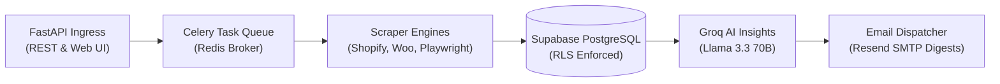

# PriceHawk

Multi-platform competitor price intelligence and monitoring platform. Automatically discovers product catalogs across e-commerce platforms, tracks historical price movements, synthesizes competitive intelligence via Groq Llama 3.3 70B AI, and dispatches automated digest notifications.

---

## 1. System Summary & Architecture



### Core Capabilities

- **Multi-Platform Discovery:** Auto-detects and extracts catalog items and pricing from Shopify (JSON & GraphQL Storefront), WooCommerce (Store API & REST), Amazon, eBay, and generic stores.
- **Automated Time-Series Tracking:** Daily background scraping via Celery worker pools with exponential backoff and idempotency protection.
- **AI-Powered Market Intelligence:** Analyzes multi-competitor 30-day price trends, detects discounting patterns, and generates pricing recommendations via Groq Llama 3.3 70B.
- **Smart Digest Alerts:** Batches price drops, increases, and currency shifts into configurable (6h, 12h, 24h) email digests to prevent notification fatigue.
- **Enterprise Security & Isolation:** Supabase Auth (ES256 JWKS JWT verification), PostgreSQL Row-Level Security (RLS) tenant isolation, SSRF domain filters, and SlowAPI rate limiting.
- **Data Export & Visualization:** CSV price history download and interactive Chart.js time-series endpoints.

### Tech Stack

| Layer | Technology | Purpose |
| :--- | :--- | :--- |
| **API Framework** | FastAPI (Python 3.13+) | High-throughput asynchronous HTTP routing, OpenAPI docs, and middlewares. |
| **Frontend UI** | Jinja2, HTMX, Tailwind CSS | Server-rendered modern responsive dashboard. |
| **Database & Auth** | Supabase (PostgreSQL 15+) | Multi-tenant persistence, Row-Level Security, and ES256 JWT authentication. |
| **Task Queue & Broker** | Celery + Redis | Asynchronous job execution, cron scheduling (Beat), and SSE progress caching. |
| **Scraping Subsystem** | HTTPX, BeautifulSoup, Playwright | Multi-platform headless Chromium extraction with anti-bot heuristics. |
| **AI Intelligence** | Groq Cloud API | Ultra-low latency inference using Llama 3.3 70B Versatile. |
| **Email Delivery** | Resend (SMTP) | Digest batching and HTML/Text email notifications. |

---

## 2. Documentation Index

The following guides provide in-depth documentation for architecture, schemas, API routes, workers, operations, and development:

| Document | Path | Description |
| :--- | :--- | :--- |
| **System Architecture Guide** | [docs/ARCHITECTURE.md](docs/ARCHITECTURE.md) | Component architecture, sequence diagrams, scraper subsystems, AI pipelines, and security boundaries. |
| **Database Schema & Persistence** | [docs/DATABASE.md](docs/DATABASE.md) | Entity-Relationship (ER) diagram, data dictionaries, indexes, triggers, and Row-Level Security policies. |
| **REST API Reference** | [docs/API.md](docs/API.md) | Comprehensive endpoint reference, request/response models, query parameters, and error responses. |
| **Background Workers & Queues** | [docs/WORKERS.md](docs/WORKERS.md) | Celery worker topology, Celery Beat periodic tasks, concurrency pools, and SSE progress tracking. |
| **Deployment & Operations Runbook** | [docs/DEPLOYMENT.md](docs/DEPLOYMENT.md) | Docker Compose setup, Railway cloud deployment, environment variable checklist, and operational runbook. |
| **Local Development Guide** | [docs/DEVELOPMENT.md](docs/DEVELOPMENT.md) | Developer onboarding, environment setup with `uv`/`pip`, Playwright installation, and test execution. |
| **Complex Logic Reference** | [docs/logic_used.md](docs/logic_used.md) | Deep dive into algorithmic trade-offs, multi-field search, and price parsing heuristics. |

---

## 3. Quickstart

### 3.1 Prerequisites
- Python 3.13+ (or 3.12+)
- [uv](https://docs.astral.sh/uv/) package manager
- Docker (for Redis and containerized execution)
- Supabase account with project initialized

### 3.2 Installation & Setup
```bash
# 1. Clone repository and install dependencies
git clone https://github.com/dreww01/pricehawk.git
cd pricehawk
uv sync

# 2. Install Playwright Chromium browser binary
uv run playwright install chromium

# 3. Configure environment variables
cp .env.example .env
```

Edit `.env` with your Supabase credentials, Redis URL, and optional Groq/SMTP API keys:
```env
SB_URL=https://your-project.supabase.co
SB_ANON_KEY=your-anon-key
SB_SERVICE_KEY=your-service-key
SB_JWT_SECRET=your-jwt-secret
REDIS_URL=redis://localhost:6379/0
```

### 3.3 Initialize Database Schema
1. Open your project in the [Supabase SQL Editor](https://app.supabase.com).
2. Execute the idempotent script in `docs/database_schema.sql`.

### 3.4 Start Local Services

#### Option A: Docker Compose (Full Stack)
```bash
docker compose up -d
```

#### Option B: Local Processes
```bash
# Terminal 1: Redis Broker
docker run -d -p 6379:6379 --name redis redis:7-alpine

# Terminal 2: FastAPI Application
uv run python run.py

# Terminal 3: Celery Worker
uv run celery -A app.tasks.celery_app worker --loglevel=info --pool=solo

# Terminal 4: Celery Beat (Optional)
uv run celery -A app.tasks.celery_app beat --loglevel=info
```

### 3.5 Verification & Health Check
```bash
# Health Check Endpoint
curl http://localhost:8000/api/health
# {"status":"healthy"}

# Run Test Suite
pytest tests/ -v
```

Interactive API Swagger documentation is available at `http://localhost:8000/api/docs`.
