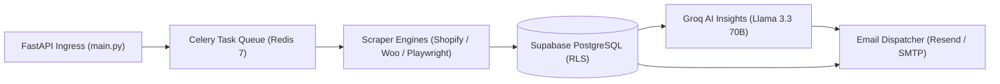

# PriceHawk

[](https://www.python.org/downloads/)
[](https://fastapi.tiangolo.com/)
[](https://supabase.com/)
[](https://docs.celeryq.dev/)
[](https://redis.io/)
[](https://playwright.dev/)

**PriceHawk** is an enterprise-grade competitor price intelligence and monitoring platform. It discovers products from competitor stores across heterogeneous e-commerce platforms, tracks price movements over time, synthesizes trends via Groq AI (Llama 3.3 70B), and dispatches automated multi-frequency email digests.

---

## Executive Summary & Capabilities

- **Automated Store Discovery**: Automatically identifies and parses store architectures (Shopify JSON endpoints, Shopify Storefront GraphQL, WooCommerce Store/REST APIs, and headless JavaScript SPAs).
- **Zero-Latency Price Reuse**: Caches and persists prices discovered during catalog exploration directly into the database, eliminating redundant network scrapes.
- **Distributed Asynchronous Scraping**: Offloads long-running price scrapes to Celery worker pools backed by Redis with real-time Server-Sent Events (SSE) progress streaming.
- **Groq AI Market Intelligence**: Generates concise, high-confidence price trend insights and actionable pricing recommendations using Llama 3.3 70B running on Groq LPUs.
- **Configurable Smart Alerts**: Flexible digest-based email notifications (6, 12, or 24-hour windows) with built-in currency guard protection.
- **Multi-Tenant Security & Isolation**: End-to-end tenant isolation enforced at the PostgreSQL level via Supabase Row-Level Security (RLS) and ES256 asymmetric JWKS JWT authentication.

---

## System Architecture



---

## Tech Stack Breakdown

| Component | Technology | Purpose |
|---|---|---|
| **API Framework** | [FastAPI](https://fastapi.tiangolo.com/) | High-performance asynchronous REST API, OpenAPI generation |
| **Database & Identity** | [Supabase](https://supabase.com/) (PostgreSQL 15+) | Managed persistence, JWT auth, and Row-Level Security (RLS) |
| **Distributed Tasks** | [Celery](https://docs.celeryq.dev/) + [Redis 7](https://redis.io/) | Background task execution, cron scheduling, and progress caching |
| **Scraper Engines** | `httpx`, `BeautifulSoup4`, `lxml`, `Playwright` | Multi-platform REST, GraphQL, and headless Chromium extraction |
| **AI Insights** | [Groq Cloud](https://groq.com/) (Llama 3.3 70B) | High-speed LLM market analysis and pricing recommendations |
| **Email Relay** | [Resend](https://resend.com/) / Standard SMTP | Batched transactional digest delivery |
| **Rate Limiting** | `slowapi` | Memory-efficient endpoint rate limiting |
| **Frontend UI** | Jinja2, HTMX, Tailwind CSS | Responsive dashboard and administrative interface |

---

## Centralized Documentation Suite

For detailed technical specifications, operational runbooks, and API contracts, refer to the dedicated guides in `docs/`:

| Document | Topic | Description |
|---|---|---|
| **[Architecture Guide](docs/ARCHITECTURE.md)** | System Design | Detailed component topologies, sequence diagrams, scraper strategies, AI pipeline, and security boundaries |
| **[Database Guide](docs/DATABASE.md)** | Data & Persistence | Full Mermaid ERD, table data dictionaries, foreign keys, cascade rules, indexing strategy, and RLS policies |
| **[REST API Reference](docs/API.md)** | API Contracts | Complete OpenAPI route documentation, JSON schemas, headers, query parameters, and HTTP error models |
| **[Workers Guide](docs/WORKERS.md)** | Background Jobs | Celery worker architecture, Redis broker topology, Beat scheduler, retries, timeouts, and SSE progress tracking |
| **[Deployment Runbook](docs/DEPLOYMENT.md)** | Operations | Production deployment guide for Docker, Docker Compose, Railway, Supabase, and environment checklists |
| **[Development Guide](docs/DEVELOPMENT.md)** | Local Engineering | Step-by-step developer onboarding, `uv` workflow, Playwright installation, test suites, and coding standards |

---

## Quickstart

### Prerequisites
- [Docker & Docker Compose](https://www.docker.com/)
- [Supabase](https://supabase.com/) Account (Free tier)
- (Optional) [Groq Cloud](https://console.groq.com/) API Key for AI features

### 1. Clone & Configure Environment
```bash
git clone https://github.com/dreww01/pricehawk.git
cd pricehawk

cp .env.example .env
```

Edit `.env` with your Supabase project credentials:
```env
SB_URL=https://your-project.supabase.co
SB_ANON_KEY=your-anon-key
SB_SERVICE_KEY=your-service-key
SB_JWT_SECRET=your-jwt-secret
REDIS_URL=redis://redis:6379/0
DEBUG=true
```

### 2. Initialize Database Schema
Execute the SQL script in `docs/database_schema.sql` inside the **Supabase SQL Editor**.

### 3. Start Application with Docker Compose
```bash
docker compose up -d --build
```

### 4. Verify System Health
```bash
curl http://localhost:8000/api/health
# {"status":"healthy"}
```

- **Interactive API Swagger UI**: `http://localhost:8000/api/docs`
- **Interactive API ReDoc**: `http://localhost:8000/api/redoc`
- **Web Application Dashboard**: `http://localhost:8000/dashboard`

---

## Test Verification

Run the automated test suite locally:

```bash
# Using pytest
pytest tests/ -v
```
