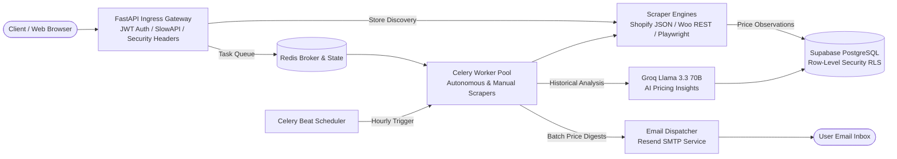

# PriceHawk

[](https://www.python.org/downloads/)
[](https://fastapi.tiangolo.com/)
[](https://docs.celeryq.dev/)
[](https://supabase.com/)

**PriceHawk** is an enterprise-grade, multi-platform competitor price intelligence and monitoring system. It autonomously discovers product catalogs from e-commerce stores, tracks price fluctuations over time, synthesizes trends with Groq Llama 3.3 70B AI, and dispatches smart alert digests.

---

## Architecture Overview



---

## Documentation Index

The repository contains an enterprise documentation suite in [`docs/`](docs/):

| Guide | File Path | Focus & Deliverables |
|---|---|---|
| **Architecture Guide** | [`docs/ARCHITECTURE.md`](docs/ARCHITECTURE.md) | Component sequence diagrams, multi-platform scraping engines, AI synthesis pipeline, and defense-in-depth security model. |
| **Database & Schema Guide** | [`docs/DATABASE.md`](docs/DATABASE.md) | Full Mermaid Entity-Relationship Diagram (`erDiagram`), column data dictionaries, foreign key cascades, and Row-Level Security (RLS) policies. |
| **REST API Reference** | [`docs/API.md`](docs/API.md) | Complete reference for all endpoints (Auth, Products, Scraping, AI Insights, Alerts, CSV Export) with JSON schemas and error codes. |
| **Workers & Queue Management** | [`docs/WORKERS.md`](docs/WORKERS.md) | Celery worker topology, Redis broker state, Beat periodic schedules (02:00 UTC scrape, hourly digests), and retry strategies. |
| **Deployment & Operations Runbook** | [`docs/DEPLOYMENT.md`](docs/DEPLOYMENT.md) | Docker multi-stage build, `docker-compose.yml`, Railway production topology, Supabase migration, and environment secret checklist. |
| **Local Development Guide** | [`docs/DEVELOPMENT.md`](docs/DEVELOPMENT.md) | Developer onboarding, `uv` virtual environment setup, Playwright browser installation, hermetic test execution, and code style. |
| **Database SQL Initialization** | [`docs/database_schema.sql`](docs/database_schema.sql) | Idempotent PostgreSQL DDL script for initializing all database tables, indexes, triggers, and RLS policies in Supabase. |
| **Product Requirements Document** | [`docs/prd.md`](docs/prd.md) | High-level system requirements, user personas, roadmap milestones, and technical delivery goals. |

---

## Core Capabilities & Features

- **Multi-Platform Store Discovery**: Auto-detects and extracts products from Shopify (Classic `/products.json` & Modern Hydrogen GraphQL Storefront API), WooCommerce (Store & REST APIs), and bespoke sites (Schema.org JSON-LD & headless Playwright Chromium fallback).
- **Automated Price Tracking**: Celery Beat schedules daily catalog scraping at 02:00 UTC with automatic delta calculations.
- **AI-Powered Market Insights**: Groq-hosted Llama 3.3 70B analyzes 30-day time-series data to detect pricing patterns, undercutting alerts, and margin recommendations.
- **Smart Digest-Based Alerting**: Configurable notification frequencies (6, 12, or 24 hours) via Resend SMTP to eliminate notification fatigue.
- **Real-Time Progress Streaming**: Asynchronous manual scrapes stream real-time progress via Server-Sent Events (SSE) backed by Redis state.
- **Defense-in-Depth Security**: Multi-tenant isolation enforced via PostgreSQL Row-Level Security (RLS), ES256 JWKS JWT authentication, SlowAPI rate limiting, and OWASP security headers.
- **CSV Data Export**: Download complete price history formatted for spreadsheet analysis.

---

## Technology Stack

| Layer | Technology | Purpose |
|---|---|---|
| **API Framework** | FastAPI (Python 3.13+) | Asynchronous HTTP endpoints, OpenAPI 3.0 specs |
| **Database & Identity** | Supabase (PostgreSQL 15+) | Managed database, JWT Auth with ES256 JWKS, Row-Level Security |
| **Task Queue & Broker** | Celery + Redis | Asynchronous background processing, periodic scheduling |
| **Web Scraping** | `httpx`, `BeautifulSoup4`, `Playwright` | Multi-engine extraction with headless Chromium |
| **AI Intelligence** | Groq API (Llama 3.3 70B) | Statistical pattern detection and pricing recommendations |
| **Rate Limiting** | SlowAPI (Redis backend) | Key-bucket rate limiting across auth and scraping routes |
| **Frontend UI** | Jinja2, HTMX, Tailwind CSS | Server-rendered interactive dashboard and settings |

---

## Quickstart Guide

### Prerequisites

- **Python 3.13+**
- **[uv](https://docs.astral.sh/uv/)** package manager (or `pip`)
- **Docker Desktop** (for Redis broker and multi-container execution)
- **Supabase Account** (free tier at [supabase.com](https://supabase.com))
- **Groq API Key** (optional, for AI insights at [console.groq.com](https://console.groq.com))

---

### Method A: Local Development with `docker-compose`

1. **Clone the repository**:
   ```bash
   git clone https://github.com/dreww01/pricehawk.git
   cd pricehawk
   ```

2. **Configure environment**:
   ```bash
   cp .env.example .env
   # Edit .env with your Supabase credentials
   ```

3. **Start the complete stack**:
   ```bash
   docker compose up -d
   docker compose logs -f
   ```
   - Web Application: http://localhost:8000
   - Swagger Documentation: http://localhost:8000/api/docs

---

### Method B: Native Local Development

1. **Install dependencies**:
   ```bash
   uv sync
   source .venv/bin/activate
   ```

2. **Install Playwright Chromium**:
   ```bash
   playwright install chromium
   ```

3. **Initialize Supabase Database**:
   - Open the **SQL Editor** in Supabase.
   - Paste and execute [`docs/database_schema.sql`](docs/database_schema.sql).

4. **Start services across separate terminals**:

   ```bash
   # Terminal 1: Redis Broker
   docker run --rm -d -p 6379:6379 --name pricehawk-redis redis:7-alpine

   # Terminal 2: FastAPI Web Server
   python run.py

   # Terminal 3: Celery Worker
   celery -A app.tasks.celery_app worker --loglevel=info --pool=solo

   # Terminal 4: Celery Beat (Periodic Scheduler)
   celery -A app.tasks.celery_app beat --loglevel=info
   ```

5. **Verify API Health**:
   ```bash
   curl http://localhost:8000/api/health
   # {"status":"healthy"}
   ```

---

## Running Automated Tests

PriceHawk includes automated hermetic test suites covering auth, route authorization, health endpoints, page rendering, and scraper progress:

```bash
# Run all tests
pytest tests/ -v
```

---

## Repository Structure

```
pricehawk/
├── app/
│   ├── api/routes/          # FastAPI route controllers
│   │   ├── auth.py          # Signup, login, password reset OTP
│   │   ├── account.py       # Account settings, password/email updates
│   │   ├── discovery.py     # Multi-platform store discovery & tracking
│   │   ├── tracked_products.py # Product group CRUD & soft delete
│   │   ├── scraper.py       # Manual scrape triggers & SSE streams
│   │   ├── charts.py        # Chart.js visualization data formatting
│   │   ├── insights.py      # Groq AI insights generation
│   │   ├── alerts.py        # Alert configuration, history, test email
│   │   ├── export.py        # Streaming CSV price history export
│   │   └── pages.py         # Jinja2 server-rendered web pages
│   ├── core/
│   │   ├── config.py        # Pydantic BaseSettings & env validation
│   │   └── security.py      # JWKS ES256 JWT validation & CurrentUser
│   ├── db/
│   │   ├── database.py      # Supabase client factory (user vs service role)
│   │   └── models.py        # Pydantic request/response schemas
│   ├── middleware/
│   │   └── rate_limit.py    # SlowAPI Redis limiter config
│   ├── services/
│   │   ├── store_discovery.py   # Catalog discovery orchestrator
│   │   ├── store_detector.py    # Platform detection waterfall
│   │   ├── scraper_service.py   # Price extraction & change detection
│   │   ├── ai_service.py        # Groq Llama 3.3 70B AI integration
│   │   ├── alert_service.py     # Price delta alert rule engine
│   │   ├── email_service.py     # Resend SMTP email digest formatter
│   │   ├── chart_service.py     # Chart data aggregation service
│   │   └── stores/              # Platform scraper plugins
│   │       ├── base.py          # Abstract BaseStoreHandler & DiscoveredProduct
│   │       ├── shopify.py       # Shopify JSON + GraphQL Storefront handler
│   │       ├── woocommerce.py   # WooCommerce REST handler
│   │       └── generic.py       # Schema.org & Playwright fallback
│   ├── tasks/
│   │   ├── celery_app.py        # Celery broker config & Beat schedules
│   │   └── scraper_tasks.py     # Background worker routines & SSE keys
│   ├── static/                  # Static CSS/JS assets
│   └── templates/               # Jinja2 HTML templates
├── docs/                        # Enterprise documentation suite
│   ├── ARCHITECTURE.md          # Architecture & Sequence flows
│   ├── DATABASE.md              # Database Schema & Mermaid ERD
│   ├── API.md                   # REST API Reference & JSON Schemas
│   ├── WORKERS.md               # Celery Workers & Queue Management
│   ├── DEPLOYMENT.md            # Docker, Railway & Production Runbook
│   ├── DEVELOPMENT.md           # Developer Onboarding & Testing Guide
│   ├── database_schema.sql      # Supabase SQL initialization script
│   └── prd.md                   # Product Requirements Document
├── tests/                       # Pytest test suite
│   ├── conftest.py              # Pytest fixtures & mock environment
│   ├── test_auth.py             # Authentication endpoint tests
│   ├── test_health.py           # Health check tests
│   ├── test_pages.py            # Page rendering & redirect tests
│   └── test_scraper.py          # Scraper endpoint tests
├── main.py                      # FastAPI application entry point & middleware
├── run.py                       # Development server runner
├── Dockerfile                   # Production multi-stage Docker build
├── docker-compose.yml           # Multi-service local & production stack
└── pyproject.toml               # Python project configuration & dependencies
```
