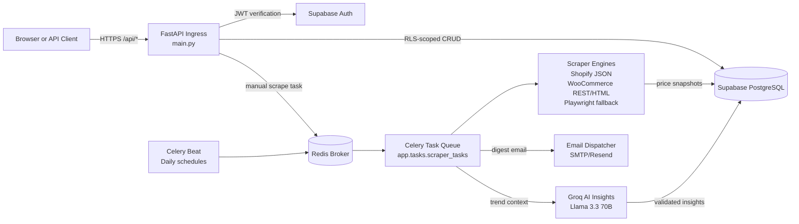

# PriceHawk

Private production service for multi-platform competitor price monitoring, AI-assisted price analysis, and digest-based alerting.

PriceHawk discovers products from commerce storefronts, groups selected competitor URLs for tracking, captures price history through asynchronous workers, synthesizes trends with Groq-hosted Llama 3.3 70B, and sends configurable email digests when material price or currency changes are detected.

## Capabilities

| Capability | Production behavior |
| --- | --- |
| Store discovery | Detects Shopify, WooCommerce, and generic commerce pages from a single HTTPS store URL. |
| Product tracking | Stores selected discovered products as tracked product groups with competitor URLs. |
| Background scraping | Queues manual and scheduled scraping through Celery workers backed by Redis. |
| Price persistence | Writes scrape results to Supabase PostgreSQL with tenant isolation through Row-Level Security (RLS). |
| AI insights | Generates pattern, alert, and recommendation insights from recent price history using Groq Llama 3.3 70B. |
| Alerts and digests | Batches price drops, price increases, and currency changes into scheduled email digests. |
| Data export | Streams product price history as CSV for spreadsheet and external analytics workflows. |

## Tech Stack

| Layer | Technology |
| --- | --- |
| API and web app | FastAPI, Starlette middleware, Jinja2 templates, HTMX/Tailwind frontend assets |
| Data validation | Pydantic and Pydantic Settings |
| Authentication | Supabase Auth JWTs verified by FastAPI dependencies |
| Database | Supabase PostgreSQL with RLS policies and service-key worker access |
| Scraping | httpx, BeautifulSoup, lxml, Playwright Chromium fallback |
| Queueing | Celery worker and Celery Beat with Redis broker/result backend |
| AI | Groq API with Llama 3.3 70B JSON-mode insight generation |
| Protection | slowapi rate limits, CORS, security headers, HTTPS-only store URL validation |
| Packaging | Python 3.13, uv, Docker, Docker Compose, Railway-compatible process model |

## High-Level Architecture



## Quickstart

### Prerequisites

- Python 3.13+
- [uv](https://docs.astral.sh/uv/) for package management
- Docker and Docker Compose
- Supabase project credentials
- Optional Groq API key for AI insights
- Optional SMTP credentials for email digests

### 1. Install dependencies

```bash
git clone https://github.com/dreww01/pricehawk.git
cd pricehawk
uv sync
```

### 2. Configure environment

Create `.env` from the project template if present, then populate the variables used by `app/core/config.py`:

```env
SB_URL=https://your-project.supabase.co
SB_ANON_KEY=your-anon-key
SB_SERVICE_KEY=your-service-role-key
SB_JWT_SECRET=your-supabase-jwt-secret
REDIS_URL=redis://localhost:6379/0
GROQ_API_KEY=your-groq-api-key
SMTP_HOST=smtp.resend.com
SMTP_PORT=587
SMTP_USERNAME=resend
SMTP_PASSWORD=your-smtp-or-resend-key
FROM_EMAIL=alerts@yourdomain.com
FROM_NAME=PriceHawk Alerts
DEBUG=true
```

### 3. Create the database schema

Run [`docs/database_schema.sql`](docs/database_schema.sql) in the Supabase SQL editor. The production schema and RLS rules are documented in [`docs/DATABASE.md`](docs/DATABASE.md).

### 4. Install browser support for JavaScript-rendered sites

```bash
uv run playwright install chromium
```

### 5. Run locally with Docker Compose

```bash
docker compose up --build
```

The compose stack starts:

- `api` on <http://localhost:8000>
- `redis` on `redis://localhost:6379/0`
- `celery-worker` for asynchronous scrape tasks
- `celery-beat` for daily scrape, hourly digest, and cleanup schedules

### 6. Run without Compose, when debugging locally

```bash
# terminal 1
redis-server

# terminal 2
uv run python run.py

# terminal 3
uv run celery -A app.tasks.celery_app worker --loglevel=info --pool=solo

# terminal 4
uv run celery -A app.tasks.celery_app beat --loglevel=info
```

### 7. Verify the service and tests

```bash
curl http://localhost:8000/api/health
# {"status":"healthy"}

uv run pytest tests/ -v
```

Interactive API documentation is served at <http://localhost:8000/api/docs> and ReDoc at <http://localhost:8000/api/redoc>.

## Documentation Index

| Guide | Purpose |
| --- | --- |
| [Architecture](docs/ARCHITECTURE.md) | Enterprise system architecture, component interactions, scraping strategy, AI pipeline, and security boundaries. |
| [Implementation Logic](docs/logic_used.md) | Engineering rationale for discovery, parsing, alerting, AI validation, exports, and dashboard data flows. |
| [Database](docs/DATABASE.md) | Supabase PostgreSQL schema, ER diagram, constraints, indexes, RLS policies, and tenant isolation rules. |
| [REST API](docs/API.md) | FastAPI route reference with request/response examples, query parameters, auth model, and error semantics. |
| [Workers](docs/WORKERS.md) | Celery/Redis topology, scheduled jobs, retry/backoff behavior, dead-letter expectations, and operational alerts. |
| [Deployment](docs/DEPLOYMENT.md) | Docker, Docker Compose, Railway topology, Supabase migration procedure, and production secret checklist. |
| [Development](docs/DEVELOPMENT.md) | Local onboarding with uv/pip, Playwright setup, test commands, formatting, linting, and typing standards. |
| [Product Requirements](docs/prd.md) | Product milestones and historical planning context. |
| [Database Setup SQL](docs/database_schema.sql) | Idempotent SQL used to provision Supabase tables, indexes, triggers, and RLS policies. |

## Actual Route Families

All API routes are mounted under `/api` except HTML page routes. Protected routes require `Authorization: Bearer <Supabase JWT>` unless noted.

| Domain | Representative routes |
| --- | --- |
| Health | `GET /api/health` |
| Authentication | `POST /api/auth/login`, `POST /api/auth/signup`, `POST /api/auth/forgot-password`, `POST /api/auth/verify-reset-otp`, `POST /api/auth/reset-password`, `GET /api/auth/me` |
| Account | `GET /api/account/settings`, `POST /api/account/change-password`, `POST /api/account/change-email`, `DELETE /api/account/delete` |
| Discovery | `POST /api/stores/discover`, `POST /api/stores/track` |
| Tracked products | `GET /api/tracked-products`, `GET /api/tracked-products/{product_id}`, `PUT /api/tracked-products/{product_id}`, `DELETE /api/tracked-products/{product_id}` |
| Scraping and prices | `POST /api/scraper/scrape/manual/{product_id}`, `GET /api/scraper/scrape/stream/{task_id}`, `GET /api/scraper/prices/{product_id}/history`, `GET /api/scraper/prices/latest/{competitor_id}`, `GET /api/scraper/scrape/worker-health` |
| Charts | `GET /api/charts/{product_id}`, `GET /api/scraper/prices/{product_id}/chart-data` |
| Insights | `GET /api/insights/{product_id}`, `POST /api/insights/generate/{product_id}` |
| Alerts | `GET /api/alerts/settings`, `PUT /api/alerts/settings`, `GET /api/alerts/pending`, `GET /api/alerts/history`, `POST /api/alerts/test`, currency acceptance endpoints |
| Export | `GET /api/export/{product_id}/csv` |

## Repository Layout

```text
pricehawk/
├── app/
│   ├── api/routes/          # FastAPI API and page routers
│   ├── core/                # Settings and JWT security helpers
│   ├── db/                  # Supabase client factory and Pydantic models
│   ├── middleware/          # slowapi rate-limit configuration
│   ├── services/            # Scraping, discovery, AI, charts, alerts, email
│   ├── tasks/               # Celery application and worker tasks
│   ├── templates/           # HTML page templates
│   └── static/              # Frontend assets
├── docs/                    # Production documentation suite
├── tests/                   # Root pytest suite
├── Dockerfile               # Production image with Playwright Chromium support
├── docker-compose.yml       # API, Redis, worker, and beat orchestration
├── main.py                  # FastAPI app, middleware, and route registration
├── run.py                   # Local uvicorn launcher
└── pyproject.toml           # Python package and dependency metadata
```

## Security Baseline

- Supabase JWTs protect application routes.
- Supabase RLS isolates rows by `auth.uid()` and product ownership joins.
- Service-role database access is reserved for backend tasks that must insert price history, insights, and alert records.
- slowapi enforces endpoint-class rate limits.
- Security headers are added globally in `main.py`.
- Store discovery rejects explicit insecure `http://` URLs.
- Secrets remain in environment variables and are never committed.
