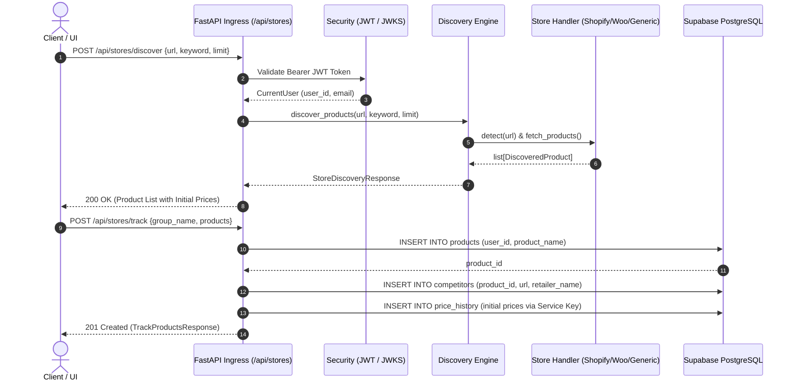
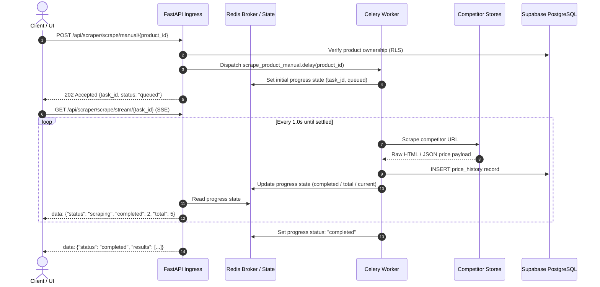
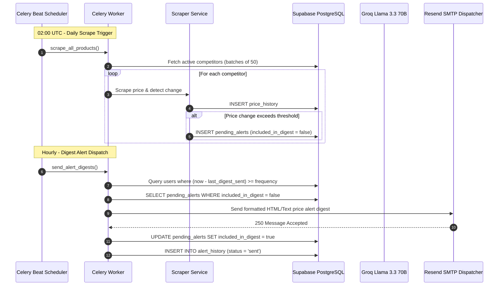

# PriceHawk — Enterprise Architecture Guide

This document provides a comprehensive technical reference for the architecture, component interactions, scraping engines, AI synthesis pipeline, and security model powering **PriceHawk**.

---

## Table of Contents

1. [System Overview & Design Principles](#1-system-overview--design-principles)
2. [Component Interaction & Sequence Flows](#2-component-interaction--sequence-flows)
3. [Multi-Platform Scraper & Discovery Engine](#3-multi-platform-scraper--discovery-engine)
4. [AI Analysis & Market Intelligence Pipeline](#4-ai-analysis--market-intelligence-pipeline)
5. [Security Boundaries & Defense in Depth](#5-security-boundaries--defense-in-depth)
6. [Data Lifecycle & Persistence Flow](#6-data-lifecycle--persistence-flow)

---

## 1. System Overview & Design Principles

PriceHawk is an asynchronous, multi-platform competitor price intelligence and monitoring platform. It automates catalog discovery, scheduled scraping, statistical trend analysis, AI-driven price recommendations, and digest-based email alerting.

```
┌────────────────────────────────────────────────────────────────────────┐
│                          FastAPI Ingress Gateway                       │
│      JWT Auth (JWKS ES256) | SlowAPI Rate Limiting | Security Headers   │
└───────────────────────────────────┬────────────────────────────────────┘
                                    │
        ┌───────────────────────────┼───────────────────────────┐
        ▼                           ▼                           ▼
┌───────────────┐           ┌───────────────┐           ┌───────────────┐
│ Store Engine  │           │ Async Queue   │           │ Data Services │
│ Discovery &   │           │ Celery +      │           │ Supabase RLS  │
│ Scraper Core  │           │ Redis Broker  │           │ Postgres & S3 │
└───────┬───────┘           └───────┬───────┘           └───────┬───────┘
        │                           │                           │
        ▼                           ▼                           ▼
┌───────────────┐           ┌───────────────┐           ┌───────────────┐
│ Scraper Nodes │           │ AI Engine     │           │ Notification  │
│ Shopify/Woo/  │           │ Groq Llama    │           │ Resend SMTP   │
│ Playwright    │           │ 3.3 70B JSON  │           │ Digest Engine │
└───────────────┘           └───────────────┘           └───────────────┘
```

### Core Architectural Principles

1. **Separation of Operational Concerns**
   - **Discovery**: One-time catalog traversal using headless APIs and structured markup.
   - **Tracking**: Persistent grouping and relational linking of competitor SKUs.
   - **Scraping**: Isolated, rate-controlled extraction of point-in-time price observations.
   - **Intelligence**: Batch synthesis via large language model inference over time-series windows.
   - **Dispatch**: Time-windowed digest batching to prevent notification fatigue.

2. **Extensible Plugin Architecture (Strategy Pattern)**
   All platform-specific scrapers implement `BaseStoreHandler`. The detection engine evaluates target URLs against handlers in strict priority order, gracefully degrading to generic HTML and headless browser extractors.

3. **Asynchronous Non-Blocking I/O**
   All network I/O utilizes Python `asyncio` and `httpx.AsyncClient` with HTTP/2 multiplexing, preventing thread starvation and allowing high-throughput concurrent scraping.

4. **Defense-in-Depth Security**
   Zero trust across layers: Application routes enforce caller tenant boundaries, while Postgres Row-Level Security (RLS) guarantees cryptographic tenant isolation at the database layer.

---

## 2. Component Interaction & Sequence Flows

### 2.1 Store Discovery & Tracking Flow

When a user submits a store URL to discover products and enroll them into automated tracking:



---

### 2.2 Manual Scrape & Real-Time SSE Progress Streaming

When a user triggers an on-demand scrape, the system offloads work to Celery and streams progress via Server-Sent Events (SSE):



---

### 2.3 Scheduled Daily Scrape, AI Synthesis, and Digest Alerts

Celery Beat orchestrates autonomous monitoring, LLM analysis, and email alerting:



---

## 3. Multi-Platform Scraper & Discovery Engine

PriceHawk supports dynamic e-commerce catalog discovery and price extraction across three primary engine tiers:

```
                      Target Store URL
                             │
            ┌────────────────┴────────────────┐
            ▼                                 ▼
   Classic Shopify Store             Modern Hydrogen Store
   GET /products.json                POST /api/storefront/graphql
            │                                 │
            ├─────────────────────────────────┘
            ▼
   WooCommerce REST API
   GET /wp-json/wc/store/products
            │
            ▼
   Generic Schema.org / DOM Fallback
   Headless Playwright (Chromium)
```

### 3.1 Store Detection Strategy (Priority Waterfall)

The detector inspects URLs using lightweight HTTP `HEAD` and `GET` probes before executing full extraction:

```python
# Execution Priority Order:
1. ShopifyHandler.detect(url)     # Probes /products.json?limit=1
2. WooCommerceHandler.detect(url) # Probes /wp-json/wc/store/products
3. GenericHandler.detect(url)     # Fallback: Always returns True
```

### 3.2 Shopify Hybrid Extraction (Classic + Hydrogen GraphQL)

Modern Shopify storefronts built with Shopify Hydrogen or Next.js frequently disable public `/products.json` endpoints. PriceHawk implements a two-tier hybrid fallback:

1. **Fast Path (`/products.json`)**: Queries `GET {store_url}/products.json?limit=250&page=N` and extracts product handles, titles, variants, SKUs, and inventory flags.
2. **GraphQL Storefront Fallback**: If `/products.json` returns empty or 404/403, the engine executes cursor-based GraphQL queries against the Storefront API (`/api/unstable/graphql` or `/api/2024-01/graphql`):

```graphql
query GetProducts($cursor: String, $first: Int!) {
  products(first: $first, after: $cursor) {
    pageInfo {
      hasNextPage
      endCursor
    }
    edges {
      node {
        id
        title
        handle
        productType
        tags
        variants(first: 20) {
          edges {
            node {
              id
              title
              sku
              availableForSale
              price {
                amount
                currencyCode
              }
            }
          }
        }
        images(first: 1) {
          edges {
            node {
              url
            }
          }
        }
      }
    }
  }
}
```

### 3.3 WooCommerce REST Store API

WooCommerce stores are queried across hierarchical endpoints:
1. `/wp-json/wc/store/products` (WooCommerce Store API)
2. `/wp-json/wc/v3/products` (WooCommerce REST API v3)
3. `/wp-json/wc/v2/products` (Legacy fallback)

Prices in minor units (cents) are automatically normalized according to currency minor unit decimal places.

### 3.4 Generic DOM & Headless Playwright Fallback

For bespoke stores and JavaScript-heavy Single Page Applications (SPAs):
- **Structured Data**: Parses `<script type="application/ld+json">` blocks adhering to Schema.org `Product` and `Offer` specifications.
- **Microdata & Meta**: Extracts OpenGraph `og:price:amount`, `product:price:amount`, and `itemprop="price"`.
- **Playwright Chromium**: Spawns isolated, sandboxed browser contexts with anti-bot evasion headers (rotating User-Agents, disabled automation flags) to render dynamic pricing widgets.

### 3.5 Multi-Field Keyword Filtering (B2B/B2C Search)

Because catalog items often use branded terminology (e.g., "Heavenly Nudes" rather than "Lipstick"), PriceHawk indexes multi-field attributes:
- Product Title / Name
- Product Type / Category
- Collection Tags
- Description Body Text

Tokenized word matching allows broad category search queries to locate relevant SKUs regardless of title branding.

### 3.6 Numeric & Locale-Aware Price Normalization

Prices across global locales are cleaned and converted into exact Python `Decimal` objects:
- Currency symbol stripping (`$`, `€`, `£`, `¥`, `CAD`, `AUD`).
- European number format conversion (`1.249,99 €` ➔ `1249.99`).
- US/UK number format conversion (`$1,249.99` ➔ `1249.99`).
- Elimination of floating-point representation anomalies in database storage.

---

## 4. AI Analysis & Market Intelligence Pipeline

PriceHawk integrates Groq-hosted **Llama 3.3 70B Versatile** to synthesize price trends and formulate actionable pricing strategies.

```
┌──────────────────────────────────────────────────────────────┐
│                    Historical Price Data                     │
│         30-Day Time-Series Window Across Competitors         │
└──────────────────────────────┬───────────────────────────────┘
                               │
                               ▼
┌──────────────────────────────────────────────────────────────┐
│               Aggregation & Privacy Sanitizer                │
│    - Compute min, max, avg, volatility, and delta %          │
│    - Strip full URLs to domains (amazon.com, walmart.com)    │
│    - Format JSON context payload                             │
└──────────────────────────────┬───────────────────────────────┘
                               │
                               ▼
┌──────────────────────────────────────────────────────────────┐
│                  Groq Llama 3.3 70B LLM                      │
│             System: Competitive Pricing Analyst              │
│             Response Format: {"type": "json_object"}         │
└──────────────────────────────┬───────────────────────────────┘
                               │
                               ▼
┌──────────────────────────────────────────────────────────────┐
│            Validation & Anti-Hallucination Gate              │
│    - Schema validation: insight_type, confidence_score       │
│    - Content sanitization (XSS / SQL escape)                 │
│    - Deduplication and database persistence (service key)    │
└──────────────────────────────────────────────────────────────┘
```

### 4.1 Context Payload Structuring

The service compiles 30-day time-series observations per competitor into statistical summaries:

```json
{
  "product_name": "Ultra Wireless Headphones",
  "analysis_period_days": 30,
  "competitors_data": [
    {
      "competitor_domain": "audio-direct.com",
      "current_price": 149.99,
      "first_price": 179.99,
      "min_price": 139.99,
      "max_price": 179.99,
      "average_price": 156.40,
      "price_change_percent": -16.67,
      "recent_observations": [
        {"date": "2026-08-25", "price": 159.99},
        {"date": "2026-09-01", "price": 149.99}
      ]
    }
  ]
}
```

### 4.2 LLM Reasoning & Output Taxonomy

The model outputs structured insights classified into three categories:
- **`pattern`**: Periodic discounts, weekend price drops, cyclical markups.
- **`alert`**: Significant margin undercutting, aggressive flash sales.
- **`recommendation`**: Optimal price target adjustments to preserve margin while remaining competitive.

### 4.3 Validation and Quality Gates

- **Rate Limiting**: AI generation is capped at once per product per calendar day to minimize token consumption and avoid redundant synthesis.
- **Confidence Scoring**: Each insight includes a normalized score (`0.00` to `1.00`) allowing UI filtering.
- **Sanitization**: String inputs and model completions are sanitized to block script injection.

---

## 5. Security Boundaries & Defense in Depth

Security is enforced across four distinct perimeters:

```
[Layer 1: Transport & Network]   HTTPS / TLS 1.3, Strict CORS, OWASP Security Headers
              │
[Layer 2: Edge Ingress]          SlowAPI Rate Limiting (Redis-backed key-bucket)
              │
[Layer 3: Authentication]        Supabase Auth, ES256 Asymmetric JWKS Token Validation
              │
[Layer 4: Database Isolation]    PostgreSQL Row-Level Security (RLS) Tenant Boundary
```

### 5.1 Asymmetric JWT Validation (ES256 JWKS)

Incoming API requests pass through `verify_token` in `app/core/security.py`:
1. The token's header `kid` (Key ID) is matched against Supabase's JWKS endpoint (`{sb_url}/auth/v1/.well-known/jwks.json`).
2. Keys are cached via Python `@lru_cache` to eliminate redundant HTTP handshakes.
3. Token signatures are verified using `ES256` (ECDSA using P-256 and SHA-256).
4. Claims (`sub`, `email`, `role`) are mapped to the immutable `CurrentUser` identity model.

### 5.2 Dual Authentication Pattern for File Exports

To accommodate browser downloads (which cannot attach custom `Authorization: Bearer` headers) without compromising security:
- **Priority 1 (API Client)**: Inspects the `Authorization` header for `Bearer <token>`.
- **Priority 2 (Browser Direct Download)**: Fallback to the secure `access_token` cookie.
- Both token vectors undergo identical cryptographic signature verification.

### 5.3 PostgreSQL Row-Level Security (RLS) Model

The database guarantees multi-tenant isolation even in the event of an application-level query defect:

```sql
-- Products Isolation Policy
CREATE POLICY "Users can view own products"
    ON products FOR SELECT
    USING (user_id = auth.uid());

-- Competitor Hierarchy Policy (Cascaded RLS)
CREATE POLICY "Users can view own competitors"
    ON competitors FOR SELECT
    USING (
        product_id IN (
            SELECT id FROM products WHERE user_id = auth.uid()
        )
    );
```

### 5.4 Dual Client Operational Separation

- **User Context Client (`sb_anon_key` + User JWT)**: Restricted to RLS-filtered rows. Used for all user-facing HTTP endpoints.
- **Service Role Client (`sb_service_key`)**: Bypasses RLS to execute autonomous background batch scraping, Celery worker updates, and alert digest aggregation.

### 5.5 Edge Security Headers Middleware

Every HTTP response emits mandatory security headers:
- `X-Content-Type-Options: nosniff`
- `X-Frame-Options: DENY`
- `X-XSS-Protection: 1; mode=block`
- `Referrer-Policy: strict-origin-when-cross-origin`
- `Strict-Transport-Security: max-age=31536000; includeSubDomains` (Production)

---

## 6. Data Lifecycle & Persistence Flow

```
[Store Discovery] ────► DiscoveredProduct (In-Memory)
                              │
                              ▼
[User Enroll]     ────► products (Table) + competitors (Table)
                              │
                              ▼
[Celery Scraping] ────► price_history (Append-Only Time Series)
                              │
                              ├───────────────────────────────┐
                              ▼                               ▼
[Alert Service]   ────► pending_alerts (Queue)        [AI Service] ──► insights
                              │
                              ▼
[Celery Beat]     ────► alert_history (Audit Log)
```

1. **Discovery**: Temporary extraction retained in client response state.
2. **Enrollment**: Persists the product entity and competitor URL relationships.
3. **Observation**: Append-only price history records created by scheduled or manual scrapes.
4. **Trigger Evaluation**: Delta calculations stage records in `pending_alerts`.
5. **Digest Fulfillment**: Hourly dispatcher batches pending alerts into emails and transitions them to `alert_history`.
6. **Retention Purging**: Automated Celery task deletes processed alerts after 7 days.
