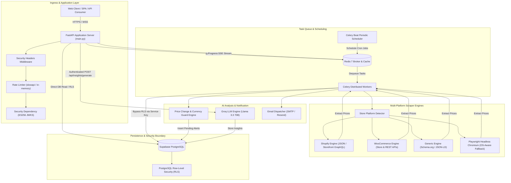
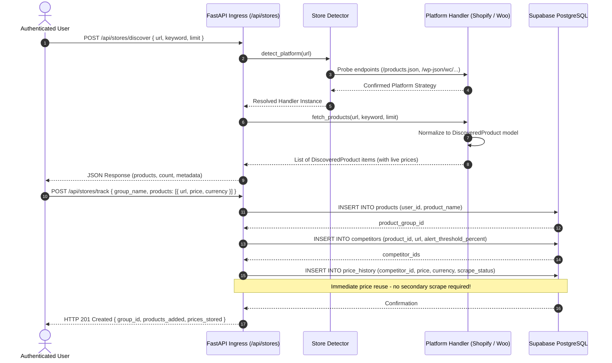
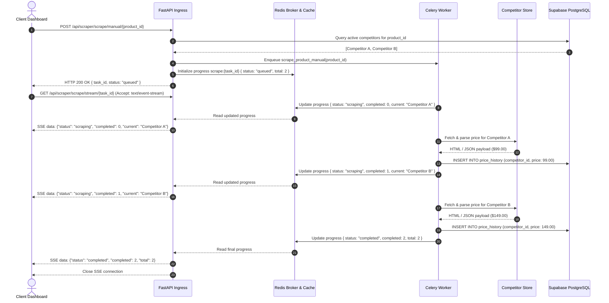
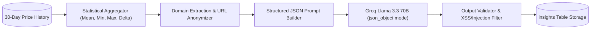
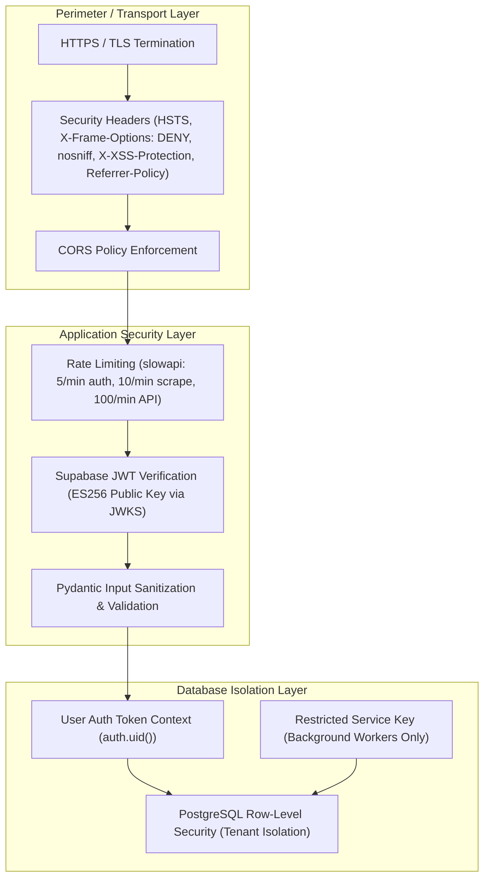

# Production Architecture & System Design Guide

## Overview

**PriceHawk** is an enterprise-grade multi-platform competitor price intelligence and monitoring system. It provides automated store discovery, scheduled price tracking across diverse e-commerce platforms, user-triggered AI price trend synthesis via Large Language Models (LLMs), and automated multi-frequency email digest alerts.

The system is built with an **async-first, decoupled architecture** designed to scale horizontally across web ingresses, distributed background task queues, and persistent storage layers.

```
┌─────────────────────────────────────────────────────────────────────────────────────────┐
│                                PriceHawk Architecture Overview                          │
├─────────────────────────────────────────────────────────────────────────────────────────┤
│                                                                                         │
│  [ HTTP Clients / UI ] ──► [ FastAPI Ingress ] ──► [ Redis Message Broker ]            │
│                                    │                          │                         │
│                                    ▼                          ▼                         │
│                         [ Supabase Postgres ]      [ Distributed Celery Workers ]       │
│                           (RLS & JWT Auth)                    │                         │
│                                  ▲                            ▼                         │
│                                  │                 [ Multi-Platform Scrapers ]          │
│                                  │                 (Shopify / Woo / Playwright)         │
│                                  │                            │                         │
│                         [ Groq AI Llama 3.3 ] ◄───────────────┐                         │
│                          (User-Triggered Insights)            ▼                         │
│                                                    [ Alert & Email Dispatch ]           │
│                                                         (Resend / SMTP)                 │
└─────────────────────────────────────────────────────────────────────────────────────────┘
```

---

## Core System Architecture & Topology

The PriceHawk platform consists of six decoupled primary sub-systems:



---

## Component Interaction & Data Workflows

### 1. Store Discovery & Tracking Flow

Discovery allows users to explore a store without storing unwanted items in the database. When the user chooses to track products, prices discovered during exploration are persisted immediately to prevent redundant network scraping.



### 2. Manual Scrape Execution with Non-Blocking SSE Streaming

Manual scrapes execute asynchronously through Celery to avoid blocking HTTP worker threads, providing real-time progress updates via Server-Sent Events (SSE).



---

## Multi-Platform Scraper Architecture

The scraping subsystem leverages the **Strategy Pattern** to dynamically detect, extract, and normalize product metadata and prices.

```
BaseStoreHandler (ABC)
 ├── ShopifyHandler (JSON endpoint + Storefront GraphQL fallback)
 ├── WooCommerceHandler (Store API + REST API fallback)
 └── GenericHandler (Schema.org JSON-LD + OpenGraph + Playwright Fallback)
```

### 1. Platform Detection Engine (`app/services/store_detector.py`)
Detection probes target URLs using lightweight HTTP HEAD/GET operations in priority sequence:
1. **Shopify Strategy**: Checks for `{store_url}/products.json?limit=1`.
2. **WooCommerce Strategy**: Probes `/wp-json/wc/store/products` (Store API) and `/wp-json/wc/v3/products`.
3. **Generic Strategy**: Fallback handler accepting any standard HTTPS URL.

### 2. Multi-Tiered Shopify Engine (`app/services/stores/shopify.py`)
- **Tier 1 (Classic Shopify)**: Fast REST collection via `GET {store_url}/products.json?limit=250&page=N`.
- **Tier 2 (Hydrogen / Headless Shopify)**: If `/products.json` is disabled or returns empty results, the engine pivots to public Storefront GraphQL across API versions (`unstable`, `2024-01`, `2023-10`, `2023-07`):
  ```graphql
  query getProducts($first: Int!, $after: String) {
    products(first: $first, after: $after) {
      edges {
        node {
          id
          title
          handle
          productType
          tags
          variants(first: 50) {
            edges {
              node {
                id
                title
                sku
                availableForSale
                price {
                  amount
                  currencyCode
                }
              }
            }
          }
        }
      }
      pageInfo {
        hasNextPage
        endCursor
      }
    }
  }
  ```

### 3. WooCommerce Engine (`app/services/stores/woocommerce.py`)
- Communicates directly with the WooCommerce Store API (`/wp-json/wc/store/products`) and REST API endpoints.
- Normalizes integer minor-unit prices (cents) to standard decimal currency values.

### 4. OS-Aware Headless Playwright Fallback (`app/services/scraper_service.py`)
For sites rendering content via client-side Single Page Application (SPA) frameworks or requiring JavaScript execution:
- **Linux / Production**: Executes via native `async_playwright()`.
- **Windows / Development**: Detects `win32` runtime and dispatches synchronous Playwright tasks via a bounded `ThreadPoolExecutor` (3 concurrent workers) to overcome the Windows `ProactorEventLoop` subprocess limitation.
- Evaluates Schema.org `Product` JSON-LD structures, OpenGraph metadata (`og:price:amount`), and standard semantic price elements (`[itemprop="price"]`, `.price`).

---

## AI Analysis Pipeline (`app/services/ai_service.py`)

PriceHawk integrates with the **Groq LPU (Language Processing Unit)** infrastructure running **Llama 3.3 70B Versatile** to synthesize competitor price fluctuations into actionable commercial intelligence only when an authenticated user calls `POST /api/insights/generate/{product_id}`. Celery scrape workers and Beat schedules do not invoke AI generation; they handle scraping, persistence, alert creation, and email dispatch.



### Synthesis Pipeline Stages:
1. **Time-Series Aggregation**: Aggregates 30-day historical data per competitor, calculating min, max, average, latest price, and percentage change.
2. **Anonymization & Privacy Guard**: Strips query strings and product parameters from URLs, presenting domain-level identifiers (e.g. `store-a.com`) to the external AI model.
3. **Deterministic JSON Schema Prompting**: Constrains output via Groq's `response_format={"type": "json_object"}`:
   ```json
   {
     "insights": [
       {
         "type": "pattern | alert | recommendation",
         "text": "Competitor pricing has dropped by 8% over the last 14 days, indicating potential promotional clearance.",
         "confidence": 0.92
       }
     ]
   }
   ```
4. **Validation & Defense**: Validates insight types, enforces 500-character limits per entry, ensures confidence bounds ($0.00 - 1.00$), sanitizes dangerous HTML/SQL characters, and limits stored insights to at most 5 records per generation.
5. **Cadence Enforcement**: Rate-limited to at most 1 generation per product per 24-hour cycle.

---

## Security Boundaries & Defense-in-Depth



### 1. Asymmetric JWT Verification (`app/core/security.py`)
- Authentication verifies Supabase JWTs signed with **ES256 (ECDSA)**.
- Public signing keys are dynamically fetched and cached via Supabase's JWKS endpoint (`{sb_url}/auth/v1/.well-known/jwks.json`) using `PyJWKClient` and `@lru_cache`.

### 2. Dual-Layer Tenant Isolation (Application + Database)
- **Application Level**: All API queries explicitly filter on `user_id = current_user.id`.
- **Database Level (RLS)**: PostgreSQL Row-Level Security policies ensure that even if an application filter is omitted, the database restricts queries to records where `auth.uid() = user_id` (or joined via product ownership for competitors and price histories).

### 3. Dual Authentication for Export Endpoints (`app/api/routes/export.py`)
- Supports **Bearer Header** tokens for programmatic API consumers (`Authorization: Bearer <token>`).
- Supports **Secure HttpOnly Cookies** (`access_token`) for one-click browser CSV downloads without leaking tokens into query parameters.

### 4. Currency Guard & Anomaly Shield (`app/services/alert_service.py`)
- Prevents false-positive price alerts when competitors switch billing currencies (e.g. `$100 USD` to `£80 GBP`).
- Dispatches a `currency_changed` alert allowing users to accept or dismiss currency migration rather than triggering faulty price drop alarms.
