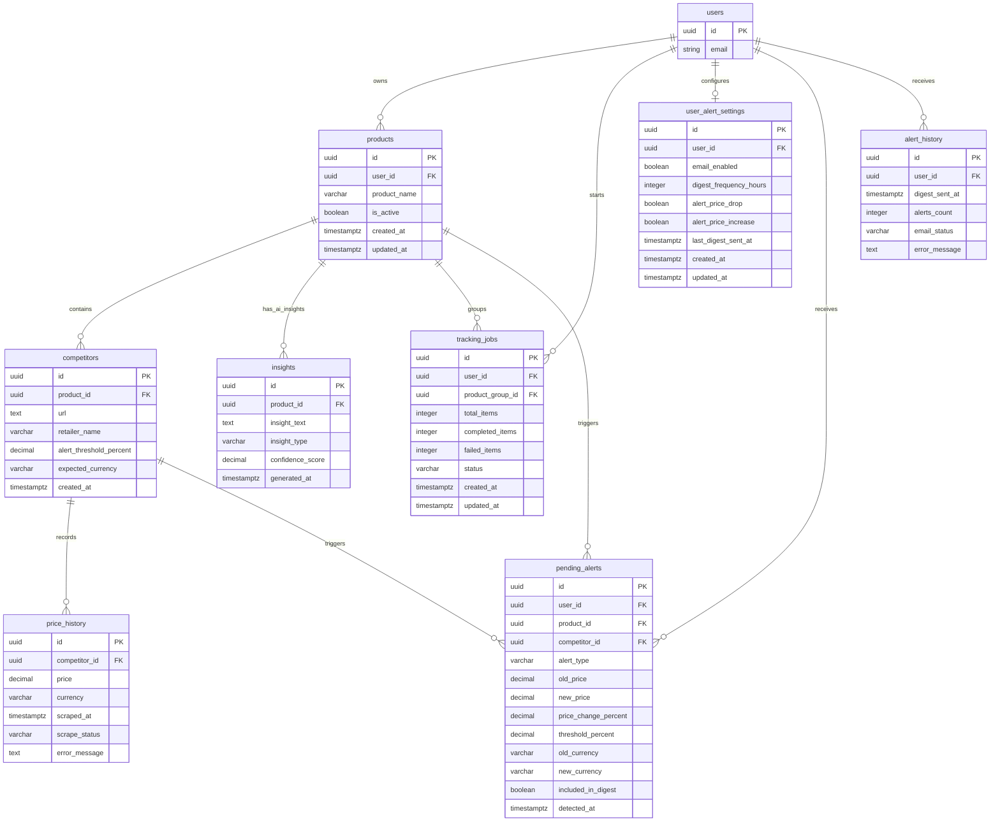

# PriceHawk Database Schema and Persistence Guide

## Navigation

- [Overview](#overview)
- [Entity Relationship Diagram](#entity-relationship-diagram)
- [Table Dictionaries](#table-dictionaries)
- [Indexes](#indexes)
- [Foreign Keys and Cascades](#foreign-keys-and-cascades)
- [Triggers](#triggers)
- [Row-Level Security](#row-level-security)
- [Migration Procedure](#migration-procedure)

## Overview

PriceHawk persists operational data in Supabase PostgreSQL. Supabase Auth owns the canonical user table (`auth.users`); application tables in the `public` schema reference that table by UUID. The setup SQL lives in [`database_schema.sql`](database_schema.sql) and is intended to be executed in the Supabase SQL editor.

The issue-level product schema centers on `users`, `competitors`, `products`, `price_history`, `alerts`, and `ai_insights`. In the actual repository those concepts map as follows:

| Product concept | Actual persistence object |
| --- | --- |
| `users` | Supabase-managed `auth.users` |
| `products` | `public.products` tracking groups |
| `competitors` | `public.competitors` monitored URLs for each product group |
| `price_history` | `public.price_history` scrape snapshots |
| `alerts` | `public.pending_alerts`, `public.alert_history`, `public.user_alert_settings` |
| `ai_insights` | `public.insights` |

## Entity Relationship Diagram



## Table Dictionaries

### `auth.users`

Supabase-managed identity table. Application code treats `auth.users.id` as the tenant key.

| Column | Type | Constraints | Notes |
| --- | --- | --- | --- |
| `id` | `uuid` | Primary key | Referenced by all user-owned application rows. |
| `email` | `text` | Supabase-managed | Used for alerts and account display. |

### `products`

Tracking group owned by a user. A single product row can contain multiple competitor URLs.

| Column | Type | Constraints | Notes |
| --- | --- | --- | --- |
| `id` | `uuid` | PK, default `gen_random_uuid()` | Public product identifier. |
| `user_id` | `uuid` | NOT NULL, FK `auth.users(id) ON DELETE CASCADE` | Tenant owner. |
| `product_name` | `varchar(255)` | NOT NULL | Display/group name. |
| `is_active` | `boolean` | Default `true` | Soft delete and scheduled scrape filter. |
| `created_at` | `timestamptz` | Default `now()` | Creation timestamp. |
| `updated_at` | `timestamptz` | Default `now()`, maintained by trigger | Updated when product row changes. |

### `competitors`

A monitored product URL within a tracking group.

| Column | Type | Constraints | Notes |
| --- | --- | --- | --- |
| `id` | `uuid` | PK, default `gen_random_uuid()` | Competitor identifier. |
| `product_id` | `uuid` | NOT NULL, FK `products(id) ON DELETE CASCADE` | Parent tracking group. |
| `url` | `text` | NOT NULL | Store/product URL to scrape. |
| `retailer_name` | `varchar(100)` | Nullable | Usually derived from URL domain. |
| `alert_threshold_percent` | `decimal(5,2)` | Default `10.00` | Per-competitor material change threshold. |
| `expected_currency` | `varchar(3)` | Default `USD` | Currency baseline for currency-change alerts. |
| `created_at` | `timestamptz` | Default `now()` | Creation timestamp. |

### `price_history`

Append-only scrape records for competitor URLs.

| Column | Type | Constraints | Notes |
| --- | --- | --- | --- |
| `id` | `uuid` | PK, default `gen_random_uuid()` | Snapshot identifier. |
| `competitor_id` | `uuid` | NOT NULL, FK `competitors(id) ON DELETE CASCADE` | Source competitor. |
| `price` | `decimal(10,2)` | Nullable | Null when a scrape fails. |
| `currency` | `varchar(3)` | Default `USD` | ISO-style currency code detected for price. |
| `scraped_at` | `timestamptz` | Default `now()` | Scrape timestamp. |
| `scrape_status` | `varchar(20)` | NOT NULL, CHECK in `success`, `failed` | Explicit success/failure contract. |
| `error_message` | `text` | Nullable | Failure detail for diagnostics. |

### `insights`

AI-generated price analysis for product groups.

| Column | Type | Constraints | Notes |
| --- | --- | --- | --- |
| `id` | `uuid` | PK, default `gen_random_uuid()` | Insight identifier. |
| `product_id` | `uuid` | NOT NULL, FK `products(id) ON DELETE CASCADE` | Product analyzed. |
| `insight_text` | `text` | NOT NULL | Sanitized recommendation/pattern text. |
| `insight_type` | `varchar(50)` | NOT NULL, CHECK in `pattern`, `alert`, `recommendation` | Insight category. |
| `confidence_score` | `decimal(3,2)` | NOT NULL, CHECK `0.00 <= score <= 1.00` | AI confidence. |
| `generated_at` | `timestamptz` | Default `now()` | Generation timestamp. |

### `tracking_jobs`

Background progress row for larger tracking/discovery flows.

| Column | Type | Constraints | Notes |
| --- | --- | --- | --- |
| `id` | `uuid` | PK | Job identifier. |
| `user_id` | `uuid` | NOT NULL, FK `auth.users(id) ON DELETE CASCADE` | Job owner. |
| `product_group_id` | `uuid` | FK `products(id) ON DELETE CASCADE` | Optional product group. |
| `total_items` | `integer` | NOT NULL | Total expected units. |
| `completed_items` | `integer` | Default `0` | Successful units. |
| `failed_items` | `integer` | Default `0` | Failed units. |
| `status` | `varchar(20)` | CHECK in `pending`, `processing`, `completed`, `failed` | Lifecycle status. |
| `created_at`, `updated_at` | `timestamptz` | Defaults `now()` | Audit timestamps. |

### `pending_alerts`

Detected but not-yet-included-in-digest price and currency changes.

| Column | Type | Constraints | Notes |
| --- | --- | --- | --- |
| `id` | `uuid` | PK | Alert identifier. |
| `user_id` | `uuid` | NOT NULL, FK `auth.users(id) ON DELETE CASCADE` | Alert recipient. |
| `product_id` | `uuid` | NOT NULL, FK `products(id) ON DELETE CASCADE` | Product affected. |
| `competitor_id` | `uuid` | NOT NULL, FK `competitors(id) ON DELETE CASCADE` | Competitor affected. |
| `alert_type` | `varchar(20)` | CHECK in `price_drop`, `price_increase`, `currency_changed` | Alert category. |
| `old_price`, `new_price` | `decimal(10,2)` | Nullable | Before/after values when applicable. |
| `price_change_percent` | `decimal(5,2)` | Nullable | Relative change. |
| `threshold_percent` | `decimal(5,2)` | Nullable | Threshold that triggered the alert. |
| `old_currency`, `new_currency` | `varchar(3)` | Nullable | Currency-change context. |
| `included_in_digest` | `boolean` | Default `false` | Idempotency marker for digest sending. |
| `detected_at` | `timestamptz` | Default `now()` | Detection timestamp. |

### `user_alert_settings`

User-specific notification preferences.

| Column | Type | Constraints | Notes |
| --- | --- | --- | --- |
| `id` | `uuid` | PK | Settings row identifier. |
| `user_id` | `uuid` | NOT NULL, UNIQUE, FK `auth.users(id) ON DELETE CASCADE` | One settings row per user. |
| `email_enabled` | `boolean` | Default `true` | Master email switch. |
| `digest_frequency_hours` | `integer` | Default `24` | Digest cadence used by hourly scheduler. |
| `alert_price_drop` | `boolean` | Default `true` | Price drop toggle. |
| `alert_price_increase` | `boolean` | Default `true` | Price increase toggle. |
| `last_digest_sent_at` | `timestamptz` | Nullable | Scheduler idempotency marker. |
| `created_at`, `updated_at` | `timestamptz` | Defaults `now()` | Audit timestamps. |

### `alert_history`

Audit record for sent or failed digest email attempts.

| Column | Type | Constraints | Notes |
| --- | --- | --- | --- |
| `id` | `uuid` | PK | History identifier. |
| `user_id` | `uuid` | NOT NULL, FK `auth.users(id) ON DELETE CASCADE` | Digest recipient. |
| `digest_sent_at` | `timestamptz` | Default `now()` | Attempt timestamp. |
| `alerts_count` | `integer` | NOT NULL | Number of alerts in digest. |
| `email_status` | `varchar(20)` | Default `pending`, CHECK in `pending`, `sent`, `failed` | Delivery outcome. |
| `error_message` | `text` | Nullable | Sanitized failure reason. |

## Indexes

| Index | Columns | Purpose |
| --- | --- | --- |
| `idx_products_user_id` | `products(user_id)` | Main tenant lookup for product lists. |
| `idx_products_is_active` | `products(is_active)` | Scheduled scraping filters active products. |
| `idx_competitors_product_id` | `competitors(product_id)` | Product-to-competitor joins. |
| `idx_price_history_competitor_id` | `price_history(competitor_id)` | Price lookups by competitor. |
| `idx_price_history_scraped_at` | `price_history(scraped_at DESC)` | Recent history and export ordering. |
| `idx_price_history_status` | `price_history(scrape_status)` | Operational filtering by success/failure. |
| `idx_insights_product_id` | `insights(product_id)` | Product insight list queries. |
| `idx_insights_generated_at` | `insights(generated_at DESC)` | Recent insight ordering and daily generation checks. |
| `idx_tracking_jobs_user_id` | `tracking_jobs(user_id)` | User job listing. |
| `idx_tracking_jobs_status` | `tracking_jobs(status)` | Worker progress filters. |
| `idx_tracking_jobs_product_group_id` | `tracking_jobs(product_group_id)` | Product job lookup. |
| `idx_pending_alerts_user_id` | `pending_alerts(user_id)` | Pending alert list and digest query. |
| `idx_pending_alerts_included` | `pending_alerts(included_in_digest)` | Digest idempotency and cleanup. |
| `idx_pending_alerts_detected_at` | `pending_alerts(detected_at DESC)` | Recent alert ordering. |
| `idx_user_alert_settings_user_id` | `user_alert_settings(user_id)` | Settings lookup. |
| `idx_alert_history_user_id` | `alert_history(user_id)` | User alert history. |
| `idx_alert_history_sent_at` | `alert_history(digest_sent_at DESC)` | History ordering. |

## Foreign Keys and Cascades

- Deleting an auth user cascades to product groups, jobs, settings, pending alerts, and alert history.
- Deleting a product cascades to competitors, insights, jobs, and pending alerts.
- Deleting a competitor cascades to price history and pending alerts.
- API-level product deletion is a soft delete (`is_active=false`), preserving historical data for exports and analysis.

## Triggers

`update_updated_at()` maintains `products.updated_at` before row updates. The schema drops and recreates the `products_updated_at` trigger idempotently.

## Row-Level Security

RLS is enabled for `products`, `competitors`, `price_history`, `insights`, and `tracking_jobs` in the current schema file.

### Tenant isolation rules

| Table | User-visible access | Write access |
| --- | --- | --- |
| `products` | Users can select rows where `user_id = auth.uid()`. | Users can insert/update/delete only their own rows. |
| `competitors` | Users can select competitors whose parent product belongs to `auth.uid()`. | Users can insert/update/delete only competitors under their own products. |
| `price_history` | Users can select rows through `competitors -> products -> user_id`. | No user INSERT/UPDATE/DELETE policy; service role writes scrape results. |
| `insights` | Users can select insights whose parent product belongs to them. | Service role inserts insights; users can delete their own insights. |
| `tracking_jobs` | Users can select jobs where `user_id = auth.uid()`. | Service role manages jobs. |

> Operational note: alert tables are user-owned and queried by API routes with `user_id` filters. If alert tables are exposed through direct Supabase client access outside the backend, enable equivalent RLS policies for `pending_alerts`, `user_alert_settings`, and `alert_history` before exposure.

## Migration Procedure

1. Create or open the Supabase project.
2. Open SQL Editor.
3. Execute [`database_schema.sql`](database_schema.sql).
4. Confirm expected tables:

   ```sql
   SELECT table_name
   FROM information_schema.tables
   WHERE table_schema = 'public'
   ORDER BY table_name;
   ```

5. Confirm RLS status:

   ```sql
   SELECT schemaname, tablename, rowsecurity
   FROM pg_tables
   WHERE schemaname = 'public'
   ORDER BY tablename;
   ```

6. Confirm policies:

   ```sql
   SELECT tablename, policyname, cmd
   FROM pg_policies
   WHERE schemaname = 'public'
   ORDER BY tablename, cmd;
   ```

7. Store `SB_URL`, `SB_ANON_KEY`, `SB_SERVICE_KEY`, and `SB_JWT_SECRET` in environment configuration for API and worker processes.
