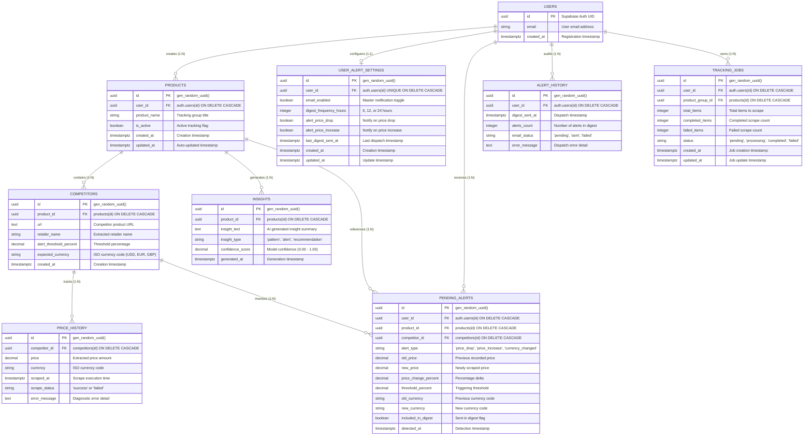

# Database Schema & Persistence Guide

## Overview

PriceHawk utilizes **Supabase PostgreSQL** as its primary persistence and identity engine. The database architecture is designed around strict **multi-tenant isolation** using native PostgreSQL **Row-Level Security (RLS)**, automated timestamp triggers, and high-performance composite indexes.

```
┌────────────────────────────────────────────────────────────────────────────────────────┐
│                               Relational Hierarchy Overview                            │
├────────────────────────────────────────────────────────────────────────────────────────┤
│                                                                                        │
│                                 auth.users (Supabase Identity)                         │
│                                       │                                                │
│        ┌──────────────────────────────┼──────────────────────────────┐                 │
│        ▼                              ▼                              ▼                 │
│     products                 user_alert_settings               alert_history           │
│        │                                                             │                 │
│   ┌────┴────────────────────────┐                                    │                 │
│   ▼                             ▼                                    ▼                 │
│ competitors                  insights                          pending_alerts          │
│   │                                                                  │                 │
│   ▼                                                                  │                 │
│ price_history ◄──────────────────────────────────────────────────────┘                 │
│                                                                                        │
└────────────────────────────────────────────────────────────────────────────────────────┘
```

---

## Entity-Relationship Diagram (ERD)



---

## Data Dictionary & Schema Specifications

### 1. `products`
Root entity representing user-defined tracking groups (e.g., "Flagship Ultrabooks").

| Column | Type | Constraints | Description |
|---|---|---|---|
| `id` | `UUID` | `PRIMARY KEY`, Default `gen_random_uuid()` | Unique product tracking group ID |
| `user_id` | `UUID` | `NOT NULL`, `REFERENCES auth.users(id) ON DELETE CASCADE` | Owner user identifier |
| `product_name` | `VARCHAR(255)` | `NOT NULL` | Human-readable product name |
| `is_active` | `BOOLEAN` | Default `true` | When `false`, excluded from Celery Beat daily scrapes |
| `created_at` | `TIMESTAMPTZ` | Default `now()` | Entity creation timestamp |
| `updated_at` | `TIMESTAMPTZ` | Default `now()` | Auto-updated via PostgreSQL trigger |

### 2. `competitors`
Competitor store listings mapped to a parent product tracking group.

| Column | Type | Constraints | Description |
|---|---|---|---|
| `id` | `UUID` | `PRIMARY KEY`, Default `gen_random_uuid()` | Unique competitor identifier |
| `product_id` | `UUID` | `NOT NULL`, `REFERENCES products(id) ON DELETE CASCADE` | Associated product group |
| `url` | `TEXT` | `NOT NULL` | Full target URL |
| `retailer_name` | `VARCHAR(100)` | Nullable | Extracted domain or retailer name |
| `alert_threshold_percent` | `DECIMAL(5,2)` | Default `10.00` | Percentage price delta required to trigger alert |
| `expected_currency` | `VARCHAR(3)` | Default `'USD'` | Base ISO currency code for price comparisons |
| `created_at` | `TIMESTAMPTZ` | Default `now()` | Registration timestamp |

### 3. `price_history`
Append-only time-series ledger of scraped price observations.

| Column | Type | Constraints | Description |
|---|---|---|---|
| `id` | `UUID` | `PRIMARY KEY`, Default `gen_random_uuid()` | Unique record identifier |
| `competitor_id` | `UUID` | `NOT NULL`, `REFERENCES competitors(id) ON DELETE CASCADE` | Observed competitor |
| `price` | `DECIMAL(10,2)` | Nullable | Normalized price (NULL when scrape fails) |
| `currency` | `VARCHAR(3)` | Default `'USD'` | Currency of scraped price |
| `scraped_at` | `TIMESTAMPTZ` | Default `now()` | Execution timestamp |
| `scrape_status` | `VARCHAR(20)` | `NOT NULL`, `CHECK (scrape_status IN ('success', 'failed'))` | Scrape execution status |
| `error_message` | `TEXT` | Nullable | Detailed failure trace if `failed` |

### 4. `insights`
AI-generated market trends and pricing recommendations produced by Groq Llama 3.3 70B.

| Column | Type | Constraints | Description |
|---|---|---|---|
| `id` | `UUID` | `PRIMARY KEY`, Default `gen_random_uuid()` | Unique insight record ID |
| `product_id` | `UUID` | `NOT NULL`, `REFERENCES products(id) ON DELETE CASCADE` | Analyzed product group |
| `insight_text` | `TEXT` | `NOT NULL` | Sanitized AI recommendation text |
| `insight_type` | `VARCHAR(50)` | `NOT NULL`, `CHECK (insight_type IN ('pattern', 'alert', 'recommendation'))` | Category of insight |
| `confidence_score` | `DECIMAL(3,2)` | `NOT NULL`, `CHECK (confidence_score >= 0.00 AND confidence_score <= 1.00)` | Statistical confidence metric |
| `generated_at` | `TIMESTAMPTZ` | Default `now()` | Generation timestamp |

### 5. `pending_alerts`
Staging queue for detected price movements awaiting digest compilation.

| Column | Type | Constraints | Description |
|---|---|---|---|
| `id` | `UUID` | `PRIMARY KEY`, Default `gen_random_uuid()` | Unique alert ID |
| `user_id` | `UUID` | `NOT NULL`, `REFERENCES auth.users(id) ON DELETE CASCADE` | Recipient user ID |
| `product_id` | `UUID` | `NOT NULL`, `REFERENCES products(id) ON DELETE CASCADE` | Associated product |
| `competitor_id` | `UUID` | `NOT NULL`, `REFERENCES competitors(id) ON DELETE CASCADE` | Associated competitor |
| `alert_type` | `VARCHAR(20)` | `NOT NULL`, `CHECK (alert_type IN ('price_drop', 'price_increase', 'currency_changed'))` | Movement classification |
| `old_price` | `DECIMAL(10,2)` | Nullable | Baseline price |
| `new_price` | `DECIMAL(10,2)` | Nullable | Newly recorded price |
| `price_change_percent` | `DECIMAL(5,2)` | Nullable | Relative percentage change |
| `threshold_percent` | `DECIMAL(5,2)` | Nullable | Trigger threshold at detection |
| `old_currency` | `VARCHAR(3)` | Nullable | Pre-detection currency |
| `new_currency` | `VARCHAR(3)` | Nullable | Detected currency |
| `included_in_digest` | `BOOLEAN` | Default `false` | True once dispatched in an email digest |
| `detected_at` | `TIMESTAMPTZ` | Default `now()` | Detection timestamp |

### 6. `user_alert_settings`
User-level notification delivery preferences and schedule.

| Column | Type | Constraints | Description |
|---|---|---|---|
| `id` | `UUID` | `PRIMARY KEY`, Default `gen_random_uuid()` | Settings identifier |
| `user_id` | `UUID` | `NOT NULL`, `UNIQUE`, `REFERENCES auth.users(id) ON DELETE CASCADE` | Target user (1:1 relationship) |
| `email_enabled` | `BOOLEAN` | Default `true` | Master email notification toggle |
| `digest_frequency_hours` | `INTEGER` | Default `24`, Options: `6, 12, 24` | Batch window frequency in hours |
| `alert_price_drop` | `BOOLEAN` | Default `true` | Enable price drop notifications |
| `alert_price_increase` | `BOOLEAN` | Default `true` | Enable price increase notifications |
| `last_digest_sent_at` | `TIMESTAMPTZ` | Nullable | Timestamp of previous email dispatch |
| `created_at` | `TIMESTAMPTZ` | Default `now()` | Creation timestamp |
| `updated_at` | `TIMESTAMPTZ` | Default `now()` | Modification timestamp |

### 7. `alert_history`
Immutable audit log of all transmitted email digests.

| Column | Type | Constraints | Description |
|---|---|---|---|
| `id` | `UUID` | `PRIMARY KEY`, Default `gen_random_uuid()` | Unique audit log ID |
| `user_id` | `UUID` | `NOT NULL`, `REFERENCES auth.users(id) ON DELETE CASCADE` | Recipient user |
| `digest_sent_at` | `TIMESTAMPTZ` | Default `now()` | Dispatch timestamp |
| `alerts_count` | `INTEGER` | `NOT NULL` | Total alert events compiled into digest |
| `email_status` | `VARCHAR(20)` | Default `'pending'`, `CHECK (email_status IN ('pending', 'sent', 'failed'))` | Delivery status |
| `error_message` | `TEXT` | Nullable | SMTP delivery error message on failure |

---

## Indexing Strategy

High-frequency query paths utilize dedicated B-tree indexes:

```sql
-- Product lookup by tenant & active status (used during Celery Beat daily crawl)
CREATE INDEX IF NOT EXISTS idx_products_user_id ON products(user_id);
CREATE INDEX IF NOT EXISTS idx_products_is_active ON products(is_active);

-- Competitor relation joins
CREATE INDEX IF NOT EXISTS idx_competitors_product_id ON competitors(product_id);

-- Price history time-series queries (charts, latest price lookups, export)
CREATE INDEX IF NOT EXISTS idx_price_history_competitor_id ON price_history(competitor_id);
CREATE INDEX IF NOT EXISTS idx_price_history_scraped_at ON price_history(scraped_at DESC);
CREATE INDEX IF NOT EXISTS idx_price_history_status ON price_history(scrape_status);

-- AI insights lookup by product
CREATE INDEX IF NOT EXISTS idx_insights_product_id ON insights(product_id);
CREATE INDEX IF NOT EXISTS idx_insights_generated_at ON insights(generated_at DESC);

-- Alert queue processing (Celery Beat digest batch job)
CREATE INDEX IF NOT EXISTS idx_pending_alerts_user_id ON pending_alerts(user_id);
CREATE INDEX IF NOT EXISTS idx_pending_alerts_included ON pending_alerts(included_in_digest);
CREATE INDEX IF NOT EXISTS idx_pending_alerts_detected_at ON pending_alerts(detected_at DESC);

-- Audit log indexing
CREATE INDEX IF NOT EXISTS idx_alert_history_user_id ON alert_history(user_id);
CREATE INDEX IF NOT EXISTS idx_alert_history_sent_at ON alert_history(digest_sent_at DESC);
```

---

## Row-Level Security (RLS) & Tenant Isolation

Every table has RLS enabled (`ALTER TABLE <table> ENABLE ROW LEVEL SECURITY;`). Supabase automatically evaluates policies against the authenticated JWT's `auth.uid()`.

```mermaid
flowchart LR
    subgraph ClientRequest["Authenticated HTTP Request"]
        Token["Supabase JWT (claims.sub = user_uuid)"]
    end

    subgraph PostgresEngine["PostgreSQL Engine"]
        RLSCheck{"RLS Policy Check"}
        Allow["Allow Read / Write"]
        Deny["Filter / Reject (0 rows / 403)"]
    end

    Token -->|auth.uid()| RLSCheck
    RLSCheck -->|user_id = auth.uid()| Allow
    RLSCheck -->|user_id != auth.uid()| Deny
```

### 1. Direct Ownership Policies (`products`, `user_alert_settings`, `pending_alerts`, `alert_history`)
Users can only manipulate records explicitly tagged with their `user_id`:
```sql
CREATE POLICY "Users can view own products"
    ON products FOR SELECT
    USING (user_id = auth.uid());

CREATE POLICY "Users can insert own products"
    ON products FOR INSERT
    WITH CHECK (user_id = auth.uid());

CREATE POLICY "Users can update own products"
    ON products FOR UPDATE
    USING (user_id = auth.uid())
    WITH CHECK (user_id = auth.uid());

CREATE POLICY "Users can delete own products"
    ON products FOR DELETE
    USING (user_id = auth.uid());
```

### 2. Join-Based Cascading Policies (`competitors`, `price_history`, `insights`)
Access to child entities is gated by ownership of the ancestor `products` record:
```sql
-- Competitors access policy
CREATE POLICY "Users can view own competitors"
    ON competitors FOR SELECT
    USING (
        product_id IN (
            SELECT id FROM products WHERE user_id = auth.uid()
        )
    );

-- Price History access policy (Read-Only for clients)
CREATE POLICY "Users can view own price history"
    ON price_history FOR SELECT
    USING (
        competitor_id IN (
            SELECT c.id FROM competitors c
            JOIN products p ON c.product_id = p.id
            WHERE p.user_id = auth.uid()
        )
    );
```

### 3. Service Role Privileges (Background Tasks)
Background Celery workers utilize the **Supabase Service Key**, which bypasses RLS at the PostgreSQL connection level. This enables asynchronous workers to write price records, compute AI insights across products, and query pending alerts across all tenants.

---

## Schema Deployment & Verification

To initialize or migrate the database, execute `docs/database_schema.sql` within the Supabase SQL Editor.

### Verification Queries
```sql
-- 1. Verify table presence
SELECT table_name FROM information_schema.tables
WHERE table_schema = 'public'
  AND table_name IN ('products', 'competitors', 'price_history', 'insights', 'pending_alerts', 'user_alert_settings', 'alert_history');

-- 2. Confirm RLS is enabled on all tables
SELECT tablename, rowsecurity FROM pg_tables
WHERE tablename IN ('products', 'competitors', 'price_history', 'insights', 'pending_alerts', 'user_alert_settings', 'alert_history');

-- 3. Verify RLS policies are active
SELECT tablename, policyname, cmd FROM pg_policies
WHERE schemaname = 'public'
ORDER BY tablename, cmd;
```
