# PriceHawk Database Schema & Persistence Guide

This guide documents the relational database architecture, Entity-Relationship (ER) model, data dictionary, indexing strategy, and Row-Level Security (RLS) tenant isolation policies for **PriceHawk**.

---

## 1. Entity-Relationship Diagram (ERD)

The PriceHawk database runs on Supabase (PostgreSQL 15+). All entity relationships enforce cascading deletes (`ON DELETE CASCADE`) to preserve referential integrity when users, tracking groups, or competitors are removed.

```mermaid
erDiagram
    USERS ||--o{ PRODUCTS : "owns (1:N)"
    USERS ||--o{ TRACKING_JOBS : "triggers (1:N)"
    USERS ||--o{ PENDING_ALERTS : "receives (1:N)"
    USERS ||--o| USER_ALERT_SETTINGS : "configures (1:1)"
    USERS ||--o{ ALERT_HISTORY : "logged for (1:N)"

    PRODUCTS ||--o{ COMPETITORS : "contains (1:N)"
    PRODUCTS ||--o{ INSIGHTS : "analyzed into (1:N)"
    PRODUCTS ||--o{ TRACKING_JOBS : "associated with (1:N)"
    PRODUCTS ||--o{ PENDING_ALERTS : "references (1:N)"

    COMPETITORS ||--o{ PRICE_HISTORY : "tracks snapshots (1:N)"
    COMPETITORS ||--o{ PENDING_ALERTS : "triggers (1:N)"

    USERS {
        uuid id PK "auth.users identifier"
        string email "User email address"
        timestamp created_at "Account creation timestamp"
    }

    PRODUCTS {
        uuid id PK "Primary key (gen_random_uuid())"
        uuid user_id FK "References auth.users(id) ON DELETE CASCADE"
        varchar product_name "Group label e.g., 'MacBook Pro 16'"
        boolean is_active "Active tracking flag (default true)"
        timestamptz created_at "Creation timestamp (default now())"
        timestamptz updated_at "Auto-updated via trigger"
    }

    COMPETITORS {
        uuid id PK "Primary key (gen_random_uuid())"
        uuid product_id FK "References products(id) ON DELETE CASCADE"
        text url "Competitor product webpage URL"
        varchar retailer_name "Retailer or domain name"
        decimal alert_threshold_percent "Alert trigger threshold % (default 10.00)"
        varchar expected_currency "ISO currency code e.g. USD (default 'USD')"
        timestamptz created_at "Creation timestamp"
    }

    PRICE_HISTORY {
        uuid id PK "Primary key (gen_random_uuid())"
        uuid competitor_id FK "References competitors(id) ON DELETE CASCADE"
        decimal price "Extracted numerical price (NULL on failure)"
        varchar currency "ISO currency code (default 'USD')"
        timestamptz scraped_at "Snapshot collection timestamp"
        varchar scrape_status "CHECK in ('success', 'failed')"
        text error_message "Failure diagnostics or timeout details"
    }

    INSIGHTS {
        uuid id PK "Primary key (gen_random_uuid())"
        uuid product_id FK "References products(id) ON DELETE CASCADE"
        text insight_text "LLM generated insight analysis"
        varchar insight_type "CHECK in ('pattern', 'alert', 'recommendation')"
        decimal confidence_score "Confidence bound between 0.00 and 1.00"
        timestamptz generated_at "Generation timestamp"
    }

    TRACKING_JOBS {
        uuid id PK "Primary key (gen_random_uuid())"
        uuid user_id FK "References auth.users(id) ON DELETE CASCADE"
        uuid product_group_id FK "References products(id) ON DELETE CASCADE"
        integer total_items "Total items in background job"
        integer completed_items "Completed items count"
        integer failed_items "Failed items count"
        varchar status "CHECK in ('pending', 'processing', 'completed', 'failed')"
        timestamptz created_at "Job creation timestamp"
        timestamptz updated_at "Job update timestamp"
    }

    PENDING_ALERTS {
        uuid id PK "Primary key (gen_random_uuid())"
        uuid user_id FK "References auth.users(id) ON DELETE CASCADE"
        uuid product_id FK "References products(id) ON DELETE CASCADE"
        uuid competitor_id FK "References competitors(id) ON DELETE CASCADE"
        varchar alert_type "CHECK in ('price_drop', 'price_increase', 'currency_changed')"
        decimal old_price "Previous scraped price"
        decimal new_price "Current scraped price"
        decimal price_change_percent "Calculated % delta"
        decimal threshold_percent "Configured alert threshold %"
        varchar old_currency "Prior currency code"
        varchar new_currency "New currency code"
        boolean included_in_digest "Batch dispatch flag (default false)"
        timestamptz detected_at "Detection timestamp"
    }

    USER_ALERT_SETTINGS {
        uuid id PK "Primary key (gen_random_uuid())"
        uuid user_id FK "Unique reference to auth.users(id) ON DELETE CASCADE"
        boolean email_enabled "Master notification switch (default true)"
        integer digest_frequency_hours "Cadence in hours (6, 12, 24; default 24)"
        boolean alert_price_drop "Notify on price decreases (default true)"
        boolean alert_price_increase "Notify on price increases (default true)"
        timestamptz last_digest_sent_at "Timestamp of last dispatched email"
        timestamptz created_at "Created timestamp"
        timestamptz updated_at "Updated timestamp"
    }

    ALERT_HISTORY {
        uuid id PK "Primary key (gen_random_uuid())"
        uuid user_id FK "References auth.users(id) ON DELETE CASCADE"
        timestamptz digest_sent_at "Dispatch timestamp"
        integer alerts_count "Number of alerts consolidated in digest"
        varchar email_status "CHECK in ('pending', 'sent', 'failed')"
        text error_message "SMTP error details if failed"
    }
```



---

## 2. Table Data Dictionaries

### 2.1 `products`
Root entity representing user-defined product tracking groups (e.g., "Apple iPhone 15 Pro").

| Column | Type | Constraints / Default | Description |
| :--- | :--- | :--- | :--- |
| `id` | `UUID` | `PRIMARY KEY DEFAULT gen_random_uuid()` | Unique product identifier. |
| `user_id` | `UUID` | `NOT NULL REFERENCES auth.users(id) ON DELETE CASCADE` | Owner tenant ID. |
| `product_name` | `VARCHAR(255)` | `NOT NULL` | Display name of the product tracking group. |
| `is_active` | `BOOLEAN` | `DEFAULT true` | Soft-delete and active monitoring flag. |
| `created_at` | `TIMESTAMPTZ` | `DEFAULT now()` | Record creation timestamp. |
| `updated_at` | `TIMESTAMPTZ` | `DEFAULT now()` | Auto-updated via `update_updated_at()` trigger. |

---

### 2.2 `competitors`
Monitored competitor product URLs mapped to a parent product group.

| Column | Type | Constraints / Default | Description |
| :--- | :--- | :--- | :--- |
| `id` | `UUID` | `PRIMARY KEY DEFAULT gen_random_uuid()` | Unique competitor identifier. |
| `product_id` | `UUID` | `NOT NULL REFERENCES products(id) ON DELETE CASCADE` | Associated product tracking group. |
| `url` | `TEXT` | `NOT NULL` | Normalized HTTPS product URL. |
| `retailer_name` | `VARCHAR(100)` | `NULL` | Extracted domain name or retailer label. |
| `alert_threshold_percent` | `DECIMAL(5,2)` | `DEFAULT 10.00` | Percentage change required to trigger an alert. |
| `expected_currency` | `VARCHAR(3)` | `DEFAULT 'USD'` | Three-letter ISO currency code. |
| `created_at` | `TIMESTAMPTZ` | `DEFAULT now()` | Record creation timestamp. |

---

### 2.3 `price_history`
Append-only time-series snapshots of competitor prices captured by background scraping workers.

| Column | Type | Constraints / Default | Description |
| :--- | :--- | :--- | :--- |
| `id` | `UUID` | `PRIMARY KEY DEFAULT gen_random_uuid()` | Unique snapshot record ID. |
| `competitor_id` | `UUID` | `NOT NULL REFERENCES competitors(id) ON DELETE CASCADE` | Monitored competitor reference. |
| `price` | `DECIMAL(10,2)`| `NULL` | Numerical price extracted (NULL if scrape failed). |
| `currency` | `VARCHAR(3)` | `DEFAULT 'USD'` | ISO 4217 currency code. |
| `scraped_at` | `TIMESTAMPTZ` | `DEFAULT now()` | Precise timestamp of scrape execution. |
| `scrape_status` | `VARCHAR(20)` | `NOT NULL CHECK (scrape_status IN ('success', 'failed'))` | Scrape outcome status. |
| `error_message` | `TEXT` | `NULL` | Diagnostic details on failure (e.g. timeout, selector miss). |

---

### 2.4 `insights`
AI-synthesized competitive pricing intelligence generated via Groq Llama 3.3 70B.

| Column | Type | Constraints / Default | Description |
| :--- | :--- | :--- | :--- |
| `id` | `UUID` | `PRIMARY KEY DEFAULT gen_random_uuid()` | Unique insight identifier. |
| `product_id` | `UUID` | `NOT NULL REFERENCES products(id) ON DELETE CASCADE` | Target product group analyzed. |
| `insight_text` | `TEXT` | `NOT NULL` | Synthesized market narrative or tactical recommendation. |
| `insight_type` | `VARCHAR(50)` | `NOT NULL CHECK (insight_type IN ('pattern', 'alert', 'recommendation'))` | Category of insight. |
| `confidence_score`| `DECIMAL(3,2)`| `NOT NULL CHECK (confidence_score >= 0.00 AND confidence_score <= 1.00)` | Statistical confidence metric. |
| `generated_at` | `TIMESTAMPTZ` | `DEFAULT now()` | Generation timestamp. |

---

### 2.5 `tracking_jobs`
State and counter tracking for asynchronous multi-item store tracking batches.

| Column | Type | Constraints / Default | Description |
| :--- | :--- | :--- | :--- |
| `id` | `UUID` | `PRIMARY KEY DEFAULT gen_random_uuid()` | Unique job execution ID. |
| `user_id` | `UUID` | `NOT NULL REFERENCES auth.users(id) ON DELETE CASCADE` | Job initiator. |
| `product_group_id`| `UUID` | `REFERENCES products(id) ON DELETE CASCADE` | Target product group. |
| `total_items` | `INTEGER` | `NOT NULL` | Total competitor items to process. |
| `completed_items`| `INTEGER` | `DEFAULT 0` | Successfully processed items count. |
| `failed_items` | `INTEGER` | `DEFAULT 0` | Failed items count. |
| `status` | `VARCHAR(20)` | `DEFAULT 'pending' CHECK (status IN ('pending', 'processing', 'completed', 'failed'))` | Execution state. |
| `created_at` | `TIMESTAMPTZ` | `DEFAULT now()` | Job enqueued time. |
| `updated_at` | `TIMESTAMPTZ` | `DEFAULT now()` | Last progress update time. |

---

### 2.6 `pending_alerts`
Price fluctuation events queued for inclusion in the user's next scheduled email digest.

| Column | Type | Constraints / Default | Description |
| :--- | :--- | :--- | :--- |
| `id` | `UUID` | `PRIMARY KEY DEFAULT gen_random_uuid()` | Unique alert ID. |
| `user_id` | `UUID` | `NOT NULL REFERENCES auth.users(id) ON DELETE CASCADE` | Recipient user ID. |
| `product_id` | `UUID` | `NOT NULL REFERENCES products(id) ON DELETE CASCADE` | Associated product. |
| `competitor_id` | `UUID` | `NOT NULL REFERENCES competitors(id) ON DELETE CASCADE` | Source competitor. |
| `alert_type` | `VARCHAR(20)` | `NOT NULL CHECK (alert_type IN ('price_drop', 'price_increase', 'currency_changed'))` | Event classification. |
| `old_price` | `DECIMAL(10,2)`| `NULL` | Price prior to scrape. |
| `new_price` | `DECIMAL(10,2)`| `NULL` | Price after scrape. |
| `price_change_percent`| `DECIMAL(5,2)`| `NULL` | Delta percentage: `((new - old) / old) * 100`. |
| `threshold_percent` | `DECIMAL(5,2)` | `NULL` | Threshold configured when triggered. |
| `old_currency` | `VARCHAR(3)` | `NULL` | Previous ISO currency. |
| `new_currency` | `VARCHAR(3)` | `NULL` | New detected ISO currency. |
| `included_in_digest` | `BOOLEAN` | `DEFAULT false` | Flag set to true once dispatched in email. |
| `detected_at` | `TIMESTAMPTZ` | `DEFAULT now()` | Fluctuation detection timestamp. |

---

### 2.7 `user_alert_settings`
User notification preferences and email frequency configurations.

| Column | Type | Constraints / Default | Description |
| :--- | :--- | :--- | :--- |
| `id` | `UUID` | `PRIMARY KEY DEFAULT gen_random_uuid()` | Unique setting record ID. |
| `user_id` | `UUID` | `NOT NULL UNIQUE REFERENCES auth.users(id) ON DELETE CASCADE` | 1:1 mapped user ID. |
| `email_enabled` | `BOOLEAN` | `DEFAULT true` | Master notification switch. |
| `digest_frequency_hours`| `INTEGER`| `DEFAULT 24` | Consolidation interval in hours (6, 12, 24). |
| `alert_price_drop` | `BOOLEAN` | `DEFAULT true` | Notify on price drops. |
| `alert_price_increase` | `BOOLEAN`| `DEFAULT true` | Notify on price increases. |
| `last_digest_sent_at` | `TIMESTAMPTZ` | `NULL` | Timestamp of last sent digest email. |
| `created_at` | `TIMESTAMPTZ` | `DEFAULT now()` | Setting creation timestamp. |
| `updated_at` | `TIMESTAMPTZ` | `DEFAULT now()` | Setting update timestamp. |

---

### 2.8 `alert_history`
Historical audit log of sent alert digest emails.

| Column | Type | Constraints / Default | Description |
| :--- | :--- | :--- | :--- |
| `id` | `UUID` | `PRIMARY KEY DEFAULT gen_random_uuid()` | Unique log ID. |
| `user_id` | `UUID` | `NOT NULL REFERENCES auth.users(id) ON DELETE CASCADE` | Recipient user ID. |
| `digest_sent_at`| `TIMESTAMPTZ` | `DEFAULT now()` | Sent timestamp. |
| `alerts_count` | `INTEGER` | `NOT NULL` | Number of alerts batched in the email. |
| `email_status` | `VARCHAR(20)` | `DEFAULT 'pending' CHECK (email_status IN ('pending', 'sent', 'failed'))` | Delivery status. |
| `error_message` | `TEXT` | `NULL` | SMTP error message if failed. |

---

## 3. Database Indexes

Indexes are optimized for real-time dashboard lookups, daily background scraping batch queries, and time-series chart slicing:

```sql
-- Products
CREATE INDEX IF NOT EXISTS idx_products_user_id ON products(user_id);
CREATE INDEX IF NOT EXISTS idx_products_is_active ON products(is_active);

-- Competitors
CREATE INDEX IF NOT EXISTS idx_competitors_product_id ON competitors(product_id);

-- Price History
CREATE INDEX IF NOT EXISTS idx_price_history_competitor_id ON price_history(competitor_id);
CREATE INDEX IF NOT EXISTS idx_price_history_scraped_at ON price_history(scraped_at DESC);
CREATE INDEX IF NOT EXISTS idx_price_history_status ON price_history(scrape_status);

-- AI Insights
CREATE INDEX IF NOT EXISTS idx_insights_product_id ON insights(product_id);
CREATE INDEX IF NOT EXISTS idx_insights_generated_at ON insights(generated_at DESC);

-- Tracking Jobs
CREATE INDEX IF NOT EXISTS idx_tracking_jobs_user_id ON tracking_jobs(user_id);
CREATE INDEX IF NOT EXISTS idx_tracking_jobs_status ON tracking_jobs(status);
CREATE INDEX IF NOT EXISTS idx_tracking_jobs_product_group_id ON tracking_jobs(product_group_id);

-- Pending Alerts
CREATE INDEX IF NOT EXISTS idx_pending_alerts_user_id ON pending_alerts(user_id);
CREATE INDEX IF NOT EXISTS idx_pending_alerts_included ON pending_alerts(included_in_digest);
CREATE INDEX IF NOT EXISTS idx_pending_alerts_detected_at ON pending_alerts(detected_at DESC);

-- User Alert Settings & History
CREATE INDEX IF NOT EXISTS idx_user_alert_settings_user_id ON user_alert_settings(user_id);
CREATE INDEX IF NOT EXISTS idx_alert_history_user_id ON alert_history(user_id);
CREATE INDEX IF NOT EXISTS idx_alert_history_sent_at ON alert_history(digest_sent_at DESC);
```

---

## 4. Row-Level Security (RLS) & Tenant Isolation

Row-Level Security is strictly enforced on all public schema tables in PostgreSQL. All client queries run with an authenticated user JWT (`auth.uid()`).

```
┌─────────────────────────────────────────────────────────────────────────────┐
│                            RLS Isolation Hierarchy                          │
├─────────────────────────────────────────────────────────────────────────────┤
│                                                                             │
│   auth.users (auth.uid())                                                   │
│        │                                                                    │
│        ├──► products (WHERE user_id = auth.uid())                           │
│        │         │                                                          │
│        │         ├──► competitors (WHERE product_id IN (products))          │
│        │         │         │                                                │
│        │         │         └──► price_history (competitor_id IN (competitors))│
│        │         │                                                          │
│        │         └──► insights (WHERE product_id IN (products))             │
│        │                                                                    │
│        ├──► user_alert_settings (WHERE user_id = auth.uid())                │
│        ├──► pending_alerts (WHERE user_id = auth.uid())                     │
│        └──► alert_history (WHERE user_id = auth.uid())                      │
│                                                                             │
└─────────────────────────────────────────────────────────────────────────────┘
```

### 4.1 Policy Definitions

#### `products` Table Policies
- **SELECT**: `user_id = auth.uid()`
- **INSERT**: `WITH CHECK (user_id = auth.uid())`
- **UPDATE**: `USING (user_id = auth.uid()) WITH CHECK (user_id = auth.uid())`
- **DELETE**: `USING (user_id = auth.uid())`

#### `competitors` Table Policies
- **SELECT**: Accessible if competitor's `product_id` belongs to a product owned by `auth.uid()`.
- **INSERT**: `WITH CHECK (product_id IN (SELECT id FROM products WHERE user_id = auth.uid()))`
- **UPDATE / DELETE**: Restricted to competitors linked to user's products.

#### `price_history` Table Policies
- **SELECT**: Read-only access for users via `competitor_id -> product_id -> user_id = auth.uid()`.
- **INSERT / UPDATE / DELETE**: No public policies granted. Mutations are executed exclusively by the background Celery worker using the Supabase Service Role Key (`sb_service_key`), preventing arbitrary price injection by clients.

#### `insights` Table Policies
- **SELECT**: Read-only access for users via product ownership.
- **INSERT**: Service role write policy (`WITH CHECK (true)`).
- **DELETE**: Users can delete insights for their owned products.

---

## 5. Schema Deployment & Migration Procedure

1. Log in to the [Supabase Console](https://app.supabase.com) and navigate to the **SQL Editor**.
2. Paste the complete contents of `docs/database_schema.sql`.
3. Execute the script. The script is idempotent and safe to re-run.
4. Verify deployment using the built-in validation query:
   ```sql
   SELECT table_name, rowsecurity 
   FROM pg_tables 
   WHERE schemaname = 'public' 
     AND tablename IN ('products', 'competitors', 'price_history', 'insights', 'pending_alerts');
   ```
