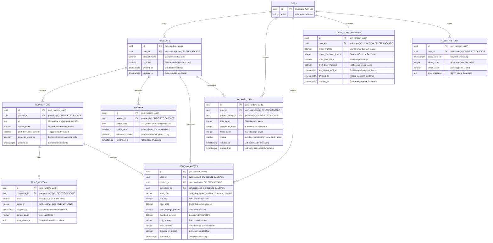

# PriceHawk — Database Schema & Persistence Guide

This document provides a comprehensive technical reference for the relational data model, Mermaid Entity-Relationship diagrams, column data dictionaries, index optimizations, cascading rules, and PostgreSQL Row-Level Security (RLS) policies powering **PriceHawk**.

---

## Table of Contents

1. [Database Architecture & Overview](#1-database-architecture--overview)
2. [Mermaid Entity-Relationship Diagram](#2-mermaid-entity-relationship-diagram)
3. [Data Dictionaries & Table Schemas](#3-data-dictionaries--table-schemas)
4. [Indexes & Performance Optimization](#4-indexes--performance-optimization)
5. [Row-Level Security (RLS) & Multi-Tenant Isolation](#5-row-level-security-rls--multi-tenant-isolation)
6. [Database Triggers & Idempotent Migrations](#6-database-triggers--idempotent-migrations)

---

## 1. Database Architecture & Overview

PriceHawk utilizes **Supabase Managed PostgreSQL** as its primary persistence engine. The schema is optimized for multi-tenant isolation, high-frequency append-only time-series price points, and scheduled digest alerting.

### Core Architectural Decisions

- **Primary Keys**: Universally Unique Identifiers (`UUID`) generated via `gen_random_uuid()` to prevent enumeration attacks and enable client-side ID pre-generation.
- **Time Representation**: All timestamps utilize `TIMESTAMP WITH TIME ZONE` (`TIMESTAMPTZ`), anchored to UTC (`now()`).
- **Precision Currency & Pricing**: Financial prices and threshold percentages are stored as `DECIMAL(10,2)` and `DECIMAL(5,2)` to eliminate floating-point rounding errors.
- **Cascading Integrity**: Foreign keys from user-owned parent records cascade on delete (`ON DELETE CASCADE`), ensuring zero orphaned competitor, price, alert, or insight records upon product or user removal.

---

## 2. Mermaid Entity-Relationship Diagram



---

## 3. Data Dictionaries & Table Schemas

### 3.1 `products`
The core aggregate root representing a tracked product group or specific item catalog.

| Column | Type | Nullable | Default | Constraints & Foreign Keys | Description |
|---|---|---|---|---|---|
| `id` | `UUID` | No | `gen_random_uuid()` | `PRIMARY KEY` | Unique identifier for the product group. |
| `user_id` | `UUID` | No | None | `REFERENCES auth.users(id) ON DELETE CASCADE` | Tenant owner identifier. |
| `product_name` | `VARCHAR(255)` | No | None | None | Display name of the product group. |
| `is_active` | `BOOLEAN` | Yes | `true` | None | Soft-delete flag; inactive products are excluded from daily scraping. |
| `created_at` | `TIMESTAMPTZ` | Yes | `now()` | None | Entity creation timestamp. |
| `updated_at` | `TIMESTAMPTZ` | Yes | `now()` | Trigger updated | Auto-updated on record modification. |

---

### 3.2 `competitors`
Competitor endpoints and retailer URLs monitored under a parent product group.

| Column | Type | Nullable | Default | Constraints & Foreign Keys | Description |
|---|---|---|---|---|---|
| `id` | `UUID` | No | `gen_random_uuid()` | `PRIMARY KEY` | Unique identifier for the competitor entry. |
| `product_id` | `UUID` | No | None | `REFERENCES products(id) ON DELETE CASCADE` | Parent product group reference. |
| `url` | `TEXT` | No | None | Valid HTTPS URL | Target competitor product page URL. |
| `retailer_name` | `VARCHAR(100)` | Yes | None | None | Normalized domain name (e.g. `amazon.com`). |
| `alert_threshold_percent` | `DECIMAL(5,2)` | Yes | `10.00` | `CHECK (>= 0 AND <= 100)` | Minimum price delta percentage triggering an alert. |
| `expected_currency` | `VARCHAR(3)` | Yes | `'USD'` | None | Standard 3-letter ISO currency code. |
| `created_at` | `TIMESTAMPTZ` | Yes | `now()` | None | Timestamp when competitor tracking was enrolled. |

---

### 3.3 `price_history`
Append-only time-series recording point-in-time price observations.

| Column | Type | Nullable | Default | Constraints & Foreign Keys | Description |
|---|---|---|---|---|---|
| `id` | `UUID` | No | `gen_random_uuid()` | `PRIMARY KEY` | Unique observation identifier. |
| `competitor_id` | `UUID` | No | None | `REFERENCES competitors(id) ON DELETE CASCADE` | Competitor link. |
| `price` | `DECIMAL(10,2)` | Yes | None | None | Extracted price value (NULL if scrape failed). |
| `currency` | `VARCHAR(3)` | Yes | `'USD'` | None | Detected ISO currency code. |
| `scraped_at` | `TIMESTAMPTZ` | Yes | `now()` | None | Timestamp of the scrape execution. |
| `scrape_status` | `VARCHAR(20)` | No | None | `CHECK (IN ('success', 'failed'))` | Scrape execution outcome. |
| `error_message` | `TEXT` | Yes | None | None | Diagnostic error trace if scrape failed. |

---

### 3.4 `insights`
AI-synthesized price trend patterns, market summaries, and pricing recommendations.

| Column | Type | Nullable | Default | Constraints & Foreign Keys | Description |
|---|---|---|---|---|---|
| `id` | `UUID` | No | `gen_random_uuid()` | `PRIMARY KEY` | Unique insight identifier. |
| `product_id` | `UUID` | No | None | `REFERENCES products(id) ON DELETE CASCADE` | Parent product reference. |
| `insight_text` | `TEXT` | No | None | Max 500 chars | Actionable insight text generated by LLM. |
| `insight_type` | `VARCHAR(50)` | No | None | `CHECK (IN ('pattern', 'alert', 'recommendation'))` | Category classification. |
| `confidence_score` | `DECIMAL(3,2)` | No | None | `CHECK (>= 0.00 AND <= 1.00)` | Statistical confidence metric. |
| `generated_at` | `TIMESTAMPTZ` | Yes | `now()` | None | Generation timestamp. |

---

### 3.5 `tracking_jobs`
Progress tracking state for asynchronous background store discovery and tracking operations.

| Column | Type | Nullable | Default | Constraints & Foreign Keys | Description |
|---|---|---|---|---|---|
| `id` | `UUID` | No | `gen_random_uuid()` | `PRIMARY KEY` | Unique job identifier. |
| `user_id` | `UUID` | No | None | `REFERENCES auth.users(id) ON DELETE CASCADE` | Submitting tenant identifier. |
| `product_group_id` | `UUID` | Yes | None | `REFERENCES products(id) ON DELETE CASCADE` | Optional associated product group. |
| `total_items` | `INTEGER` | No | None | `CHECK (total_items >= 0)` | Total number of items in batch. |
| `completed_items` | `INTEGER` | Yes | `0` | `CHECK (completed_items >= 0)` | Count of successfully processed items. |
| `failed_items` | `INTEGER` | Yes | `0` | `CHECK (failed_items >= 0)` | Count of failed items. |
| `status` | `VARCHAR(20)` | Yes | `'pending'` | `CHECK (IN ('pending', 'processing', 'completed', 'failed'))` | Current lifecycle state. |
| `created_at` | `TIMESTAMPTZ` | Yes | `now()` | None | Job submission timestamp. |
| `updated_at` | `TIMESTAMPTZ` | Yes | `now()` | Trigger updated | Last progress update timestamp. |

---

### 3.6 `pending_alerts`
Staged price change events awaiting batching into user digest emails.

| Column | Type | Nullable | Default | Constraints & Foreign Keys | Description |
|---|---|---|---|---|---|
| `id` | `UUID` | No | `gen_random_uuid()` | `PRIMARY KEY` | Unique alert event identifier. |
| `user_id` | `UUID` | No | None | `REFERENCES auth.users(id) ON DELETE CASCADE` | Recipient tenant identifier. |
| `product_id` | `UUID` | No | None | `REFERENCES products(id) ON DELETE CASCADE` | Related product group. |
| `competitor_id` | `UUID` | No | None | `REFERENCES competitors(id) ON DELETE CASCADE` | Related competitor. |
| `alert_type` | `VARCHAR(20)` | No | None | `CHECK (IN ('price_drop', 'price_increase', 'currency_changed'))` | Trigger event classification. |
| `old_price` | `DECIMAL(10,2)` | Yes | None | None | Prior observation price. |
| `new_price` | `DECIMAL(10,2)` | Yes | None | None | New observation price. |
| `price_change_percent` | `DECIMAL(5,2)` | Yes | None | None | Computed delta percentage. |
| `threshold_percent` | `DECIMAL(5,2)` | Yes | None | None | Trigger threshold at detection time. |
| `old_currency` | `VARCHAR(3)` | Yes | None | None | Currency code prior to change. |
| `new_currency` | `VARCHAR(3)` | Yes | None | None | Newly detected currency code. |
| `included_in_digest` | `BOOLEAN` | Yes | `false` | None | True once dispatched in an email digest. |
| `detected_at` | `TIMESTAMPTZ` | Yes | `now()` | None | Detection observation timestamp. |

---

### 3.7 `user_alert_settings`
User notification preferences and delivery schedule configuration.

| Column | Type | Nullable | Default | Constraints & Foreign Keys | Description |
|---|---|---|---|---|---|
| `id` | `UUID` | No | `gen_random_uuid()` | `PRIMARY KEY` | Unique configuration row identifier. |
| `user_id` | `UUID` | No | None | `UNIQUE REFERENCES auth.users(id) ON DELETE CASCADE` | One-to-one user configuration mapping. |
| `email_enabled` | `BOOLEAN` | Yes | `true` | None | Master toggle for email delivery. |
| `digest_frequency_hours` | `INTEGER` | Yes | `24` | `CHECK (IN (6, 12, 24))` | Digest interval in hours. |
| `alert_price_drop` | `BOOLEAN` | Yes | `true` | None | Flag to alert on competitor price drops. |
| `alert_price_increase` | `BOOLEAN` | Yes | `true` | None | Flag to alert on competitor price increases. |
| `last_digest_sent_at` | `TIMESTAMPTZ` | Yes | None | None | Timestamp when last digest email was dispatched. |
| `created_at` | `TIMESTAMPTZ` | Yes | `now()` | None | Record creation timestamp. |
| `updated_at` | `TIMESTAMPTZ` | Yes | `now()` | Trigger updated | Last settings modification timestamp. |

---

### 3.8 `alert_history`
Immutable audit log recording sent digest emails and transmission status.

| Column | Type | Nullable | Default | Constraints & Foreign Keys | Description |
|---|---|---|---|---|---|
| `id` | `UUID` | No | `gen_random_uuid()` | `PRIMARY KEY` | Unique audit record identifier. |
| `user_id` | `UUID` | No | None | `REFERENCES auth.users(id) ON DELETE CASCADE` | Recipient tenant identifier. |
| `digest_sent_at` | `TIMESTAMPTZ` | Yes | `now()` | None | Dispatch timestamp. |
| `alerts_count` | `INTEGER` | No | None | `CHECK (alerts_count >= 0)` | Total price alerts batched in digest. |
| `email_status` | `VARCHAR(20)` | Yes | `'pending'` | `CHECK (IN ('pending', 'sent', 'failed'))` | Delivery status from SMTP transport. |
| `error_message` | `TEXT` | Yes | None | None | SMTP diagnostic details if failed. |

---

## 4. Indexes & Performance Optimization

PriceHawk defines targeted B-Tree indexes to accelerate common queries, foreign key joins, and time-series ranges:

```sql
-- Products Indexes
CREATE INDEX IF NOT EXISTS idx_products_user_id ON products(user_id);
CREATE INDEX IF NOT EXISTS idx_products_is_active ON products(is_active);

-- Competitors Indexes
CREATE INDEX IF NOT EXISTS idx_competitors_product_id ON competitors(product_id);

-- Price History Indexes
CREATE INDEX IF NOT EXISTS idx_price_history_competitor_id ON price_history(competitor_id);
CREATE INDEX IF NOT EXISTS idx_price_history_scraped_at ON price_history(scraped_at DESC);
CREATE INDEX IF NOT EXISTS idx_price_history_status ON price_history(scrape_status);

-- Insights Indexes
CREATE INDEX IF NOT EXISTS idx_insights_product_id ON insights(product_id);
CREATE INDEX IF NOT EXISTS idx_insights_generated_at ON insights(generated_at DESC);

-- Tracking Jobs Indexes
CREATE INDEX IF NOT EXISTS idx_tracking_jobs_user_id ON tracking_jobs(user_id);
CREATE INDEX IF NOT EXISTS idx_tracking_jobs_status ON tracking_jobs(status);
CREATE INDEX IF NOT EXISTS idx_tracking_jobs_product_group_id ON tracking_jobs(product_group_id);

-- Pending Alerts Indexes
CREATE INDEX IF NOT EXISTS idx_pending_alerts_user_id ON pending_alerts(user_id);
CREATE INDEX IF NOT EXISTS idx_pending_alerts_included ON pending_alerts(included_in_digest);
CREATE INDEX IF NOT EXISTS idx_pending_alerts_detected_at ON pending_alerts(detected_at DESC);

-- User Alert Settings Indexes
CREATE INDEX IF NOT EXISTS idx_user_alert_settings_user_id ON user_alert_settings(user_id);

-- Alert History Indexes
CREATE INDEX IF NOT EXISTS idx_alert_history_user_id ON alert_history(user_id);
CREATE INDEX IF NOT EXISTS idx_alert_history_sent_at ON alert_history(digest_sent_at DESC);
```

### Query Performance Rationale

1. `idx_products_user_id` & `idx_products_is_active`: Ensures instantaneous dashboard loading and optimizes the daily Celery task filter `WHERE is_active = true`.
2. `idx_price_history_scraped_at DESC` & `idx_price_history_competitor_id`: Powers chart time-series queries (`WHERE competitor_id IN (...) ORDER BY scraped_at DESC LIMIT N`) without sequential table scans.
3. `idx_pending_alerts_included`: Accelerates the hourly digest runner filtering on `included_in_digest = false`.

---

## 5. Row-Level Security (RLS) & Multi-Tenant Isolation

Row-Level Security (RLS) is activated across all tables to guarantee cryptographic tenant separation at the storage engine level.

### 5.1 RLS Activation

```sql
ALTER TABLE products ENABLE ROW LEVEL SECURITY;
ALTER TABLE competitors ENABLE ROW LEVEL SECURITY;
ALTER TABLE price_history ENABLE ROW LEVEL SECURITY;
ALTER TABLE insights ENABLE ROW LEVEL SECURITY;
ALTER TABLE tracking_jobs ENABLE ROW LEVEL SECURITY;
```

### 5.2 Tenant Isolation Policies

#### Products Table
```sql
CREATE POLICY "Users can view own products"
    ON products FOR SELECT
    USING (user_id = auth.uid());

CREATE POLICY "Users can insert own products"
    ON products FOR INSERT
    WITH CHECK (user_id = auth.uid());

CREATE POLICY "Users can update own products"
    ON products FOR UPDATE
    USING (user_id = auth.uid())
    WITH CHECK (user_id = auth.uid());

CREATE POLICY "Users can delete own products"
    ON products FOR DELETE
    USING (user_id = auth.uid());
```

#### Competitors Table (Cascaded via Product Ownership)
```sql
CREATE POLICY "Users can view own competitors"
    ON competitors FOR SELECT
    USING (
        product_id IN (
            SELECT id FROM products WHERE user_id = auth.uid()
        )
    );

CREATE POLICY "Users can insert own competitors"
    ON competitors FOR INSERT
    WITH CHECK (
        product_id IN (
            SELECT id FROM products WHERE user_id = auth.uid()
        )
    );

CREATE POLICY "Users can update own competitors"
    ON competitors FOR UPDATE
    USING (
        product_id IN (
            SELECT id FROM products WHERE user_id = auth.uid()
        )
    )
    WITH CHECK (
        product_id IN (
            SELECT id FROM products WHERE user_id = auth.uid()
        )
    );

CREATE POLICY "Users can delete own competitors"
    ON competitors FOR DELETE
    USING (
        product_id IN (
            SELECT id FROM products WHERE user_id = auth.uid()
        )
    );
```

#### Price History Table (Read-Only for Users)
```sql
CREATE POLICY "Users can view own price history"
    ON price_history FOR SELECT
    USING (
        competitor_id IN (
            SELECT c.id FROM competitors c
            JOIN products p ON c.product_id = p.id
            WHERE p.user_id = auth.uid()
        )
    );
```

#### Insights Table
```sql
CREATE POLICY "Users can view own insights"
    ON insights FOR SELECT
    USING (
        product_id IN (
            SELECT id FROM products WHERE user_id = auth.uid()
        )
    );

CREATE POLICY "Service can insert insights"
    ON insights FOR INSERT
    WITH CHECK (true);

CREATE POLICY "Users can delete own insights"
    ON insights FOR DELETE
    USING (
        product_id IN (
            SELECT id FROM products WHERE user_id = auth.uid()
        )
    );
```

### 5.3 Service Role vs User Context

- **User JWT Access**: Applies `auth.uid()` evaluation; any attempt to query, mutate, or delete records owned by another tenant returns zero rows or raises an authorization error.
- **Service Role Access (`SB_SERVICE_KEY`)**: Bypasses RLS to execute cross-tenant background worker duties (such as Celery Beat daily price collection, AI synthesis storage, and alert digest dispatching).

---

## 6. Database Triggers & Idempotent Migrations

### 6.1 Automated `updated_at` Trigger

```sql
CREATE OR REPLACE FUNCTION update_updated_at()
RETURNS TRIGGER AS $$
BEGIN
  NEW.updated_at = now();
  RETURN NEW;
END;
$$ LANGUAGE plpgsql;

DROP TRIGGER IF EXISTS products_updated_at ON products;
CREATE TRIGGER products_updated_at
  BEFORE UPDATE ON products
  FOR EACH ROW EXECUTE FUNCTION update_updated_at();
```

### 6.2 Executing the Initialization Migration

To initialize or migrate a Supabase database instance:
1. Open the **SQL Editor** in the Supabase Dashboard.
2. Load and execute the complete script located at [`docs/database_schema.sql`](database_schema.sql).
3. The script is fully idempotent using `CREATE TABLE IF NOT EXISTS`, `DROP POLICY IF EXISTS`, and `CREATE OR REPLACE FUNCTION` statements.
