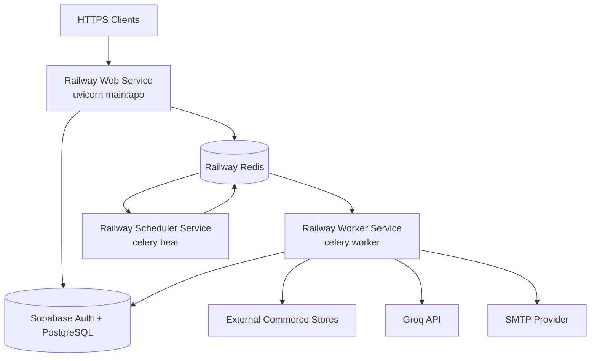

# PriceHawk Deployment and Operations Runbook

## Navigation

- [Deployment Topology](#deployment-topology)
- [Docker Image](#docker-image)
- [Docker Compose](#docker-compose)
- [Railway Production Deployment](#railway-production-deployment)
- [Supabase Integration and Migration](#supabase-integration-and-migration)
- [Environment Variables and Secrets](#environment-variables-and-secrets)
- [Verification](#verification)
- [Troubleshooting](#troubleshooting)

## Deployment Topology



## Docker Image

[`../Dockerfile`](../Dockerfile) builds a Python 3.13 slim production image with:

- uv-based dependency installation in a builder stage.
- Playwright Chromium system libraries and browser installation.
- Non-root `pricehawk` runtime user.
- `main:app` uvicorn default command.
- Health check against `/api/health`.

Build locally:

```bash
docker build -t pricehawk:local .
docker run --env-file .env -p 8000:8000 pricehawk:local
```

## Docker Compose

[`../docker-compose.yml`](../docker-compose.yml) runs the production process set locally:

| Service | Purpose | Command/port |
| --- | --- | --- |
| `api` | FastAPI app | Port `8000`, health check `/api/health` |
| `redis` | Celery broker/result backend | Port `6379`, persistent `redis_data` volume |
| `celery-worker` | Executes scrape/digest tasks | `celery -A app.tasks.celery_app worker --loglevel=info` |
| `celery-beat` | Runs schedules | `celery -A app.tasks.celery_app beat --loglevel=info` |

Run:

```bash
docker compose up --build
```

Inspect:

```bash
docker compose ps
docker compose logs -f api
docker compose logs -f celery-worker
docker compose logs -f celery-beat
```

## Railway Production Deployment

Railway should run separate services from the same repository/image:

| Railway service | Start command | Required dependencies |
| --- | --- | --- |
| Web | `uvicorn main:app --host 0.0.0.0 --port $PORT` | Redis, Supabase env, optional Groq/SMTP |
| Celery worker | `celery -A app.tasks.celery_app worker --loglevel=info` | Redis, Supabase env, optional Groq/SMTP |
| Celery beat | `celery -A app.tasks.celery_app beat --loglevel=info` | Redis, Supabase env, optional Groq/SMTP |
| Redis | Railway Redis plugin | Referenced by `REDIS_URL` |

[`../Procfile`](../Procfile), when present, should use the same `main:app` import path as the Dockerfile and local launcher. If deploying through Railway Dockerfile detection, configure worker and beat as custom start commands.

Recommended Railway steps:

1. Create a new Railway project from the GitHub repository.
2. Add a Railway Redis instance.
3. Configure the Web service variables from [Environment Variables and Secrets](#environment-variables-and-secrets).
4. Add a second service from the same repository for the Celery worker and set its custom start command.
5. Add a third service for Celery Beat and set its custom start command.
6. Reference the same `REDIS_URL` and Supabase secrets in all three services.
7. Deploy and verify `/api/health`, `/api/docs`, worker logs, and Beat schedule logs.

## Supabase Integration and Migration

1. Create a Supabase project.
2. Copy [`database_schema.sql`](database_schema.sql) into the SQL editor and execute it.
3. Verify the tables, indexes, trigger, and RLS policies described in [Database](DATABASE.md).
4. Configure Supabase Auth email templates for signup, password reset, and email change workflows.
5. Store keys in Railway/Compose environment variables:
   - `SB_URL`
   - `SB_ANON_KEY`
   - `SB_SERVICE_KEY`
   - `SB_JWT_SECRET`
6. Never expose `SB_SERVICE_KEY` to browser JavaScript or client-side templates.

## Environment Variables and Secrets

| Variable | Required | Used by | Notes |
| --- | --- | --- | --- |
| `SB_URL` | Yes | API and workers | Supabase project URL. |
| `SB_ANON_KEY` | Yes | API | User-scoped Supabase client. |
| `SB_SERVICE_KEY` | Yes | API backend and workers | Service-role writes and worker scans; keep secret. |
| `SB_JWT_SECRET` | Yes | API | JWT verification. |
| `REDIS_URL` | Yes | API, worker, beat | Redis broker/result backend. |
| `DEBUG` | Production: `false` | API | Controls logging, CORS default, and HSTS header. |
| `GROQ_API_KEY` | Optional unless AI is enabled | API/workers | Required for insight generation. |
| `SMTP_HOST` | Optional unless email is enabled | Workers/API alert test | SMTP server hostname. |
| `SMTP_PORT` | Optional | Workers/API alert test | Defaults to `587`. |
| `SMTP_USERNAME` | Optional | Workers/API alert test | Provider username, e.g. `resend`. |
| `SMTP_PASSWORD` | Optional unless email is enabled | Workers/API alert test | Provider API key/password. |
| `FROM_EMAIL` | Optional unless email is enabled | Workers/API alert test | Verified sender. |
| `FROM_NAME` | Optional | Workers/API alert test | Defaults to `PriceHawk Alerts`. |
| `MAX_PRODUCTS_FETCH` | Optional | Discovery services | Raises/lower API-backed catalog fetch limit. |

Secret management rules:

- Store production values in Railway variables or an equivalent secrets manager.
- Keep `.env` local only.
- Rotate `SB_SERVICE_KEY`, SMTP credentials, and Groq key after any accidental exposure.
- Use separate Supabase projects for development/staging/production.

## Verification

After deployment:

```bash
curl https://<service-domain>/api/health
```

Expected:

```json
{"status":"healthy"}
```

Then verify:

1. Swagger UI loads at `/api/docs`.
2. Login succeeds through `/api/auth/login`.
3. `GET /api/auth/me` returns the current user with a bearer token.
4. `POST /api/stores/discover` returns normalized products for a known test store.
5. `POST /api/scraper/scrape/manual/{product_id}` returns `202` and a task ID.
6. `/api/scraper/scrape/worker-health` reports a healthy worker.
7. Worker logs show successful scrape task execution.
8. Beat logs show registered schedules.
9. Supabase contains `price_history` rows after a scrape.
10. If configured, `/api/alerts/test` sends a test email.

## Troubleshooting

| Symptom | Likely cause | Fix |
| --- | --- | --- |
| Web service fails at import with missing settings | Required `SB_*` values absent | Add all required settings to the service environment. |
| `/api/scraper/scrape/worker-health` says offline | Worker not running or wrong `REDIS_URL` | Start worker service and ensure it references the same Redis instance. |
| Manual scrape queues but never completes | Worker cannot reach stores, Redis, or Supabase | Inspect worker logs and network egress settings. |
| Playwright errors in production | Browser or system libraries missing | Use the provided Dockerfile; rebuild image. |
| AI insight generation returns 500 | `GROQ_API_KEY` missing or provider error | Configure key and inspect API logs. |
| Test email fails | SMTP variables missing or sender unverified | Configure provider credentials and verified `FROM_EMAIL`. |
| Cross-user data unexpectedly visible in direct Supabase access | Missing RLS policy on exposed table | Review [Database RLS](DATABASE.md#row-level-security) and add equivalent policies before exposing table. |

Related guides: [Architecture](ARCHITECTURE.md), [Workers](WORKERS.md), [Development](DEVELOPMENT.md).
