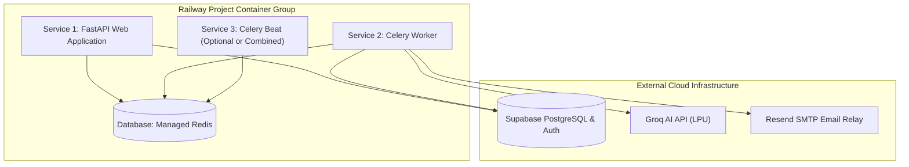

# Deployment & Operations Runbook

## Overview

This guide provides exhaustive operational runbooks for deploying, maintaining, and scaling the PriceHawk production infrastructure across **Docker / Docker Compose** and managed cloud platforms like **Railway** and **Supabase**.

```
┌─────────────────────────────────────────────────────────────────────────────────────────┐
│                               Production Deployment Topology                            │
├─────────────────────────────────────────────────────────────────────────────────────────┤
│                                                                                         │
│                      [ Cloudflare / Reverse Proxy / SSL Termination ]                   │
│                                              │                                          │
│                         ┌────────────────────┴────────────────────┐                     │
│                         ▼                                         ▼                     │
│          [ Web Service (FastAPI) ]                     [ Celery Worker Pool ]           │
│          Container / Railway Web                       Container / Railway Worker       │
│                         │                                         │                     │
│                         ▼                                         ▼                     │
│               [ Managed Redis 7 ] ◄───────────────────────────────┘                     │
│                (Broker / Caching)                                                       │
│                         │                                                               │
│                         ▼                                                               │
│            [ Supabase PostgreSQL + Auth ]                                               │
│                (Database / RLS Engine)                                                  │
│                                                                                         │
└─────────────────────────────────────────────────────────────────────────────────────────┘
```

---

## Environment Variables & Secret Checklist

Production configuration is strictly driven via environment variables:

| Variable | Required | Default / Example | Purpose / Description |
|---|---|---|---|
| `SB_URL` | **Yes** | `https://xyzcompany.supabase.co` | Supabase project API root URL |
| `SB_ANON_KEY` | **Yes** | `eyJhbGciOi...` | Supabase anonymous public API key (used for client requests) |
| `SB_SERVICE_KEY` | **Yes** | `eyJhbGciOi...` | Supabase service role secret key (bypasses RLS for workers) |
| `SB_JWT_SECRET` | **Yes** | `your-supabase-jwt-secret` | Supabase JWT secret for cryptographic verification |
| `REDIS_URL` | **Yes** | `redis://redis:6379/0` | Connection string for Celery broker and result backend |
| `DEBUG` | **Yes** | `false` | Set to `false` in production (disables CORS `*`, enables HSTS) |
| `GROQ_API_KEY` | No | `gsk_...` | Groq API key for Llama 3.3 70B AI price synthesis |
| `MAX_PRODUCTS_FETCH` | No | `500` | Maximum catalog items to retrieve per discovery execution |
| `SMTP_HOST` | No | `smtp.resend.com` | Outbound SMTP relay host |
| `SMTP_PORT` | No | `587` | Outbound SMTP port |
| `SMTP_USERNAME` | No | `resend` | Outbound SMTP username |
| `SMTP_PASSWORD` | No | `re_...` | Outbound SMTP password / Resend API key |
| `FROM_EMAIL` | No | `alerts@yourdomain.com` | Sender address for price digest notifications |
| `FROM_NAME` | No | `PriceHawk Alerts` | Display sender name |

---

## Docker & Docker Compose Deployment

The repository contains a production-hardened multi-stage `Dockerfile` and `docker-compose.yml` service specification.

### 1. Multi-Stage Dockerfile Highlights (`Dockerfile`)
- **Stage 1 (Builder)**: Uses `uv` to resolve and install Python 3.13 dependencies into an isolated virtual environment (`/app/.venv`) without lingering build dependencies.
- **Stage 2 (Production)**: Uses `python:3.13-slim`, installs Chromium OS dependencies for Playwright (`libnss3`, `libgbm1`, `libasound2`, etc.), provisions a non-privileged system user (`pricehawk:1000`), pre-installs Chromium binaries, and executes health checks.

### 2. Multi-Container Orchestration (`docker-compose.yml`)

The compose manifest spins up 4 coordinated services:
1. `api`: The FastAPI web server on port 8000.
2. `redis`: Redis 7 Alpine message broker with persistent volume storage.
3. `celery-worker`: Background worker processing scraping and AI tasks.
4. `celery-beat`: Scheduler triggering cron tasks (2:00 AM daily scrape, hourly email digests).

### 3. Quickstart Commands

```bash
# 1. Initialize environment configuration
cp .env.example .env
# Edit .env with your Supabase credentials

# 2. Build and launch services in detached mode
docker compose up -d --build

# 3. Stream service logs
docker compose logs -f

# 4. Verify system health
curl http://localhost:8000/api/health
# {"status":"healthy"}

# 5. Scale Celery workers
docker compose up -d --scale celery-worker=3

# 6. Teardown
docker compose down
```

---

## Railway Production Deployment

Railway provides an optimal PaaS deployment topology for PriceHawk with zero server management overhead.



### Step 1: Initialize Project & Add Redis
1. Navigate to [railway.app](https://railway.app) and create a **New Project**.
2. Add a **Redis Database** (`+ New` ➔ `Database` ➔ `Redis`).

### Step 2: Deploy Web Service (`FastAPI`)
1. Add a new service from your GitHub repository (`dreww01/pricehawk`).
2. Railway detects the `Dockerfile` and builds the image automatically.
3. Under **Variables**, configure:
   - `REDIS_URL`: Reference variable `${{Redis.REDIS_URL}}`.
   - `SB_URL`, `SB_ANON_KEY`, `SB_SERVICE_KEY`, `SB_JWT_SECRET`.
   - `DEBUG`: `false`.
   - `GROQ_API_KEY`: Your Groq API key.
4. Under **Settings** ➔ **Networking**, click **Generate Domain** to expose the public endpoint.

### Step 3: Deploy Background Worker (`Celery Worker`)
1. Add another service from the same GitHub repository (`+ New` ➔ `GitHub Repo`).
2. Go to **Settings** ➔ **Deploy** ➔ **Custom Start Command**:
   ```bash
   celery -A app.tasks.celery_app worker --loglevel=info
   ```
3. Attach the same environment variables (`REDIS_URL` reference, Supabase keys, Groq key, SMTP credentials).

### Step 4: Deploy Beat Scheduler (`Celery Beat`)
1. Add another service from the GitHub repository (`+ New` ➔ `GitHub Repo`).
2. Set the **Custom Start Command**:
   ```bash
   celery -A app.tasks.celery_app beat --loglevel=info
   ```
3. Attach the same environment variables.

---

## Supabase Database Initialization & Migration

1. Create a project at [supabase.com](https://supabase.com).
2. Navigate to the **SQL Editor** tab.
3. Paste and execute the entire contents of `docs/database_schema.sql`.
4. Verify all tables, indexes, and RLS policies using the built-in validation script:
   ```sql
   SELECT table_name FROM information_schema.tables
   WHERE table_schema = 'public'
     AND table_name IN ('products', 'competitors', 'price_history', 'insights', 'pending_alerts', 'user_alert_settings', 'alert_history');
   ```

---

## Operational Monitoring & Health Checks

### 1. Ingress Health Endpoint
- **URL**: `GET /api/health`
- **Expected Status**: `200 OK` (`{"status":"healthy"}`)
- **Usage**: Used by Docker health checks and load balancers.

### 2. Distributed Worker Health Endpoint
- **URL**: `GET /api/scraper/scrape/worker-health`
- **Expected Status**: `200 OK` (`{"worker_status": "online", "active_workers": 2, "broker_status": "connected"}`)
- **Usage**: Diagnostic monitoring for Redis and Celery pool responsiveness.

### 3. Structured Logging & Auditing
- Logs are output to `stdout` in structured format:
  ```
  2026-09-03 02:00:00,120 | INFO | app.tasks.scraper_tasks | Starting daily crawl for 45 active products
  ```
- Unhandled HTTP 500 exceptions generate an opaque 8-character `error_id` returned to clients while printing full stack traces to server logs for OWASP-compliant diagnostic tracing.
