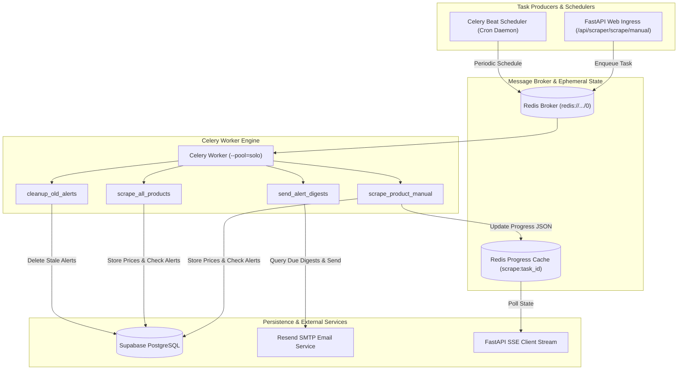

# PriceHawk Background Workers & Queue Management

This document details the asynchronous task queue architecture, scheduling topology, retry mechanisms, worker pools, and progress streaming for **PriceHawk**.

---

## 1. Asynchronous Architecture & Topology

PriceHawk utilizes **Celery** with **Redis** as both its message broker and result/progress state backend.



---

## 2. Celery Beat Periodic Schedules

The Celery Beat scheduler continuously evaluates cron rules and enqueues maintenance and collection jobs to Redis:

| Task Name | Task Target | Cron Expression | Cadence | Purpose |
| :--- | :--- | :--- | :--- | :--- |
| `daily-scrape-all-products` | `app.tasks.scraper_tasks.scrape_all_products` | `crontab(hour=2, minute=0)` | Daily @ 02:00 UTC | Collects fresh price snapshots for all active products across all users. |
| `hourly-send-alert-digests` | `app.tasks.scraper_tasks.send_alert_digests` | `crontab(minute=0)` | Hourly @ :00 | Evaluates user digest schedules (6h, 12h, 24h) and dispatches consolidated emails. |
| `daily-cleanup-old-alerts` | `app.tasks.scraper_tasks.cleanup_old_alerts` | `crontab(hour=3, minute=0)` | Daily @ 03:00 UTC | Purges processed pending alerts older than 7 days to maintain database health. |

---

## 3. Worker Task Inventory

### 3.1 `scrape_product_manual(product_id)`
- **Trigger:** Initiated by user via `POST /api/scraper/scrape/manual/{product_id}`.
- **Progress Tracking:** Updates Redis key `scrape:{task_id}` on every competitor scrape with `{status, completed, total, current, results, error}`.
- **TTL:** Ephemeral progress keys have a 300-second (5 minute) expiration window.

### 3.2 `scrape_all_products()`
- **Trigger:** Scheduled by Celery Beat at 2:00 AM UTC.
- **Batching:** Iterates active products in batches of 50 (`BATCH_SIZE = 50`) to maintain bounded memory consumption.
- **Idempotency Check:** Evaluates `_was_scraped_today(client, competitor_id)` prior to dispatching network requests to eliminate duplicate daily snapshots.

### 3.3 `send_alert_digests()`
- **Trigger:** Scheduled by Celery Beat every hour.
- **Execution Logic:**
  1. Queries users where `email_enabled = true` and `(now - last_digest_sent_at) >= digest_frequency_hours`.
  2. Batches pending alerts (up to 50 alerts per email).
  3. Sends multipart HTML/Text emails via `EmailService`.
  4. Updates `pending_alerts.included_in_digest = true` and logs to `alert_history`.

### 3.4 `cleanup_old_alerts()`
- **Trigger:** Scheduled by Celery Beat at 3:00 AM UTC.
- **Execution Logic:** Deletes rows in `pending_alerts` where `included_in_digest = true` and `detected_at < NOW() - INTERVAL '7 days'`.

---

## 4. Execution Guarantees & Resiliency

### 4.1 Time Limits & Task Acknowledgment
```python
# app/tasks/celery_app.py
celery_app.conf.update(
    task_acks_late=True,                 # Acknowledge message only AFTER execution finishes
    task_reject_on_worker_lost=True,     # Re-queue task if worker process abruptly terminates
    task_soft_time_limit=270,            # 4.5 minutes: raises SoftTimeLimitExceeded for clean exit
    task_time_limit=300,                 # 5.0 minutes: SIGKILL sent to rogue child process
    result_expires=86400,                # Clean results after 24 hours
)
```

### 4.2 Concurrency Pools & Headless Browser Safety
- **Local & Container Default:** `--pool=solo`
  - Playwright and Chromium headless browser subprocesses on macOS and Windows require non-forked process trees to avoid `ProactorEventLoop` deadlock.
  - Single-concurrency solo worker guarantees hermetic browser session cleanup.
- **Production Scale:** For high-throughput worker nodes, scale horizontally by launching multiple independent Celery worker containers rather than using `prefork` with shared memory.

### 4.3 Idempotency Strategy
```python
def _was_scraped_today(client, competitor_id: str) -> bool:
    """Ensure at most one successful daily scrape per competitor."""
    today_start = _get_today_start_utc()
    result = (
        client.table("price_history")
        .select("id")
        .eq("competitor_id", competitor_id)
        .gte("scraped_at", today_start)
        .limit(1)
        .execute()
    )
    return bool(result.data)
```

---

## 5. Operations & Monitoring Commands

### Running Worker Locally
```bash
# Start worker with solo pool
uv run celery -A app.tasks.celery_app worker --loglevel=info --pool=solo

# Start beat scheduler
uv run celery -A app.tasks.celery_app beat --loglevel=info
```

### Checking Worker Health via API
```bash
curl http://localhost:8000/api/scraper/scrape/worker-health
# {"worker_status":"healthy","ping_response":"pong","active_tasks":0,"error":null}
```
