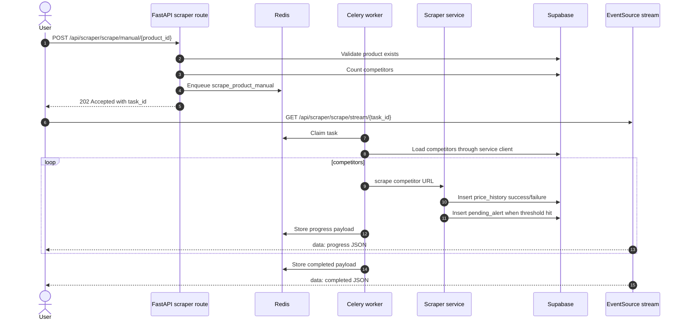

# PriceHawk Background Workers and Queue Management

## Navigation

- [Topology](#topology)
- [Celery Configuration](#celery-configuration)
- [Task Inventory](#task-inventory)
- [Manual Scrape Flow](#manual-scrape-flow)
- [Beat Schedule](#beat-schedule)
- [Retries, Backoff, and Idempotency](#retries-backoff-and-idempotency)
- [Failure Handling and Dead-Letter Expectations](#failure-handling-and-dead-letter-expectations)
- [Operational Commands](#operational-commands)

## Topology

```mermaid
flowchart LR
    API[FastAPI API\n/api/scraper/scrape/manual] -->|delay(product_id)| Redis[(Redis Broker + Result Backend)]
    Beat[Celery Beat\napp.tasks.celery_app] -->|scheduled messages| Redis
    Redis --> Worker1[Celery Worker]
    Redis --> Worker2[Optional Additional Worker]
    Worker1 --> DB[(Supabase PostgreSQL)]
    Worker2 --> DB
    Worker1 --> Stores[External Storefronts]
    Worker2 --> Stores
    Worker1 --> Groq[Groq API]
    Worker1 --> SMTP[SMTP Email]
```

The worker system is defined by:

- `app/tasks/celery_app.py` for broker/backend settings, serializers, time limits, reliability settings, and Beat schedule.
- `app/tasks/scraper_tasks.py` for scrape, digest, and cleanup task bodies.
- `docker-compose.yml` for local `redis`, `celery-worker`, and `celery-beat` services.

## Celery Configuration

| Setting | Value | Production purpose |
| --- | --- | --- |
| Broker | `settings.celery_broker_url` -> `REDIS_URL` | Queue transport. |
| Result backend | `settings.celery_result_backend` -> `REDIS_URL` | Task results and progress integration. |
| Serializer | JSON only | Portable and safe payload format. |
| Timezone | UTC | Deterministic schedules. |
| `task_acks_late` | `true` | Acknowledge after successful task execution. |
| `task_reject_on_worker_lost` | `true` | Requeue work if the worker process disappears. |
| Soft time limit | 270 seconds | Task receives timeout signal before hard kill. |
| Hard time limit | 300 seconds | Prevents permanently stuck scrapes. |
| Result expiry | 24 hours | Keeps Redis bounded. |

## Task Inventory

| Task | Producer | Responsibility |
| --- | --- | --- |
| `scrape_product_manual` | API route `POST /api/scraper/scrape/manual/{product_id}` | Scrape every competitor in one product group and publish progress for SSE consumers. |
| `scrape_all_products` | Celery Beat daily schedule | Find active products and run recurring price collection. |
| `send_alert_digests` | Celery Beat hourly schedule | Send users due for digest emails and mark included alerts. |
| `cleanup_old_alerts` | Celery Beat daily schedule | Remove processed/expired alert rows to keep alert tables bounded. |

## Manual Scrape Flow



## Beat Schedule

| Schedule name | Task | Cron | Purpose |
| --- | --- | --- | --- |
| `daily-scrape-all-products` | `app.tasks.scraper_tasks.scrape_all_products` | `0 2 * * *` UTC | Capture daily price history for all active product groups. |
| `hourly-send-alert-digests` | `app.tasks.scraper_tasks.send_alert_digests` | hourly at minute `0` | Send 6/12/24-hour digest emails when users are due. |
| `daily-cleanup-old-alerts` | `app.tasks.scraper_tasks.cleanup_old_alerts` | `0 3 * * *` UTC | Cleanup processed alert rows after the retention window. |

## Retries, Backoff, and Idempotency

Production expectations for worker code:

1. Scrape tasks should retry transient network and storefront failures with exponential backoff where the task implementation declares retries.
2. Stored `price_history` rows include `scrape_status` so failed attempts remain visible rather than disappearing.
3. Digest sending uses `included_in_digest` and `last_digest_sent_at` to avoid duplicate emails.
4. Email failures leave pending alerts unprocessed so a later hourly digest can retry.
5. Worker time limits bound hung browser sessions, slow storefronts, and network stalls.

Recommended retry profile for future task additions:

```python
@celery_app.task(bind=True, max_retries=3, default_retry_delay=60)
def task(self, *args):
    try:
        ...
    except TransientError as exc:
        raise self.retry(exc=exc, countdown=60 * (2 ** self.request.retries))
```

## Failure Handling and Dead-Letter Expectations

The current Redis/Celery topology does not declare a separate broker-level dead-letter queue. Production operations should treat exhausted retries and task time-limit failures as dead-letter-equivalent events that require alerting and manual review.

Minimum production alerting expectations:

| Signal | Recommended action |
| --- | --- |
| Worker health returns `offline` or `error` from `/api/scraper/scrape/worker-health` | Page/on-call or restart worker process. |
| Repeated `scrape_status='failed'` for the same competitor | Review scraper selectors, site blocking, Playwright fallback, and network policy. |
| Digest task records `email_status='failed'` | Check SMTP credentials, provider quota, and email formatting. |
| Redis memory growth or result expiry pressure | Lower result retention or provision larger Redis instance. |
| Task hard time limits | Inspect storefront latency, browser leaks, and retry rates. |

For a dedicated dead-letter queue, add a broker transport that supports DLQ semantics or route terminal failures into an explicit `failed_tasks` table from task error handlers. Do not silently drop failed tasks.

## Operational Commands

Local Docker Compose:

```bash
docker compose up --build

docker compose logs -f celery-worker

docker compose logs -f celery-beat
```

Local process debugging:

```bash
uv run celery -A app.tasks.celery_app worker --loglevel=info --pool=solo
uv run celery -A app.tasks.celery_app beat --loglevel=info
```

Worker health endpoint:

```bash
curl http://localhost:8000/api/scraper/scrape/worker-health
```

Related guides: [Architecture](ARCHITECTURE.md), [Deployment](DEPLOYMENT.md), [Database](DATABASE.md).
