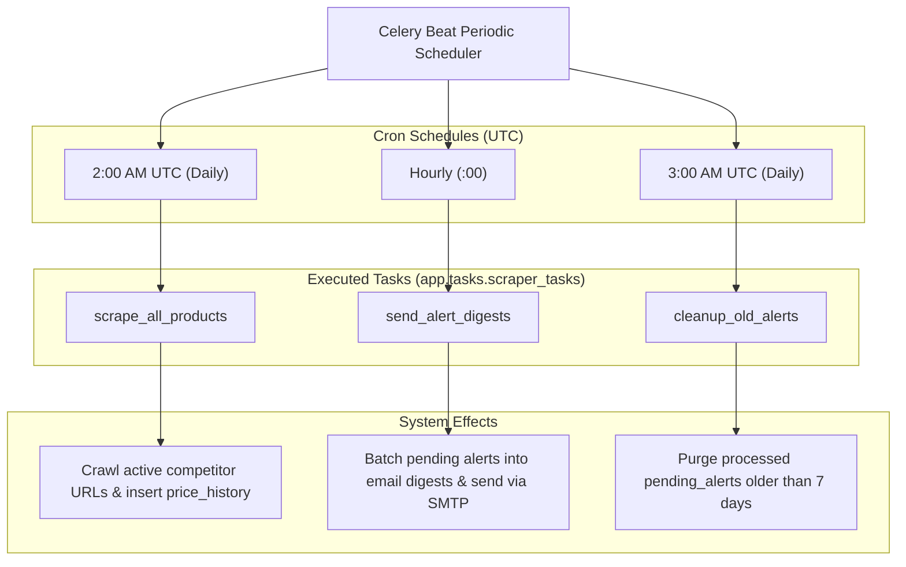

# Background Workers & Queue Management Guide

## Overview

PriceHawk utilizes **Celery** backed by **Redis** to execute asynchronous, non-blocking background operations. The distributed worker tier powers scheduled daily competitor crawls, real-time manual scrape progress tracking via Server-Sent Events (SSE), hourly email digest aggregation, and database maintenance cleanup routines.

```
┌─────────────────────────────────────────────────────────────────────────────────────────┐
│                                Background Task Topology                                │
├─────────────────────────────────────────────────────────────────────────────────────────┤
│                                                                                         │
│  [ Celery Beat Scheduler ] ──(Cron Triggers)──┐                                         │
│                                               ▼                                         │
│  [ FastAPI Manual Triggers ] ──(Enqueue)──► [ Redis 7 Broker ]                          │
│                                               │                                         │
│                     ┌─────────────────────────┴─────────────────────────┐               │
│                     ▼                                                   ▼               │
│          [ Celery Worker Pool #1 ]                           [ Celery Worker Pool #2 ]  │
│                     │                                                   │               │
│        ┌────────────┼────────────┐                         ┌────────────┼────────────┐  │
│        ▼            ▼            ▼                         ▼            ▼            ▼  │
│    [Scraping]   [AI Insights] [Digests]                [Scraping]   [AI Insights] [Digests]
│                                                                                         │
└─────────────────────────────────────────────────────────────────────────────────────────┘
```

---

## Topology & Broker Architecture

### 1. Redis Broker & Result Backend (`app/core/config.py`)
- **Connection**: `redis_url` defaults to `redis://localhost:6379/0` (development) or `${{Redis.REDIS_URL}}` (production).
- **TTL Cache**: Redis handles in-memory scrape progress key-value pairs (`scrape:{task_id}`) with a 300-second (5-minute) TTL to power real-time SSE streams.
- **Serialization**: Strictly configured with JSON payload serialization (`task_serializer="json"`, `result_serializer="json"`).

### 2. Worker Concurrency & Execution Pools
- **Production (Linux/Docker)**: Defaults to standard `prefork` or `gevent`/`eventlet` pools capable of executing concurrent async scraper tasks.
- **Development (macOS/Windows)**: Uses `--pool=solo` or `--pool=threads` to prevent platform-specific fork issues.

---

## Celery Beat Periodic Scheduler

The Celery Beat daemon (`celery -A app.tasks.celery_app beat`) manages automated periodic cron schedules defined in `app/tasks/celery_app.py`:



### Schedule Configuration Matrix

| Task Name | Target Function | Schedule | Description |
|---|---|---|---|
| `daily-scrape-all-products` | `app.tasks.scraper_tasks.scrape_all_products` | `0 2 * * *` (2:00 AM UTC) | Iterates through all active products and scrapes competitor prices |
| `hourly-send-alert-digests` | `app.tasks.scraper_tasks.send_alert_digests` | `0 * * * *` (Hourly at :00) | Identifies users due for digests (6h, 12h, 24h) and sends batched emails |
| `daily-cleanup-old-alerts` | `app.tasks.scraper_tasks.cleanup_old_alerts` | `0 3 * * *` (3:00 AM UTC) | Removes processed pending alerts older than 7 days to maintain database health |

---

## Task Execution Workflows

### 1. Daily Crawl Task (`scrape_all_products`)
1. Fetches all products where `is_active = true` using the Supabase Service Key.
2. Batches competitor URLs in groups of `50` (`BATCH_SIZE = 50`) to control memory consumption and prevent upstream rate-limiting.
3. Invokes `_was_scraped_today(client, competitor_id)` as an **idempotency guard**:
   ```python
   def _was_scraped_today(client, competitor_id: str) -> bool:
       today_start = _get_today_start_utc()
       result = client.table("price_history")\
           .select("id")\
           .eq("competitor_id", competitor_id)\
           .gte("scraped_at", today_start)\
           .limit(1)\
           .execute()
       return bool(result.data)
   ```
4. Scrapes new prices, persists records to `price_history`, and checks if price shifts violate alert thresholds.

### 2. Manual Scrape Task (`scrape_product_manual`)
1. Receives `product_id` and unique Celery `task_id`.
2. Initializes progress state in Redis at `scrape:{task_id}`.
3. Iteratively fetches prices for each competitor in the product group, publishing real-time incremental updates to Redis after each completion.
4. Updates final state to `completed` or `error`.

### 3. Digest Dispatch Task (`send_alert_digests`)
1. Queries `user_alert_settings` where `email_enabled = true`.
2. Computes if `(now - last_digest_sent_at) >= digest_frequency_hours` (supports 6, 12, and 24-hour windows).
3. Fetches un-dispatched records from `pending_alerts` (`included_in_digest = false`), capping at 50 alerts per email.
4. Renders responsive HTML/plain-text templates and transmits via `EmailService`.
5. On success: Marks alerts as `included_in_digest = true`, records an entry in `alert_history`, and updates `last_digest_sent_at`.
6. On failure: Logs error in `alert_history` with `email_status = 'failed'`, leaving alerts pending for automatic retry during the next hourly cycle.

---

## Reliability, Timeouts & Error Recovery

Celery configuration in `app/tasks/celery_app.py` enforces strict operational guarantees:

```python
celery_app.conf.update(
    task_acks_late=True,
    task_reject_on_worker_lost=True,
    task_soft_time_limit=270,  # 4.5 minutes soft limit
    task_time_limit=300,       # 5.0 minutes hard kill
    result_expires=86400,      # Results expire after 24 hours
)
```

### 1. Late Acknowledgments & Worker Loss Recovery
- `task_acks_late=True`: Tasks are acknowledged only **after** successful completion. If a worker process crashes mid-scrape, the broker requeues the task for another worker.
- `task_reject_on_worker_lost=True`: If worker execution fails due to a SIGKILL or hardware fault, the task is rejected and returned to the queue.

### 2. Execution Timeouts (Soft & Hard Limits)
- **Soft Time Limit (270s / 4.5 min)**: Triggers `SoftTimeLimitExceeded` inside the Python task, allowing the worker to cleanly close browser sessions, record partial failure states, and release Redis locks.
- **Hard Time Limit (300s / 5.0 min)**: Hard SIGKILL enforced by the Celery supervisor to prevent runaway Playwright browser subprocesses from consuming host memory.

### 3. Exponential Backoff & Retry Strategy
`scrape_single_competitor` uses Celery's built-in automatic retry mechanism rather than a hand-written `self.retry(...)` block:
```python
@celery_app.task(
    bind=True,
    max_retries=3,
    autoretry_for=(Exception,),
    retry_backoff=60,
    retry_backoff_max=240,
    retry_jitter=False,
)
def scrape_single_competitor(self, competitor_id: str) -> dict:
    ...
```

Operational behavior:

| Setting | Value | Effect |
|---|---:|---|
| `autoretry_for` | `(Exception,)` | Any unhandled exception from the task body is retried automatically. |
| `max_retries` | `3` | Celery may run the initial attempt plus up to three retry attempts. |
| `retry_backoff` | `60` | The first retry is delayed by 60 seconds. |
| `retry_backoff_max` | `240` | Retry delay is capped at 240 seconds. |
| `retry_jitter` | `False` | Delays are deterministic rather than randomized. |

With these settings, scraper failures retry on the documented `60s -> 120s -> 240s` schedule before the task is marked failed.

---

## Operational Commands

### Starting the Worker Daemon
```bash
# Production (Linux)
celery -A app.tasks.celery_app worker --loglevel=info --concurrency=4

# Development (macOS / Windows)
celery -A app.tasks.celery_app worker --loglevel=info --pool=solo
```

### Starting the Beat Scheduler
```bash
celery -A app.tasks.celery_app beat --loglevel=info
```

### Inspecting Queue & Worker State
```bash
# Ping active workers
celery -A app.tasks.celery_app inspect ping

# View active running tasks
celery -A app.tasks.celery_app inspect active

# View scheduled/reserved tasks
celery -A app.tasks.celery_app inspect reserved

# View registered tasks
celery -A app.tasks.celery_app inspect registered
```
