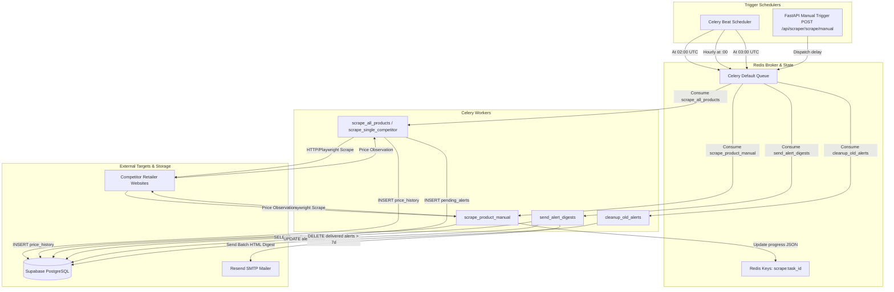

# PriceHawk — Background Workers & Queue Management

This document provides a comprehensive technical reference for the background asynchronous task processing, Celery worker topology, Redis message broker architecture, periodic schedules, retry strategies, and real-time Server-Sent Events (SSE) progress tracking in **PriceHawk**.

---

## Table of Contents

1. [Worker Topology & Architecture Overview](#1-worker-topology--architecture-overview)
2. [Task Flow & Broker Interaction (Mermaid Flowchart)](#2-task-flow--broker-interaction-mermaid-flowchart)
3. [Celery Configuration & Execution Controls](#3-celery-configuration--execution-controls)
4. [Celery Beat Periodic Schedules](#4-celery-beat-periodic-schedules)
5. [Task Implementation & Workflows](#5-task-implementation--workflows)
6. [Reliability, Idempotency & Fault Tolerance](#6-reliability-idempotency--fault-tolerance)
7. [Worker Monitoring & Health Checks](#7-worker-monitoring--health-checks)

---

## 1. Worker Topology & Architecture Overview

PriceHawk utilizes **Celery** backed by **Redis** to execute high-latency I/O operations outside the critical path of the FastAPI request-response lifecycle.

```
┌─────────────────────────────────────────────────────────────┐
│                    FastAPI Web Application                  │
│   Ingress Endpoints | Manual Scrape Trigger | Health Checks │
└──────────────┬───────────────────────────────▲──────────────┘
               │                               │
       Dispatch Async Tasks            SSE Stream Polling
               │                               │
               ▼                               │
┌──────────────────────────────────────────────┴──────────────┐
│                  Redis In-Memory Broker                     │
│    Celery Task Queues | Result Backend | SSE Progress Keys  │
└──────────────┬───────────────────────────────▲──────────────┘
               │                               │
        Consume Messages               Publish Progress
               │                               │
               ▼                               │
┌──────────────────────────────────────────────┴──────────────┐
│                     Celery Worker Pool                      │
│   Headless Scraping | Change Detection | Digest Dispatcher  │
└──────────────────────────────┬──────────────────────────────┘
                               │
               PostgreSQL Persistence (Service Key)
                               │
                               ▼
┌─────────────────────────────────────────────────────────────┐
│                 Supabase PostgreSQL Database                │
│    products | competitors | price_history | pending_alerts   │
└─────────────────────────────────────────────────────────────┘
```

### Key Architectural Components

- **Message Broker (`REDIS_URL`)**: Transport layer managing task distribution, queue prioritization, and worker heartbeats.
- **Result Backend**: Stores task return payloads and Celery async results with a 24-hour expiration (`result_expires=86400`).
- **Real-Time State Channel**: Dedicated Redis keys (`scrape:{task_id}`) with 5-minute TTLs used to coordinate SSE event streams between Celery workers and FastAPI web servers.
- **Beat Scheduler**: Clock process triggering cron-like periodic tasks across distributed workers.

---

## 2. Task Flow & Broker Interaction (Mermaid Flowchart)



---

## 3. Celery Configuration & Execution Controls

Celery settings are centralized in `app/tasks/celery_app.py`:

```python
celery_app.conf.update(
    # Serialization & Character Sets
    task_serializer="json",
    accept_content=["json"],
    result_serializer="json",
    timezone="UTC",
    enable_utc=True,

    # Reliability & Delivery Invariants
    task_acks_late=True,
    task_reject_on_worker_lost=True,

    # Execution Bounds
    task_soft_time_limit=270,  # 4.5 minutes (raises SoftTimeLimitExceeded)
    task_time_limit=300,       # 5.0 minutes (terminates worker process)

    # Result Retention
    result_expires=86400,      # 24 hours in seconds
)
```

### Execution Controls Explained

- **Late Acknowledgement (`task_acks_late=True`)**: Tasks are acknowledged *after* successful execution rather than immediately upon dequeue. If a worker process crashes mid-scrape, the task is re-queued for another worker.
- **Worker Loss Rejection (`task_reject_on_worker_lost=True`)**: If a child process is killed by the OS (e.g., OOM killer during Playwright execution), the task is rejected back to the broker.
- **Time Limits**: `task_soft_time_limit=270` allows running tasks to perform graceful cleanup before `task_time_limit=300` forces process termination.

---

## 4. Celery Beat Periodic Schedules

The Celery Beat scheduler triggers three recurring maintenance and monitoring jobs:

| Task Identifier | Cron Schedule | Target Task | Description |
|---|---|---|---|
| `daily-scrape-all-products` | `0 2 * * *` (02:00 UTC) | `app.tasks.scraper_tasks.scrape_all_products` | Iterates over all active products in batches of 50, executing scraping and price delta checks. |
| `hourly-send-alert-digests` | `0 * * * *` (Hourly @ :00) | `app.tasks.scraper_tasks.send_alert_digests` | Evaluates user digest frequencies (6h, 12h, 24h), compiling pending alerts into emails. |
| `daily-cleanup-old-alerts` | `0 3 * * *` (03:00 UTC) | `app.tasks.scraper_tasks.cleanup_old_alerts` | Purges delivered pending alert rows older than 7 days to maintain database lean state. |

---

## 5. Task Implementation & Workflows

### 5.1 Manual Scrape with Real-Time Progress (`scrape_product_manual`)

- **Trigger**: User clicks "Get Current Prices" in UI or calls `POST /api/scraper/scrape/manual/{product_id}`.
- **Execution**:
  1. Retrieves all competitor URLs associated with the product group.
  2. Initializes progress state in Redis under `scrape:{task_id}`:
     ```json
     {"status": "scraping", "completed": 0, "total": 3, "current": "amazon.com"}
     ```
  3. Iteratively executes scraping across competitor targets.
  4. Stores prices directly into PostgreSQL `price_history` using the service client.
  5. Updates Redis state after each competitor observation.
  6. Emits final completed payload with observed prices and status metadata.
- **Client Consumption**: The frontend connects via Server-Sent Events (`GET /api/scraper/scrape/stream/{task_id}`) to update the progress bar in real time.

---

### 5.2 Daily Autonomous Scrape (`scrape_all_products`)

- **Trigger**: Scheduled at 02:00 UTC by Celery Beat.
- **Execution**:
  1. Fetches all active products (`is_active = true`) from PostgreSQL.
  2. Queries associated competitors in memory-safe batches (`BATCH_SIZE = 50`).
  3. For each competitor, executes an idempotency check (`_was_scraped_today`).
  4. If not yet scraped, executes extraction and delta evaluation:
     - Detects price drops or increases exceeding `competitors.alert_threshold_percent`.
     - Detects currency transitions (e.g., USD ➔ EUR).
     - Inserts staged rows into `pending_alerts` with `included_in_digest = false`.

---

### 5.3 Digest Notification Dispatcher (`send_alert_digests`)

- **Trigger**: Runs every hour on the hour.
- **Execution**:
  1. Identifies users where `email_enabled = true` and `(now - last_digest_sent_at) >= digest_frequency_hours`.
  2. Checks if the user has unstaged pending alerts (`included_in_digest = false`).
  3. Formats responsive HTML and plain-text email digests via `EmailService`.
  4. Transmits email via Resend SMTP.
  5. On success: Marks alerts as `included_in_digest = true` and writes an audit record to `alert_history`.
  6. On failure: Retries next hour without dropping unstaged alerts.

---

### 5.4 Alert Purge Maintenance (`cleanup_old_alerts`)

- **Trigger**: Daily at 03:00 UTC.
- **Execution**:
  Executes `DELETE FROM pending_alerts WHERE included_in_digest = true AND detected_at < now() - INTERVAL '7 days'`, ensuring database table bloat is prevented.

---

## 6. Reliability, Idempotency & Fault Tolerance

### 6.1 Idempotency Guard

To prevent duplicate price entries if tasks are retried or duplicated:

```python
def _was_scraped_today(client, competitor_id: str) -> bool:
    """Check if competitor was already scraped today in UTC."""
    today_start = datetime.now(timezone.utc).replace(
        hour=0, minute=0, second=0, microsecond=0
    ).isoformat()
    
    result = (
        client.table("price_history")
        .select("id")
        .eq("competitor_id", competitor_id)
        .gte("scraped_at", today_start)
        .limit(1)
        .execute()
    )
    return bool(result.data)
```

### 6.2 Exponential Backoff Retry Strategy

Transient network failures during web scraping are retried using exponential backoff:

```python
@celery_app.task(
    bind=True,
    max_retries=3,
    default_retry_delay=60,
)
def scrape_single_competitor(self, competitor_id: str, force: bool = False):
    try:
        # Scrape and record price
        ...
    except Exception as exc:
        logger.warning(f"Scrape attempt {self.request.retries + 1} failed for {competitor_id}: {exc}")
        countdown = 60 * (2 ** self.request.retries)  # 60s -> 120s -> 240s
        raise self.retry(exc=exc, countdown=countdown)
```

### 6.3 Dead-Lettering & Error Auditing

When all retries fail, PriceHawk records the error explicitly in the database rather than dropping the failure:
- `price_history.scrape_status`: Marked as `'failed'`.
- `price_history.price`: Recorded as `NULL`.
- `price_history.error_message`: Contains the sanitized exception message.

---

## 7. Worker Monitoring & Health Checks

### 7.1 Programmatic Health Endpoint

The API exposes `GET /api/scraper/scrape/worker-health`:

```bash
curl http://localhost:8000/api/scraper/scrape/worker-health
```

**Response Format:**
```json
{
  "worker_status": "healthy",
  "ping_response": "['celery@worker-node-1']",
  "active_tasks": 0,
  "error": null
}
```

### 7.2 Starting Workers in Production & Development

**Development (Single process / macOS):**
```bash
uv run celery -A app.tasks.celery_app worker --loglevel=info --pool=solo
```

**Production (Multi-core / Linux):**
```bash
celery -A app.tasks.celery_app worker --loglevel=info --concurrency=4 --max-tasks-per-child=100
```

**Periodic Beat Runner:**
```bash
celery -A app.tasks.celery_app beat --loglevel=info
```
