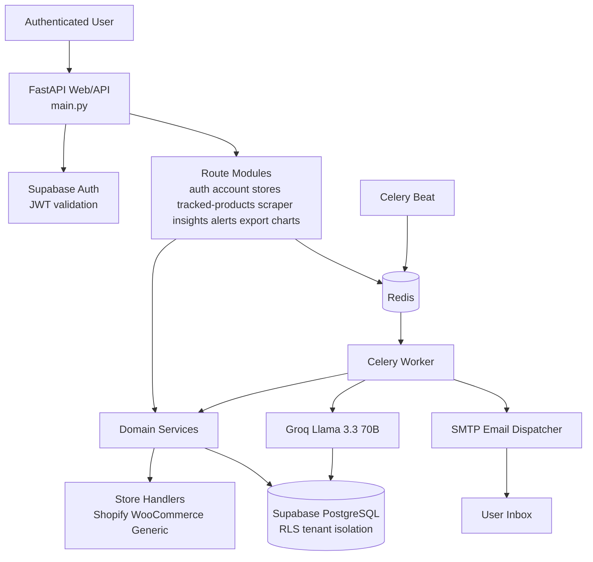
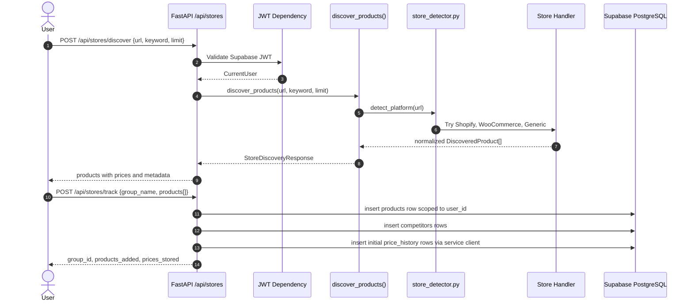
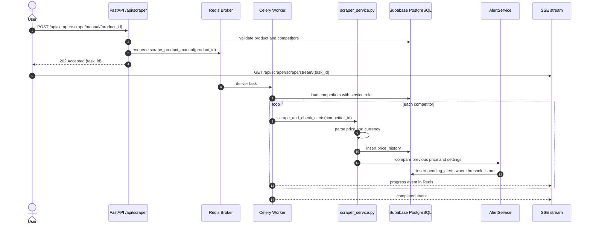
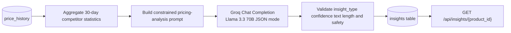

# PriceHawk Production Architecture

## Navigation

- [System Context](#system-context)
- [Component Interaction](#component-interaction)
- [Scraper Architecture](#scraper-architecture)
- [AI Analysis Pipeline](#ai-analysis-pipeline)
- [Security Boundaries](#security-boundaries)
- [Operational Characteristics](#operational-characteristics)

## System Context

PriceHawk is a private FastAPI service that discovers competitor products, tracks selected URLs, scrapes price history through Celery workers, analyzes trends with Groq Llama 3.3 70B, and sends digest email alerts. The application is intentionally split into route, service, persistence, and worker layers:

| Layer | Key files | Responsibility |
| --- | --- | --- |
| Ingress | `main.py`, `app/api/routes/*.py` | HTTP routing, auth dependencies, request validation, response models, page rendering. |
| Domain services | `app/services/*.py`, `app/services/stores/*.py` | Discovery, platform detection, scraping, chart aggregation, AI prompt/validation, alert detection, email rendering. |
| Persistence | `app/db/database.py`, `app/db/models.py`, `docs/database_schema.sql` | Supabase client creation, Pydantic schemas, PostgreSQL tables, indexes, triggers, RLS. |
| Async execution | `app/tasks/celery_app.py`, `app/tasks/scraper_tasks.py` | Manual scrape jobs, daily scraping, hourly digest dispatch, alert cleanup. |
| Infrastructure | `Dockerfile`, `docker-compose.yml`, `Procfile` | Containerized API, Redis broker, Celery worker, Celery Beat, Railway process commands. |

## Component Interaction

### Price discovery and tracking

### Scrape execution and alert generation

## Scraper Architecture

PriceHawk uses a strategy-style platform handler model for discovery and a price scraper service for tracked competitor URLs.

| Platform path | Implementation | Strategy |
| --- | --- | --- |
| Shopify | `app/services/stores/shopify.py` | Prefer public `/products.json` catalog pagination. Fall back to Storefront GraphQL for Hydrogen/custom storefronts where JSON catalog access is disabled. |
| WooCommerce | `app/services/stores/woocommerce.py` | Probe Store API and REST product endpoints, normalize cents/string prices, and fall back to HTML parsing when needed. |
| Generic commerce | `app/services/stores/generic.py` | Parse Schema.org JSON-LD and common product card/price selectors for unknown HTTPS storefronts. |
| Tracked URL scrape | `app/services/scraper_service.py` | Fetch product pages, validate network safety/domain constraints, parse locale-aware prices, and optionally use Playwright for JavaScript-rendered pages. |

Design rules:

1. Discovery accepts only HTTPS-normalized store URLs from `StoreDiscoveryRequest`.
2. Platform handlers return the common `DiscoveredProduct` shape, keeping route responses stable.
3. API-backed stores fetch enough catalog data before keyword filtering so search results are not biased by page ordering.
4. Price values use `Decimal` in service/model boundaries to avoid financial rounding errors.
5. Scrape failures are persisted as `price_history` rows with `scrape_status='failed'` and an error message rather than being silently dropped.

## AI Analysis Pipeline

`app/services/ai_service.py` generates insight candidates from recent price history, asks Groq for structured JSON, validates each item, caps result volume, and stores accepted insights through the service client. The public API exposes:

- `GET /api/insights/{product_id}` to list persisted insights for a user-owned product.
- `POST /api/insights/generate/{product_id}` to manually generate fresh insights, subject to service-level validation and daily generation controls.

## Security Boundaries

| Boundary | Enforced by | Notes |
| --- | --- | --- |
| Authentication | `app/core/security.py`, Supabase JWTs | Protected endpoints depend on `get_current_user` or bearer/cookie token verification. |
| Tenant isolation | Supabase RLS and application ownership checks | Product rows are scoped by `user_id`; competitors, prices, and insights are scoped through product ownership joins. |
| Service role isolation | `get_supabase_client()` without user token | Reserved for workers and backend-only writes to `price_history`, `insights`, and alert tables. |
| Rate limiting | `app/middleware/rate_limit.py`, slowapi decorators | Auth endpoints use auth limits; manual scrape uses scrape limits; exceeded limits produce HTTP 429. |
| Browser/API hardening | `SecurityHeadersMiddleware` in `main.py` | Adds content-type, frame, XSS, referrer, and production HSTS headers. |
| CORS | `CORSMiddleware` in `main.py` | Debug mode allows all origins; production defaults to no wildcard origins. |
| Input validation | Pydantic request models | Validates email, URL shape, limits, names, booleans, and numeric thresholds. |

## Operational Characteristics

- API startup is lightweight; optional Groq and SMTP clients are lazily initialized when used.
- Redis is required for Celery task dispatch, SSE scrape progress, and scheduled jobs.
- Celery tasks acknowledge late and reject on worker loss so interrupted jobs can be retried by the broker.
- Beat schedules daily all-product scraping at 02:00 UTC, alert cleanup at 03:00 UTC, and digest checks hourly.
- CSV export supports bearer-token API clients and cookie-authenticated browser downloads through a shared verification path.

## Related Guides

- [Database schema and RLS](DATABASE.md)
- [REST API reference](API.md)
- [Workers and queues](WORKERS.md)
- [Deployment runbook](DEPLOYMENT.md)
- [Development guide](DEVELOPMENT.md)
- [Implementation logic](logic_used.md)
