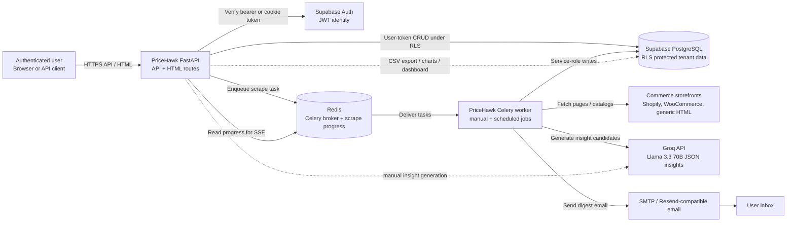
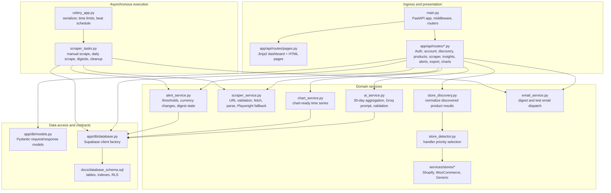
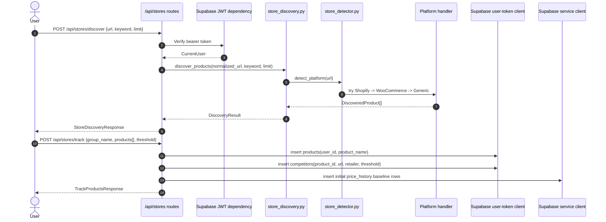
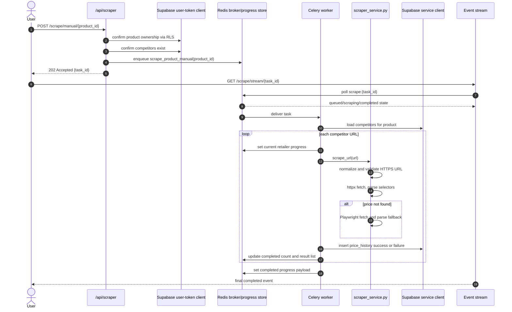
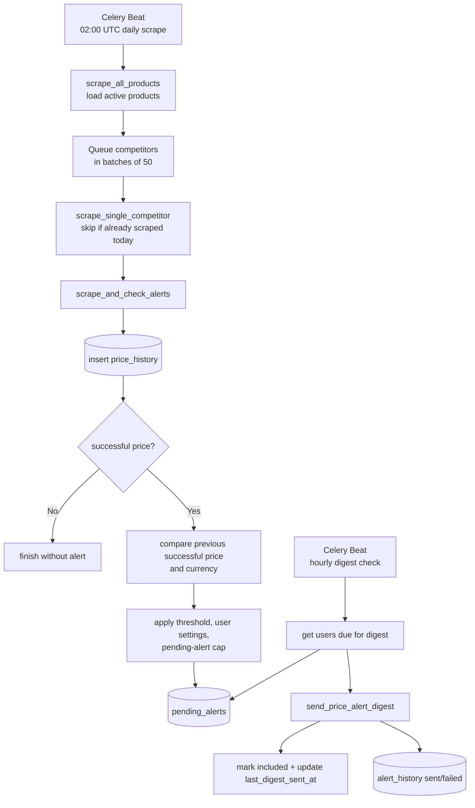

# PriceHawk Production Architecture

## Navigation

- [Executive Summary](#executive-summary)
- [Architectural Principles](#architectural-principles)
- [System Context](#system-context)
- [Runtime Containers](#runtime-containers)
- [Application Component Model](#application-component-model)
- [Primary Data Flows](#primary-data-flows)
- [Scraper Architecture](#scraper-architecture)
- [AI Analysis Architecture](#ai-analysis-architecture)
- [Persistence Architecture](#persistence-architecture)
- [Security Boundaries](#security-boundaries)
- [Operational Characteristics](#operational-characteristics)
- [Failure Modes and Recovery](#failure-modes-and-recovery)
- [Related Guides](#related-guides)

## Executive Summary

PriceHawk is a private, production-oriented competitor price monitoring service. It combines an authenticated FastAPI web/API application, Supabase PostgreSQL persistence with Row-Level Security (RLS), Redis-backed Celery workers, multi-platform commerce discovery/scraping services, Groq-hosted Llama 3.3 70B insights, and scheduled digest email delivery.

The important architectural separation is:

1. **FastAPI owns user-facing request handling**: authentication, route-level ownership checks, request/response schemas, HTML rendering, CSV streaming, and enqueueing asynchronous work.
2. **Domain services own business capabilities**: store detection, product discovery, scraping, chart aggregation, AI prompt generation/validation, alert detection, and email composition.
3. **Supabase owns durable state and tenant isolation**: user-owned rows are protected by RLS and explicit API checks; service-role writes are reserved for backend-only tables and worker operations.
4. **Celery owns long-running and scheduled work**: manual scrapes, daily scrape fan-out, hourly alert digest checks, and daily cleanup jobs run outside the web request lifecycle.

## Architectural Principles

| Principle | Implementation in PriceHawk |
| --- | --- |
| Tenant isolation is a data-layer invariant | Application rows are keyed by Supabase Auth user IDs; RLS policies restrict user-token clients; service-role clients are used only where backend ownership is required. |
| Scraping is asynchronous by default | User-triggered scrapes return `202 Accepted` with a task ID; Celery workers execute network-bound scraping and progress is streamed through Redis-backed SSE. |
| Discovery and tracking are separate concerns | Discovery normalizes potential products without persistence; tracking persists only the products selected by the user and stores initial baseline prices. |
| Price data is append-only | `price_history` stores every successful or failed scrape snapshot so charts, exports, alerts, and diagnostics share the same audit trail. |
| External AI is bounded and validated | Groq output is treated as untrusted structured data: JSON is parsed, insight types/confidence/text are validated, results are capped, and accepted rows are persisted. |
| Degradation is explicit | Unsupported pages and failed scrapes produce status/error records instead of disappearing from operational history. |

## System Context

PriceHawk sits between authenticated users, commerce storefronts, Supabase, Redis, Groq, and email infrastructure.

## Runtime Containers

| Runtime unit | Entry point | Primary responsibilities | Required dependencies |
| --- | --- | --- | --- |
| API/web process | `main.py`, `run.py`, `Procfile` | FastAPI app creation, middleware, route registration, page rendering, OpenAPI, request validation, auth, enqueueing Celery work. | Supabase URL/keys/JWT secret; Redis for scrape dispatch/progress; optional Groq/SMTP for invoked features. |
| Celery worker | `app/tasks/celery_app.py`, `app/tasks/scraper_tasks.py` | Execute manual scrape tasks, single-competitor scrape tasks, digest sending, cleanup jobs, Redis progress writes. | Redis broker/result backend, Supabase service key, Playwright browser runtime, optional SMTP. |
| Celery Beat | `app/tasks/celery_app.py` | Schedule daily all-product scrapes, hourly digest checks, and daily cleanup. | Redis broker. |
| Redis | `docker-compose.yml` | Message broker, Celery result backend, short-lived scrape progress state. | Network reachable by API and worker. |
| Supabase PostgreSQL/Auth | External Supabase project | Identity, relational persistence, RLS, indexes, cascades, SQL constraints. | Schema from `docs/database_schema.sql`. |

## Application Component Model

The application follows a route-service-persistence structure. Route modules should stay thin: validate/authenticate, call services or Supabase clients, translate expected domain failures into HTTP responses, and return Pydantic response models.

### Route families

| Domain | Routes | Architectural role |
| --- | --- | --- |
| Health | `GET /api/health` | Minimal readiness/liveness indicator for the API process. |
| Authentication | `/api/auth/*` | Supabase email/password and password-reset flows; returns bearer tokens for protected APIs. |
| Account | `/api/account/*` | User account settings, email/password changes, and deletion flows. |
| Discovery | `POST /api/stores/discover`, `POST /api/stores/track` | Detect storefront capabilities, normalize product candidates, persist selected tracked groups. |
| Tracked products | `/api/tracked-products/*` | Product group listing, detail, update, and soft-delete behavior. |
| Scraping/prices | `/api/scraper/*` | Manual scrape dispatch, SSE progress, price history, latest price, worker health, scraper chart data. |
| Charts | `/api/charts/{product_id}` | Chart-ready series and aggregate price metrics. |
| Insights | `/api/insights/*` | Persisted AI insights and manual insight generation. |
| Alerts | `/api/alerts/*` | Alert settings, pending alerts, history, test email, and currency-acceptance operations. |
| Export | `/api/export/{product_id}/csv` | CSV streaming for browser and API clients. |

## Primary Data Flows

### 1. Product discovery and tracking

Discovery is intentionally read-before-write. Users can inspect product candidates before choosing what becomes durable tracking state.

### 2. Manual scrape with SSE progress

Manual scrapes use asynchronous execution so the API request does not block on external storefront latency or Playwright fallback.

### 3. Scheduled scrape, alert detection, and digest delivery

Scheduled scraping is more alert-focused than manual scraping: each single-competitor task stores a scrape result and then evaluates alerts when the scrape succeeds.

## Scraper Architecture

PriceHawk uses two related scraping paths:

1. **Discovery handlers** (`app/services/stores/*`) discover catalog candidates from store-level URLs.
2. **Tracked URL scraper** (`app/services/scraper_service.py`) revisits persisted competitor product URLs for monitoring.

| Platform/path | Detection strategy | Extraction strategy | Design rationale |
| --- | --- | --- | --- |
| Shopify discovery | Prefer Shopify-specific signals and public catalog endpoints. | `/products.json` catalog pagination; handler-level fallback for modern/custom storefront behavior. | Fast, structured, and avoids brittle HTML parsing when the catalog is available. |
| WooCommerce discovery | Probe WordPress/WooCommerce API surfaces under `/wp-json`. | Store API and REST product responses; HTML fallback where public APIs are unavailable. | WooCommerce exposes stable public product APIs on many stores, but themes vary widely. |
| Generic discovery | Always available fallback after specific handlers fail to detect. | Schema.org JSON-LD and common product-card selectors. | Preserves usefulness for unsupported commerce stacks without pretending to know the platform. |
| Tracked URL scrape | Works from persisted competitor URLs, not store catalogs. | HTTPS normalization, SSRF-oriented URL validation, randomized user agents, httpx fetch, selector parsing, Playwright fallback. | Recurring monitoring needs a deterministic product-page scraper independent from initial discovery. |

Scraper rules that matter operationally:

- Explicit `http://` URLs are rejected; domain-only values are normalized to HTTPS where the request model allows it.
- Private, loopback, link-local, metadata, and internal hostnames are blocked before network fetches.
- HTML response size is capped to reduce memory pressure and protect workers from unexpectedly large pages.
- Price parsing returns both `Decimal | None` and currency, allowing failed extraction to be represented cleanly.
- Failed scrapes are persisted with `scrape_status='failed'` and an error message so exports and operations can explain missing prices.
- Playwright is a fallback, not the primary fetch mechanism, because browser automation is heavier and subject to a five-minute Celery task limit.

## AI Analysis Architecture

AI generation is an enrichment layer over trusted persisted price history. It does not own source-of-truth pricing data.

```mermaid
flowchart LR
    Request["POST /api/insights/generate/{product_id}"] --> Ownership["Load product through user-token client\nRLS + route ownership"]
    Ownership --> Window["Fetch last 30 days of price_history"]
    Window --> Aggregate["Group by competitor\nprice_count, avg, min, max, current, first"]
    Aggregate --> Prompt["Build constrained pricing-analysis prompt"]
    Prompt --> Groq["Groq Chat Completion\nllama-3.3-70b-versatile\nJSON object mode"]
    Groq --> Validate["Parse JSON\nvalidate type, text, confidence, count"]
    Validate --> Store[("insights")]
    Store --> API["GET /api/insights/{product_id}"]
```

Key constraints:

- Generation is rate-limited at service level by checking whether insights already exist for the product on the current day.
- The input window is intentionally compact: 30 days of history and the last 10 points per competitor are enough for short tactical insights without oversized prompts.
- The model is instructed to return only JSON; nevertheless, the service validates every field because LLM output is probabilistic.
- Accepted `insight_type` values are `pattern`, `alert`, and `recommendation`, matching database checks and API contracts.

## Persistence Architecture

Supabase PostgreSQL is the system of record. The canonical schema, constraints, indexes, triggers, and policies are documented in [Database](DATABASE.md) and provisioned by [`database_schema.sql`](database_schema.sql).

| Table group | Tables | Purpose |
| --- | --- | --- |
| Identity anchor | `auth.users` | Supabase-managed users; `auth.users.id` is the tenant identifier. |
| Tracking | `products`, `competitors` | User-owned product groups and monitored competitor URLs. |
| Time-series | `price_history` | Append-only scrape snapshots used by charts, exports, AI, and alert comparisons. |
| AI | `insights` | Validated generated insight rows tied to a product group. |
| Worker/progress | `tracking_jobs` | Background job state for larger tracking/discovery workflows. |
| Alerts | `pending_alerts`, `user_alert_settings`, `alert_history` | Notification preferences, pending digest items, and delivery audit records. |

Data-access patterns:

- **User-token client**: used by protected API routes where RLS should enforce ownership.
- **Service-role client**: used by workers and backend-only insert paths for tables users should not directly write (`price_history`, `insights`, alert audit rows).
- **Soft delete for products**: product deletion marks `is_active=false`, preserving historical data and avoiding destructive analytics loss.

## Security Boundaries

| Boundary | Enforcement point | Production expectation |
| --- | --- | --- |
| Authentication | Supabase JWT validation in route dependencies | Protected APIs require bearer tokens; browser-oriented flows may use cookie token verification where explicitly supported. |
| Authorization | Supabase RLS plus route-level ownership checks | Product/competitor/history/export/chart operations must only expose rows owned by the authenticated user. |
| Service-role containment | `get_supabase_client()` without user token in workers/backend-only flows | Service role bypasses RLS and must remain server-side only. Never send it to browsers or commit it. |
| Input validation | Pydantic models in `app/db/models.py` and route-local schemas | URL, email, name, limit, threshold, and boolean fields are validated before domain logic. |
| Network safety | `scraper_service.validate_url` | Scraping rejects insecure, private, loopback, link-local, cloud metadata, and internal hostnames. |
| Rate limiting | `app/middleware/rate_limit.py`, slowapi decorators | Auth and manual scraping endpoints enforce configured throttle windows and return HTTP 429 on excess. |
| Browser/API hardening | `SecurityHeadersMiddleware`, `CORSMiddleware` in `main.py` | Security headers are global; production CORS is closed unless explicitly configured. |
| Error disclosure | `global_exception_handler` in `main.py` | Unexpected failures are logged server-side with an error ID and returned as generic 500 payloads. |

## Operational Characteristics

- **Startup**: API startup is intentionally lightweight; expensive clients such as Groq, SMTP, Redis, and Playwright are initialized lazily or inside the runtime path that needs them.
- **Queue semantics**: Celery serializes tasks/results as JSON, acknowledges tasks late, rejects on worker loss, and expires results after 24 hours.
- **Task limits**: worker tasks have a 270-second soft time limit and a 300-second hard time limit, aligning with manual SSE timeout expectations.
- **Schedules**: Beat runs daily all-product scraping at 02:00 UTC, hourly alert digest checks at minute 0, and old-alert cleanup at 03:00 UTC.
- **Progress state**: manual scrape progress is stored in Redis under `scrape:{task_id}` with a five-minute TTL.
- **Export contract**: CSV export supports both bearer-token API clients and browser downloads through the `access_token` cookie path.
- **Deployment shape**: Docker Compose runs API, Redis, worker, and beat locally; Railway process definitions use the same API/worker separation.

## Failure Modes and Recovery

| Failure mode | Expected behavior | Recovery/diagnostic path |
| --- | --- | --- |
| Store platform cannot be detected | Generic handler is used as fallback where possible. | Discovery response includes zero products and an error when all handlers fail. |
| Price cannot be extracted | A `price_history` row is stored with `scrape_status='failed'` and a bounded error message. | Review exports/history, scraper logs, and storefront markup. |
| Manual scrape worker unavailable | API can enqueue only if Redis is reachable; worker-health endpoint reports no worker response. | Start/restart Celery worker and verify Redis connectivity. |
| SSE progress expires | Redis progress key TTL is five minutes; stale streams eventually emit timeout/error. | Re-run manual scrape or inspect Celery result/logs. |
| Groq key missing or API fails | Insight generation raises a controlled service error rather than storing partial insights. | Configure `GROQ_API_KEY` and retry when upstream is healthy. |
| Email delivery fails | `alert_history` records failed status and error; pending alerts are not marked included. | Fix SMTP/Resend credentials or deliverability settings; next due digest can retry pending alerts. |
| RLS denies a user-token operation | Route returns not found/forbidden-style behavior depending on endpoint. | Confirm authenticated user owns the product/competitor and schema policies are installed. |

## Related Guides

- [Implementation logic](logic_used.md)
- [Database schema and RLS](DATABASE.md)
- [REST API reference](API.md)
- [Workers and queues](WORKERS.md)
- [Deployment runbook](DEPLOYMENT.md)
- [Development guide](DEVELOPMENT.md)
