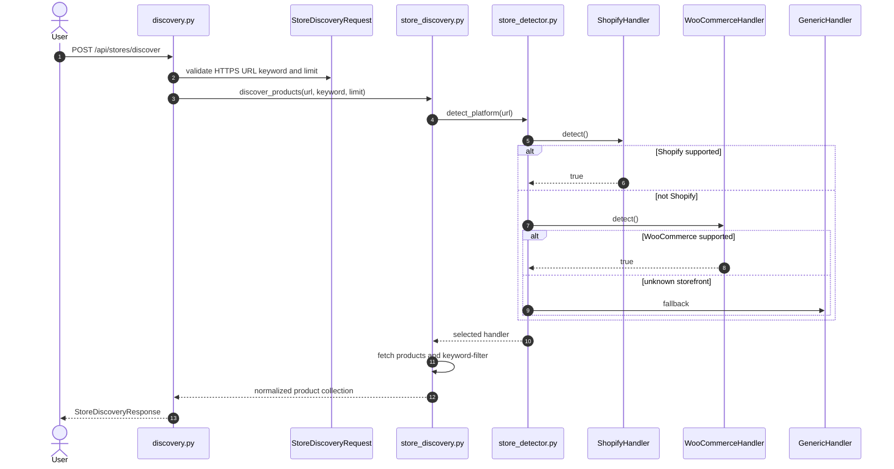
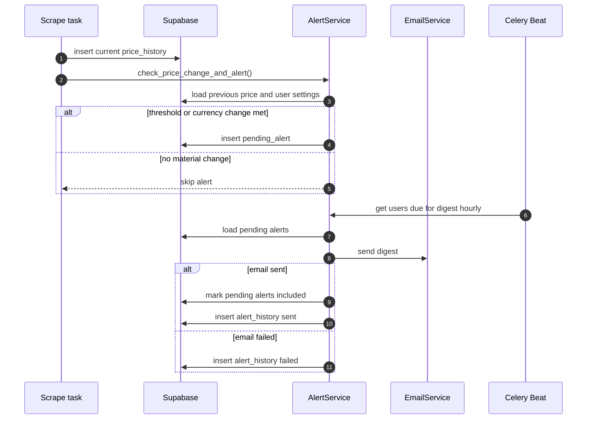

# PriceHawk Implementation Logic Reference

## Navigation

- [Purpose](#purpose)
- [Discovery Logic](#discovery-logic)
- [Multi-Platform Scraper Logic](#multi-platform-scraper-logic)
- [Price Parsing and Persistence](#price-parsing-and-persistence)
- [AI Insight Logic](#ai-insight-logic)
- [Alert Logic](#alert-logic)
- [Security Logic](#security-logic)
- [Export and Dashboard Logic](#export-and-dashboard-logic)

## Purpose

This guide documents the non-obvious implementation decisions behind PriceHawk. For system diagrams and deployment-level architecture, see [Architecture](ARCHITECTURE.md). For persistence details, see [Database](DATABASE.md).

## Discovery Logic

Discovery is initiated by `POST /api/stores/discover` and implemented through `app/services/store_discovery.py`, `app/services/store_detector.py`, and `app/services/stores/*`.



Key rules:

1. Explicit `http://` URLs are rejected. Domain-only input is normalized to HTTPS.
2. Discovery and tracking are separate steps so users can review products before persistence.
3. All handlers return a common `DiscoveredProduct` model with product URL, price, currency, image, SKU/variant metadata, and stock state.
4. Keyword search uses multiple fields where available: title/name, product type, tags, and description.
5. API-backed stores fetch a broader catalog before filtering to avoid missing matches that appear after the first page.

## Multi-Platform Scraper Logic

| Platform | Detection | Extraction | Why this approach |
| --- | --- | --- | --- |
| Shopify | Probe public catalog endpoints such as `/products.json`; support modern Storefront GraphQL fallback in handler logic. | Parse variants, product handles, images, tags, product type, and availability. | Fast for classic stores and resilient for Hydrogen/custom storefronts. |
| WooCommerce | Probe Store API and REST product endpoints under `/wp-json`. | Normalize Store API integer minor units and REST string prices. | Uses stable public APIs where available before falling back to HTML. |
| Generic | Always available as fallback. | Parse Schema.org JSON-LD and common product-card selectors. | Allows unknown storefronts to degrade gracefully without platform-specific code. |
| Tracked URL scraping | `app/services/scraper_service.py`. | Parse price text, infer currency, and persist success/failure rows. | Keeps recurring monitoring independent from initial catalog discovery. |

## Price Parsing and Persistence

Price handling uses `Decimal` at model/service boundaries to avoid floating-point precision errors. The parser supports common US and European formats, including examples such as `$1,234.56`, `€1.234,56`, and simple integer values.

Persistence behavior:

- Successful scrapes store `price`, `currency`, `scrape_status='success'`, and null `error_message`.
- Failed scrapes store null price, `scrape_status='failed'`, and a diagnostic error message.
- Initial prices discovered during `POST /api/stores/track` are stored directly in `price_history` through the service client so the user gets immediate baseline data.

## AI Insight Logic

`app/services/ai_service.py` transforms recent price history into a compact analysis payload for Groq Llama 3.3 70B.

```mermaid
flowchart TD
    Start[POST /api/insights/generate/{product_id}] --> Own[Validate product ownership]
    Own --> History[Fetch recent price history]
    History --> Stats[Compute competitor stats\navg min max current change]
    Stats --> Prompt[Build pricing expert prompt]
    Prompt --> Groq[Groq Llama 3.3 70B\nJSON response]
    Groq --> Parse[Parse JSON insights]
    Parse --> Validate[Validate type confidence length\nand sanitize text]
    Validate --> Limit[Cap insight count]
    Limit --> Store[(Insert insights)]
    Store --> Return[Return InsightListResponse]
```

Validation exists because LLM output is probabilistic. Accepted insights must have:

- `insight_type` in `pattern`, `alert`, or `recommendation`.
- `confidence_score` between `0.00` and `1.00`.
- Sanitized text safe for web display.
- Bounded length and result count.

## Alert Logic

Alerting is digest-based to avoid email spam. Detection is decoupled from sending:

1. A successful scrape compares the new price to the previous successful price.
2. The service calculates percent change and checks the competitor threshold.
3. Currency changes are treated as explicit alert events because cross-currency trend lines can mislead users.
4. Alert settings (`email_enabled`, `alert_price_drop`, `alert_price_increase`, `digest_frequency_hours`) gate whether pending alerts should be created or sent.
5. `pending_alerts.included_in_digest` prevents duplicate digest inclusion.
6. `alert_history` records send attempts and failures for auditability.



## Security Logic

Security is layered rather than relying on a single control.

| Layer | Logic |
| --- | --- |
| JWT authentication | `get_current_user` verifies Supabase JWTs and provides `CurrentUser` to route handlers. |
| RLS-scoped clients | User-token Supabase clients enforce database policies for user-owned rows. |
| Explicit route checks | Product, export, chart, and currency routes validate ownership and return 404/403 as appropriate. |
| Service key use | Workers and backend-only insert paths use service key access for rows users cannot directly write, such as `price_history`. |
| Rate limiting | Auth routes use `AUTH_RATE_LIMIT`; manual scrape uses `SCRAPE_RATE_LIMIT`; exceeded limits return HTTP 429. |
| Headers and CORS | `main.py` attaches security headers globally and keeps production CORS closed by default. |

## Export and Dashboard Logic

CSV export (`GET /api/export/{product_id}/csv`) supports bearer-token API clients and browser downloads with an `access_token` cookie. It validates ownership, fetches competitors, joins price history in memory, sanitizes the filename, and streams CSV with stable columns.

Dashboard helper routes in `app/api/routes/pages.py` aggregate stats, activity, recent products, and insight summaries so the browser dashboard avoids many small API calls during first paint.

## Related Guides

- [Architecture](ARCHITECTURE.md)
- [API](API.md)
- [Database](DATABASE.md)
- [Workers](WORKERS.md)
- [Deployment](DEPLOYMENT.md)
- [Development](DEVELOPMENT.md)
