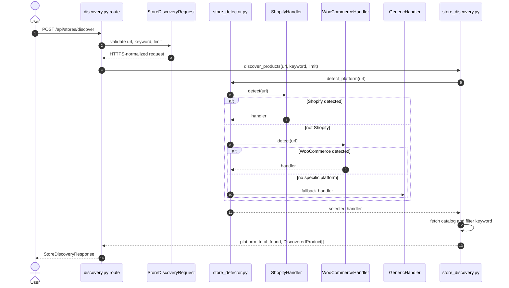
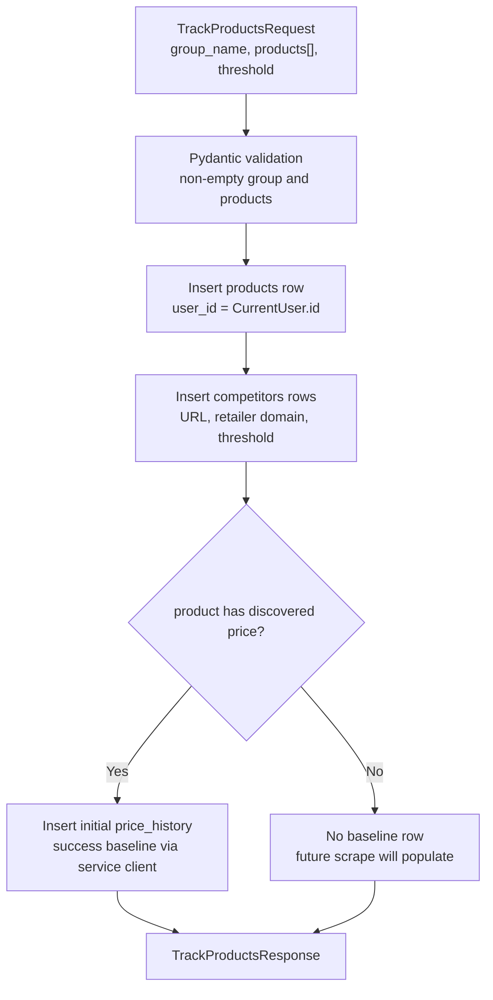
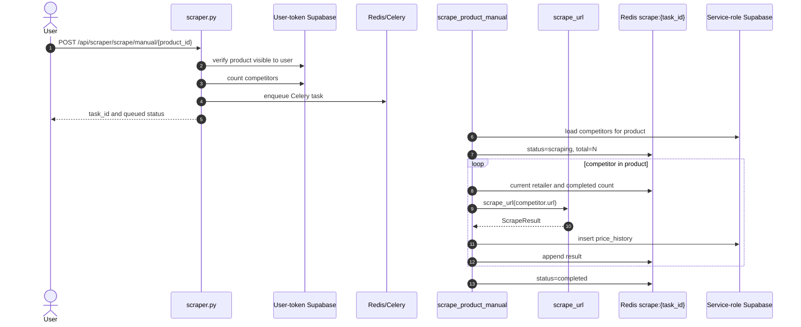
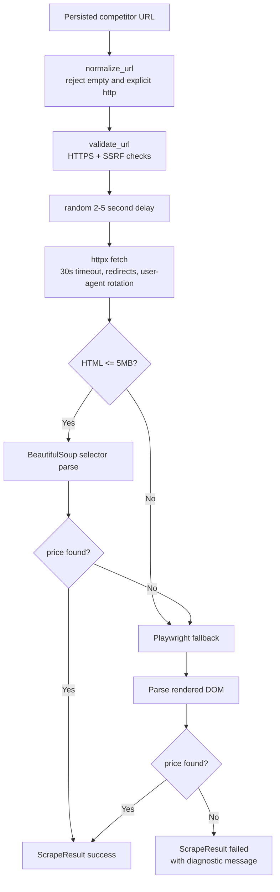
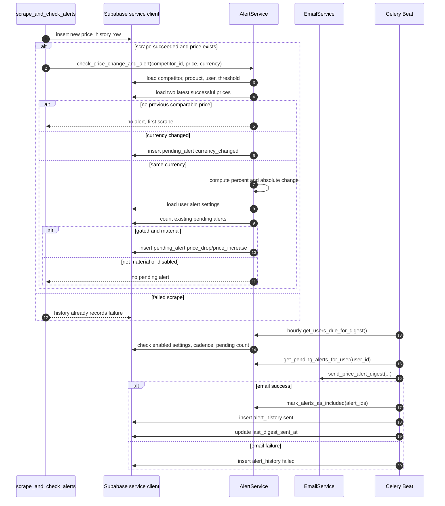
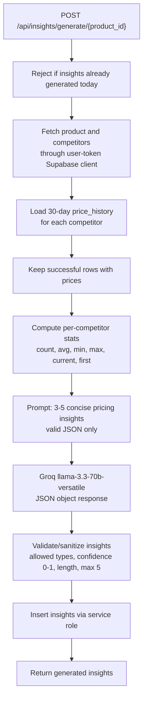
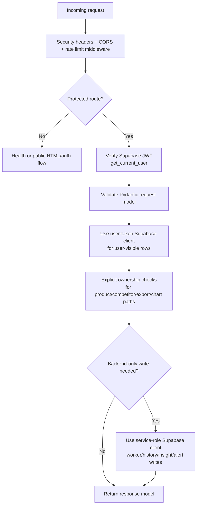

# PriceHawk Implementation Logic Reference

## Navigation

- [Purpose and Scope](#purpose-and-scope)
- [Domain Model Logic](#domain-model-logic)
- [Store Discovery Logic](#store-discovery-logic)
- [Tracking Logic](#tracking-logic)
- [Recurring Scraper Logic](#recurring-scraper-logic)
- [Price Parsing and Persistence Logic](#price-parsing-and-persistence-logic)
- [Alert Detection and Digest Logic](#alert-detection-and-digest-logic)
- [AI Insight Logic](#ai-insight-logic)
- [Chart, Dashboard, and Export Logic](#chart-dashboard-and-export-logic)
- [Security and Authorization Logic](#security-and-authorization-logic)
- [Operational Decision Matrix](#operational-decision-matrix)
- [Related Guides](#related-guides)

## Purpose and Scope

This document explains the implementation decisions that are easy to miss when reading individual modules. It is intentionally complementary to:

- [Architecture](architecture.md), which describes runtime boundaries and component topology.
- [Database](DATABASE.md), which describes schema, constraints, indexes, and RLS.
- [API](API.md), which describes request/response contracts.
- [Workers](WORKERS.md), which describes Celery and schedule operations.

PriceHawk's central product loop is: discover products, persist selected competitor URLs, collect price snapshots, detect material changes, enrich history with AI insights, and present/export the resulting data.

## Domain Model Logic

| Concept | Implementation object | Important invariant |
| --- | --- | --- |
| User | Supabase `auth.users` and `CurrentUser` dependency | The Supabase user UUID is the tenant key across product, alert, job, and insight data. |
| Product group | `products` table, `ProductResponse` | A group belongs to one user and may contain many competitor URLs. Soft deletion uses `is_active=false`. |
| Competitor | `competitors` table, `CompetitorResponse` | A competitor is a single monitored URL inside a product group, with retailer metadata and alert threshold. |
| Price snapshot | `price_history` table, `PriceHistoryResponse` | Every scrape attempt is represented as success or failure, preserving auditability. |
| Pending alert | `pending_alerts` table | Alerts are detected immediately after qualifying scrapes but sent later in digests. |
| Alert settings | `user_alert_settings` table | Email enablement, digest cadence, and drop/increase toggles gate digest behavior. |
| AI insight | `insights` table, `InsightResponse` | Insights are derived from persisted price history and never replace raw price data. |

The model intentionally groups competitors under products instead of making every URL a top-level product. This lets charts, alerts, exports, and AI compare multiple retailers for the same market item without requiring a separate comparison table.

## Store Discovery Logic

Discovery is initiated by `POST /api/stores/discover` and implemented by `app/api/routes/discovery.py`, `app/services/store_discovery.py`, `app/services/store_detector.py`, and `app/services/stores/*`.

### Why discovery is separate from tracking

Discovery can be noisy because storefront catalogs differ widely. The service therefore returns normalized candidates first and persists only after explicit user selection through `/api/stores/track`. This avoids creating durable competitor rows for false positives or irrelevant catalog items.

### URL handling rules

1. `StoreDiscoveryRequest` rejects explicit `http://` input because PriceHawk should not initiate insecure storefront requests.
2. Domain-only input such as `example.com` is normalized to `https://example.com` when it has a dot and no spaces.
3. URL length is capped at the request-model boundary.
4. Recurring scrapes apply additional SSRF-oriented validation in `scraper_service.validate_url` before any network fetch.

### Handler priority rules

| Handler | When selected | Product extraction logic | Failure behavior |
| --- | --- | --- | --- |
| Shopify | Shopify-specific signals or catalog endpoint availability are detected. | Prefer structured catalog/variant data, including product handles, prices, images, tags, product type, SKU/variant, and availability. | Detection/fetch exceptions close the handler and the detector continues to the next handler. |
| WooCommerce | WooCommerce/WordPress API surfaces are detected. | Normalize Store API minor units and REST/string price formats; retain product URLs and image metadata. | Falls through to generic logic when structured surfaces are unavailable. |
| Generic | Specific handlers do not match or all specific detection fails. | Parse Schema.org JSON-LD and common commerce selectors. | Returns an empty result with a bounded error if extraction cannot produce products. |

### Keyword and limit behavior

Discovery handlers should fetch enough catalog data before filtering so keyword results are not biased toward the first storefront page. Keyword matching is expected to consider multiple fields when available: title/name, product type/category, tags, and description. The response `total_found` reflects returned normalized candidates, not necessarily the storefront's full catalog size.

## Tracking Logic

Tracking is implemented by `POST /api/stores/track` in `app/api/routes/discovery.py`.

Important tracking decisions:

- The product group name is user-provided and validated for length.
- Retailer names are derived from URL hostnames with `www.` removed, providing useful display labels before richer store metadata exists.
- Initial discovered prices are stored directly in `price_history`; there is no immediate re-scrape just to create a baseline.
- The service client writes initial history because end users should not directly insert arbitrary historical price rows under RLS.
- Competitor threshold is copied from the request to each competitor, allowing future per-competitor customization without changing alert history semantics.

## Recurring Scraper Logic

Recurring scraping is intentionally separate from discovery because monitoring revisits known product URLs and must produce durable success/failure snapshots.

### Manual scrape flow

Manual scrape behavior is optimized for user feedback. Progress is stored in Redis with a short TTL and consumed by `GET /api/scraper/scrape/stream/{task_id}` as Server-Sent Events.

### Scheduled scrape flow

Scheduled scraping uses Celery Beat and `scrape_all_products`:

1. At 02:00 UTC, Beat invokes `scrape_all_products`.
2. The task loads `is_active=true` product groups.
3. It loads competitors for those products.
4. It queues competitors in batches of `50` to avoid memory and broker pressure.
5. Each `scrape_single_competitor` task skips competitors already scraped since UTC midnight.
6. Successful scrape results flow into alert detection via `scrape_and_check_alerts`.

This split keeps fan-out lightweight and lets individual competitor scrapes retry independently.

### Fetch and fallback rules

The random delay and browser fallback improve scrape resilience but are bounded by Celery's five-minute hard task limit. Playwright has platform-specific handling: sync Playwright runs in a thread pool on Windows, while async Playwright is used on Linux/macOS.

## Price Parsing and Persistence Logic

`app/services/scraper_service.py` is responsible for extracting a price and currency from text/HTML. It returns a `ScrapeResult` dataclass rather than throwing for ordinary extraction failure.

### Currency detection

Currency detection is intentionally symbol/string based and conservative:

| Signal | Currency |
| --- | --- |
| `₦` or `NGN` | `NGN` |
| `£` | `GBP` |
| `€` | `EUR` |
| `CAD` or `C$` | `CAD` |
| Default/no clear signal | `USD` |

### Number normalization

The parser handles common formats:

| Input style | Intended normalized value |
| --- | --- |
| `$1,234.56` | `1234.56` |
| `€1.234,56` | `1234.56` |
| `1,234` | `1234` |
| `1,23` | `1.23` |
| Plain integer text | integer `Decimal` |

`Decimal` is used at service/model boundaries to avoid binary floating-point surprises in business logic. Values are converted to primitive types only where external clients or Supabase payloads require serialization.

### Persistence contract

| Scenario | `price_history.price` | `currency` | `scrape_status` | `error_message` |
| --- | --- | --- | --- | --- |
| Price extracted | Parsed amount | Detected/default currency | `success` | `null` |
| Network/fetch/parser failure | `null` | Default or detected currency | `failed` | Bounded diagnostic |
| Initial discovered baseline | Discovered amount | Product currency | `success` | `null` |

Storing failures is deliberate. It allows charts, CSV exports, dashboards, and operations to distinguish "not scraped" from "scraped and failed."

## Alert Detection and Digest Logic

Alerts are two-stage: detection creates pending alert records; scheduled digest delivery sends and audits them.

### Materiality rules

Alert creation considers:

1. **Comparable baseline**: the service needs at least two successful price rows because the newest row has already been inserted before comparison.
2. **Currency mismatch**: a currency change creates a `currency_changed` alert because comparing raw price numbers across currencies would be misleading.
3. **Percentage threshold**: `alert_threshold_percent` on the competitor determines price-drop or price-increase significance.
4. **Absolute minimum change**: `AlertConfig.MIN_SIGNIFICANT_CHANGE_AMOUNT` can still catch meaningful value changes even when the percent threshold is not reached.
5. **User preferences**: `email_enabled`, `alert_price_drop`, and `alert_price_increase` gate pending alert creation for price-change alert types.
6. **Pending-alert cap**: `MAX_PENDING_ALERTS_PER_USER` prevents unbounded pending queue growth.

### Digest idempotency rules

- `included_in_digest=false` means a pending alert is eligible for a future digest.
- After a successful email, alerts are marked included and `last_digest_sent_at` is updated.
- Failed email attempts write `alert_history` with `email_status='failed'` and leave pending alerts eligible for retry.
- Cleanup removes old included pending alerts after the configured retention window.

## AI Insight Logic

`app/services/ai_service.py` converts recent price history into compact JSON prompt context for Groq Llama 3.3 70B.

AI design decisions:

- The AI sees summarized competitor history, not arbitrary database rows, to control prompt size and reduce leakage.
- The service includes only the last 10 price points per competitor in the prompt, while summary statistics cover the 30-day window.
- Daily generation control limits cost and discourages repeatedly asking the LLM for slightly different outputs on unchanged data.
- The database and API allow only `pattern`, `alert`, and `recommendation` insight types.
- Text is escaped/sanitized before persistence because model output is untrusted user-visible content.

## Chart, Dashboard, and Export Logic

### Charts

Chart routes and `ChartService` transform `price_history` into frontend-ready time series:

- Data is grouped per competitor.
- Success/failure status stays attached to points so clients can represent scrape gaps.
- Average, min, max, current price, and change percentages are computed per competitor.
- `days` bounds keep chart queries focused and predictable.

### Dashboard

Dashboard helper routes in `app/api/routes/pages.py` aggregate data for first paint instead of forcing the browser to call many small APIs. This keeps page load simpler and centralizes ownership checks on the backend.

### CSV export

CSV export (`GET /api/export/{product_id}/csv`) supports both automation and browser downloads:

| Client type | Auth mechanism | Why it exists |
| --- | --- | --- |
| API/script client | `Authorization: Bearer <token>` | Standard protected API access. |
| Browser download | `access_token` cookie | Allows direct link/download behavior where custom headers are inconvenient. |

Export logic validates product ownership, fetches competitors and history, sanitizes the filename, and streams stable columns: `Date`, `Time`, `Competitor`, `Price`, `Currency`, `Status`, and `Error`.

## Security and Authorization Logic

Security is deliberately layered so no single mechanism carries all trust.

| Security concern | Implementation logic |
| --- | --- |
| Authentication | Protected endpoints depend on `get_current_user` and/or bearer/cookie verification. |
| Tenant isolation | RLS restricts user-token clients; route code also checks product or competitor ownership before returning derived data. |
| Service key safety | Service-role writes occur only server-side in routes/workers/services that need to bypass user INSERT restrictions. |
| SSRF resistance | Recurring scraper validates HTTPS scheme and blocks private, loopback, link-local, metadata, and internal hostnames. |
| Rate limiting | slowapi applies configured auth and scraper limits; exceeded limits return HTTP 429. |
| Error disclosure | Unexpected API exceptions are logged with an error ID and returned as generic JSON. |
| Browser hardening | Global middleware attaches content-type, frame, XSS, referrer, and production HSTS headers. |

## Operational Decision Matrix

| Decision point | Chosen behavior | Rationale |
| --- | --- | --- |
| Storefront platform unknown | Use generic handler fallback. | Unknown stores may still expose JSON-LD or common product selectors. |
| Discovery result has price | Store it as an initial baseline during tracking. | Avoids redundant network calls and gives charts/alerts immediate starting data. |
| Scrape cannot parse a price | Persist failed history row. | Supports diagnostics and distinguishes failure from missing execution. |
| Manual scrape requested | Enqueue task and stream progress from Redis. | Prevents request timeouts and provides user feedback. |
| Scheduled scrape fan-out | Queue individual competitors in batches. | Keeps large tenant/product sets from monopolizing a single task. |
| Same competitor already scraped today | Skip scheduled single-competitor scrape. | Avoids duplicate scheduled price rows and unnecessary storefront load. |
| Currency changes | Create a dedicated alert type. | Cross-currency numeric comparisons are misleading without FX conversion. |
| Email digest fails | Keep pending alerts un-included and audit failure. | Allows retry after SMTP/configuration recovery without losing alert state. |
| LLM returns unexpected JSON | Validate, coerce safe defaults where appropriate, cap results. | Treats AI output as untrusted while preserving useful responses. |

## Related Guides

- [Architecture](architecture.md)
- [API](API.md)
- [Database](DATABASE.md)
- [Workers](WORKERS.md)
- [Deployment](DEPLOYMENT.md)
- [Development](DEVELOPMENT.md)
